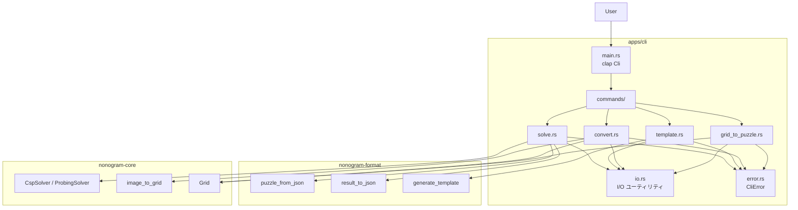
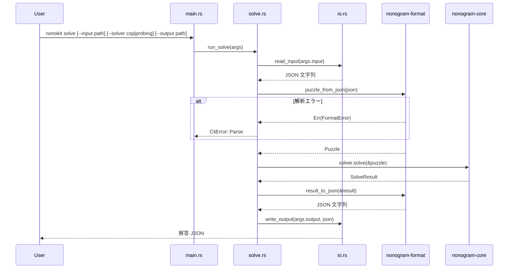
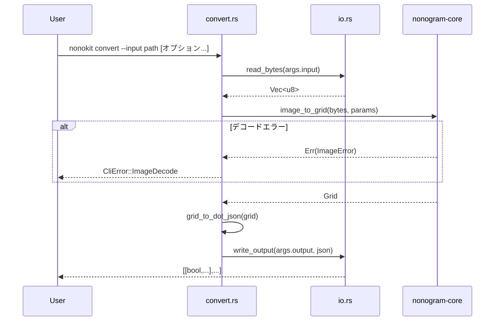
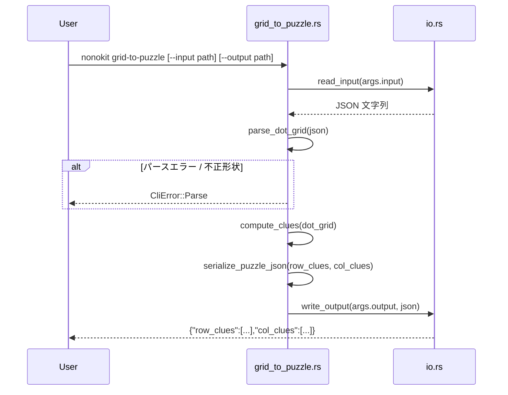

# 技術設計書: nonogram-cli

## 概要

`nonokit` は、nonogram パズルの解法・テンプレート生成・画像変換・グリッド→パズル変換を JSON インターフェースで提供するコマンドラインツールである。`apps/cli` クレート（Rust バイナリ）として実装され、`nonogram-core` および `nonogram-format` クレートに依存する薄いアダプター層となる。

**目的**: パズル設計者・研究者・ノノグラム制作者がスクリプトやパイプラインでノノグラム関連の処理を自動化できる CLI を提供する。

**利用者**: パズル設計者、研究者、ノノグラム制作者がシェルスクリプト・パイプラインで利用する。

### ゴール

- `solve`, `template`, `convert`, `grid-to-puzzle` の 4 サブコマンドを提供する
- 標準入力 / ファイル入力・標準出力 / ファイル出力に対応し、パイプライン構成を可能にする
- `nonogram-core` および `nonogram-format` の既存実装を最大活用し、ロジックの重複を排除する
- 統一されたエラーメッセージを stderr に出力し、終了コードで成否を表現する

### 非ゴール

- インタラクティブ UI・TUI の提供
- ノノグラム以外の画像処理機能
- `nonogram-core`/`nonogram-format` ライブラリへの新規ロジックの追加
- ネットワーク通信・リモート API の呼び出し

---

## 要件トレーサビリティ

| 要件 | サマリー | コンポーネント | インターフェース | フロー |
|------|---------|--------------|----------------|--------|
| 1.1–1.12 | solve コマンド全体 | SolveCommand | `SolveArgs`, `run_solve()` | Solve フロー |
| 2.1–2.5 | template コマンド全体 | TemplateCommand | `TemplateArgs`, `run_template()` | — |
| 3.1–3.12 | convert コマンド全体 | ConvertCommand | `ConvertArgs`, `run_convert()` | Convert フロー |
| 4.1–4.8 | grid-to-puzzle コマンド全体 | GridToPuzzleCommand | `GridToPuzzleArgs`, `run_grid_to_puzzle()` | GridToPuzzle フロー |
| 5.1–5.8 | 共通 I/O・ヘルプ・終了コード | Cli（clap 定義）, IoUtils, CliError | `Cli`, `read_input()`, `write_output()` | — |

---

## アーキテクチャ

### 既存アーキテクチャ分析

`apps/cli/src/main.rs` は現在スタブ（`println!("Hello, world!")`）であり、`Cargo.toml` に依存関係がない。ワークスペースにはすでに登録済みである。

ステアリングの方針:
- `apps/` 層はクレートを組み合わせてユーザー向け機能を提供する（`structure.md`）
- `nonogram-core` → `nonogram-format` の依存は禁止。変換責務はアプリ層に置く（`tech.md`）

### アーキテクチャパターンと境界マップ

薄いアダプター（Thin Adapter）パターンを採用する。CLI 層は clap で引数を受け取り、ライブラリ呼び出しに変換し、結果を JSON として出力するだけの責務を持つ。



**アーキテクチャ統合**:
- 採用パターン: 薄いアダプター（既存ライブラリを最大活用し、CLI は I/O とディスパッチのみ担当）
- 境界: 各サブコマンドは独立したモジュールとして分離し、`io.rs` で共通 I/O を集約
- 既存パターン維持: `nonogram-core` のソルバ・画像変換、`nonogram-format` の JSON シリアライズを変更しない
- ステアリング準拠: `mod.rs` 不使用、`commands.rs` + `commands/` 構成を採用

### テクノロジースタック

| レイヤー | 選択 / バージョン | 機能 | 備考 |
|---------|-----------------|------|------|
| CLI フレームワーク | `clap` v4（derive feature） | 引数パース・ヘルプ生成 | ステアリングで指定済み |
| JSON | `serde_json` v1 | ドットグリッド・パズル JSON のシリアライズ | `nonogram-format` 経由でも使用 |
| エラー処理 | `thiserror` v2 | `CliError` 型定義 | `nonogram-core` と統一バージョン |
| ソルバ・変換 | `nonogram-core` v0.1 | `CspSolver`, `ProbingSolver`, `image_to_grid` | ワークスペースクレート |
| JSON フォーマット | `nonogram-format` v0.1 | `puzzle_from_json`, `result_to_json`, `generate_template` | ワークスペースクレート |

---

## システムフロー

### solve コマンドフロー



### convert コマンドフロー



### grid-to-puzzle フロー



---

## コンポーネントとインターフェース

### コンポーネントサマリー

| コンポーネント | レイヤー | 目的 | 要件カバレッジ | 主要依存（優先度） | コントラクト |
|--------------|---------|------|--------------|-----------------|------------|
| Cli（clap 定義） | CLI エントリポイント | clap 引数定義・コマンドディスパッチ | 5.1–5.8 | clap v4（P0） | Service |
| SolveCommand | コマンドハンドラ | solve ロジック | 1.1–1.12 | nonogram-format（P0）, nonogram-core（P0） | Service |
| TemplateCommand | コマンドハンドラ | template ロジック | 2.1–2.5 | nonogram-format（P0） | Service |
| ConvertCommand | コマンドハンドラ | convert ロジック | 3.1–3.12 | nonogram-core（P0） | Service |
| GridToPuzzleCommand | コマンドハンドラ | grid-to-puzzle ロジック | 4.1–4.8 | serde_json（P0） | Service |
| IoUtils | I/O ユーティリティ | stdin/stdout/ファイル抽象化 | 5.8 | 標準ライブラリ（P0） | Service |
| CliError | エラー型 | エラーカテゴリ分類・メッセージ | 5.4–5.6 | thiserror（P0） | State |

---

### CLI エントリポイント

#### Cli（clap 定義）と main

| フィールド | 詳細 |
|-----------|------|
| Intent | clap による引数パース、サブコマンドへのディスパッチ、エラー時の終了コード制御 |
| 要件 | 5.1, 5.2, 5.3, 5.4, 5.5, 5.6, 5.7 |

**責務と制約**
- `#[derive(Parser)]` で `Cli` 構造体を定義し、`Commands` enum をサブコマンドとして保持する
- `main` 関数でコマンドを実行し、`CliError` 発生時は stderr にメッセージを出力して `process::exit(1)` を呼ぶ
- 正常終了時は `process::exit(0)`（暗黙的）

**依存関係**
- External: `clap` v4 — 引数パース・ヘルプ生成（P0）
- Outbound: `SolveCommand`, `TemplateCommand`, `ConvertCommand`, `GridToPuzzleCommand` — 各サブコマンド実行（P0）

**コントラクト**: Service [x]

##### サービスインターフェース

```rust
#[derive(Parser)]
#[command(name = "nonokit", about = "Nonogram CLI tool")]
struct Cli {
    #[command(subcommand)]
    command: Commands,
}

#[derive(Subcommand)]
enum Commands {
    Solve(SolveArgs),
    Template(TemplateArgs),
    Convert(ConvertArgs),
    GridToPuzzle(GridToPuzzleArgs),
}
```

**実装ノート**
- Integration: `main` は `Cli::parse()` を呼び、`Commands` をマッチして各ハンドラを呼び出す
- Validation: clap が `--help` 表示・型変換を自動処理する
- Risks: なし

---

### コマンドハンドラ層

#### SolveCommand

| フィールド | 詳細 |
|-----------|------|
| Intent | パズル JSON を読み込み、指定ソルバで解き、解答 JSON を出力する |
| 要件 | 1.1, 1.2, 1.3, 1.4, 1.5, 1.6, 1.7, 1.8, 1.9, 1.10, 1.11, 1.12 |

**責務と制約**
- `--input` が指定されたときはファイルから、省略時は stdin から JSON を読む（1.1, 1.2）
- `--solver` オプションに応じて `CspSolver`（デフォルト）または `ProbingSolver` を選択する（1.4, 1.5, 1.6）
- 解答 JSON を `--output` ファイルまたは stdout に出力する（1.3, 1.12）
- 入力・パースエラーは stderr に出力し、非ゼロ終了コードで終了する（1.10, 1.11）

**依存関係**
- Inbound: `Cli` — コマンドディスパッチ（P0）
- Outbound: `IoUtils::read_input` — 入力読み込み（P0）
- Outbound: `IoUtils::write_output` — 出力書き込み（P0）
- External: `nonogram-format::puzzle_from_json` — パズル解析（P0）
- External: `nonogram-format::result_to_json` — 解答シリアライズ（P0）
- External: `nonogram-core::CspSolver`, `ProbingSolver` — ソルバ実行（P0）

**コントラクト**: Service [x]

##### サービスインターフェース

```rust
#[derive(Args)]
struct SolveArgs {
    #[arg(long, value_name = "PATH")]
    input: Option<PathBuf>,
    #[arg(long, value_name = "PATH")]
    output: Option<PathBuf>,
    #[arg(long, value_enum, default_value = "csp")]
    solver: SolverKind,
}

#[derive(Clone, ValueEnum)]
enum SolverKind { Csp, Probing }

fn run_solve(args: SolveArgs) -> Result<(), CliError>;
```

- 事前条件: `args.input` がファイルパスの場合はファイルが存在する
- 事後条件: 解答 JSON が stdout または `args.output` に書き込まれる
- 不変条件: `result_to_json` が返す JSON は `{"status":..., "solutions":[...]}` 形式

**実装ノート**
- Integration: `let solver: Box<dyn Solver> = match args.solver { SolverKind::Csp => Box::new(CspSolver), SolverKind::Probing => Box::new(ProbingSolver) };`
- Validation: `puzzle_from_json` の `FormatError` を `CliError::Parse` にマップする
- Risks: 大規模パズルでの解法時間（現時点では許容、タイムアウト要件なし）

---

#### TemplateCommand

| フィールド | 詳細 |
|-----------|------|
| Intent | 指定サイズの空パズルテンプレート JSON を生成する |
| 要件 | 2.1, 2.2, 2.3, 2.4, 2.5 |

**責務と制約**
- `--rows` と `--cols` を必須引数として受け取る（2.1）
- 1 未満の値はエラーとする（2.4）
- `generate_template(rows, cols)` を呼び、stdout または `--output` ファイルに出力する（2.2, 2.3）

**依存関係**
- External: `nonogram-format::generate_template` — テンプレート JSON 生成（P0）
- Outbound: `IoUtils::write_output`（P0）

**コントラクト**: Service [x]

##### サービスインターフェース

```rust
#[derive(Args)]
struct TemplateArgs {
    #[arg(long, value_name = "N")]
    rows: usize,
    #[arg(long, value_name = "M")]
    cols: usize,
    #[arg(long, value_name = "PATH")]
    output: Option<PathBuf>,
}

fn run_template(args: TemplateArgs) -> Result<(), CliError>;
```

- 事前条件: `rows >= 1`, `cols >= 1`
- 事後条件: `{"row_clues":[[],[],...],"col_clues":[[],[],...]}` が出力される
- 不変条件: `row_clues` の長さ = `rows`、`col_clues` の長さ = `cols`

**実装ノート**
- Validation: `rows == 0 || cols == 0` のとき `CliError::Validation` を返す
- Risks: なし

---

#### ConvertCommand

| フィールド | 詳細 |
|-----------|------|
| Intent | 画像ファイルをドットグリッド JSON に変換する |
| 要件 | 3.1–3.12 |

**責務と制約**
- `--input <image-path>` を必須引数として受け取る（3.1）
- clap の `value_parser` またはコマンドハンドラで各パラメータの範囲を検証する（3.12）
- `image_to_grid(bytes, params)` を呼び、`Grid` をドットグリッド JSON として出力する（3.10）
- 対応画像形式: PNG, JPEG, WebP, GIF（`nonogram-core` の `image` crate 設定による）（3.11）

**依存関係**
- External: `nonogram-core::image_to_grid`, `ImageConvertParams`, `ImageError` — 画像変換（P0）
- Outbound: `IoUtils::read_bytes`, `IoUtils::write_output`（P0）

**コントラクト**: Service [x]

##### サービスインターフェース

```rust
#[derive(Args)]
struct ConvertArgs {
    #[arg(long, value_name = "PATH")]
    input: PathBuf,
    #[arg(long, value_name = "PATH")]
    output: Option<PathBuf>,
    #[arg(long, default_value = "1.0")]
    smooth_strength: f32,   // 範囲: 0–5
    #[arg(long, default_value = "0.3")]
    edge_strength: f32,     // 範囲: 0–1
    #[arg(long, default_value = "20")]
    grid_width: u32,        // 範囲: 5–50
    #[arg(long, default_value = "20")]
    grid_height: u32,       // 範囲: 5–50
    #[arg(long, default_value = "128")]
    threshold: u8,          // 範囲: 0–255
    #[arg(long, default_value = "0")]
    noise_removal: u32,     // 範囲: 0–20
}

fn run_convert(args: ConvertArgs) -> Result<(), CliError>;
```

- 事前条件: `input` ファイルが存在し、対応フォーマットである
- 事後条件: `[[bool,...],...]` JSON が出力される
- 不変条件: 出力 JSON は行優先 2D boolean 配列

**実装ノート**
- Integration: `Grid` → `Vec<Vec<bool>>` 変換は `(0..grid.height()).map(|r| (0..grid.width()).map(|c| grid.get(r,c) == Cell::Filled).collect()).collect()` で実装し `serde_json::to_string` でシリアライズ
- Validation: `grid_width` / `grid_height` が範囲外のとき `CliError::Validation` を返す
- Risks: 大きな画像は `ImageError::Decode` 以外のパニックを起こす可能性あり（`nonogram-core` 依存）

---

#### GridToPuzzleCommand

| フィールド | 詳細 |
|-----------|------|
| Intent | ドットグリッド JSON からパズルの行・列クルーを計算する |
| 要件 | 4.1–4.8 |

**責務と制約**
- `--input` 省略時は stdin から読む（4.1, 4.2）
- 2D boolean 配列としてパースし、行の長さが一致しない場合はエラー（4.7, 4.8）
- 各行・列のクルー計算（ランレングス符号化）は本コンポーネントが担う（4.3, 4.4, 4.5）
- すべて blank の行・列は空配列 `[]` とする（4.5）

**依存関係**
- External: `serde_json` — ドットグリッド JSON の解析・出力（P0）
- Outbound: `IoUtils::read_input`, `IoUtils::write_output`（P0）

**コントラクト**: Service [x]

##### サービスインターフェース

```rust
#[derive(Args)]
struct GridToPuzzleArgs {
    #[arg(long, value_name = "PATH")]
    input: Option<PathBuf>,
    #[arg(long, value_name = "PATH")]
    output: Option<PathBuf>,
}

fn run_grid_to_puzzle(args: GridToPuzzleArgs) -> Result<(), CliError>;

/// 1 行（または 1 列）の bool スライスからクルー（ブロックサイズ列）を計算する。
fn compute_clue(line: &[bool]) -> Vec<u32>;
```

- 事前条件: 入力 JSON が `[[bool,...],...]` 形式で、すべての行の長さが等しい
- 事後条件: `{"row_clues":[[u32,...],...], "col_clues":[[u32,...],...]}` が出力される
- 不変条件: すべて blank の行・列のクルーは `[]`

**実装ノート**
- Integration: `serde_json::from_str::<Vec<Vec<bool>>>` でドットグリッドを解析。列アクセスは転置（行インデックスを列インデックスとして再収集）で実現
- Validation: `rows.is_empty()` または行長不一致のとき `CliError::Parse` を返す
- Risks: なし

---

### I/O ユーティリティ

#### IoUtils

| フィールド | 詳細 |
|-----------|------|
| Intent | stdin/stdout/ファイルの読み書きを抽象化し、全コマンドハンドラから再利用する |
| 要件 | 5.6, 5.8 |

**責務と制約**
- `--input` が `None` のとき stdin から読む（5.8）
- `--output` が `None` のとき stdout に書く（5.6）
- 結果 JSON は stdout のみ。エラーメッセージは `CliError` 経由で main が stderr に出力する

**コントラクト**: Service [x]

##### サービスインターフェース

```rust
/// テキスト入力: ファイルまたは stdin
fn read_input(path: Option<&Path>) -> Result<String, CliError>;

/// バイナリ入力: ファイル（画像）
fn read_bytes(path: &Path) -> Result<Vec<u8>, CliError>;

/// テキスト出力: ファイルまたは stdout
fn write_output(path: Option<&Path>, content: &str) -> Result<(), CliError>;
```

---

### エラー型

#### CliError

| フィールド | 詳細 |
|-----------|------|
| Intent | CLI 全体のエラーカテゴリを定義し、適切なメッセージを提供する |
| 要件 | 5.5, 5.6 |

**コントラクト**: State [x]

```rust
#[derive(Debug, thiserror::Error)]
enum CliError {
    #[error("I/O error: {0}")]
    Io(#[from] std::io::Error),
    #[error("Parse error: {0}")]
    Parse(String),
    #[error("Validation error: {0}")]
    Validation(String),
    #[error("Image decode error: {0}")]
    ImageDecode(String),
}
```

---

## データモデル

### ドメインモデル

CLI が扱うデータ型:

- **パズル JSON**: `{"row_clues": [[u32,...], ...], "col_clues": [[u32,...], ...]}` — ソルバ入力・テンプレート出力・`grid-to-puzzle` 出力
- **解答 JSON**: `{"status": "none"|"unique"|"multiple", "solutions": [[[bool,...], ...], ...]}` — `solve` コマンド出力
- **ドットグリッド JSON**: `[[bool,...], ...]` — `convert` 出力・`grid-to-puzzle` 入力（行優先 2D boolean 配列）

### データコントラクト

| フォーマット | 方向 | コマンド | シリアライズ手段 |
|-----------|------|---------|----------------|
| パズル JSON | 入力 | `solve` | `nonogram-format::puzzle_from_json` |
| 解答 JSON | 出力 | `solve` | `nonogram-format::result_to_json` |
| テンプレート JSON | 出力 | `template` | `nonogram-format::generate_template` |
| ドットグリッド JSON | 出力 | `convert` | `serde_json::to_string::<Vec<Vec<bool>>>` |
| ドットグリッド JSON | 入力 | `grid-to-puzzle` | `serde_json::from_str::<Vec<Vec<bool>>>` |
| パズル JSON | 出力 | `grid-to-puzzle` | `serde_json::to_string` + 構造体 |

> `nonogram-format::grid_to_json`/`json_to_grid`（`{"rows","cols","cells"}` 形式）は `convert` コマンドのドットグリッド出力には**使用しない**。詳細は `research.md` 参照。

---

## エラーハンドリング

### エラー戦略

全エラーを `CliError` に集約し、`main` 関数で stderr への出力と `process::exit(1)` を一元管理する。

### エラーカテゴリと対応

| カテゴリ | 原因例 | `CliError` バリアント | 終了コード |
|--------|--------|---------------------|-----------|
| ユーザーエラー（入力） | ファイル未存在、画像フォーマット非対応 | `Io`, `ImageDecode` | 1 |
| パースエラー | 不正 JSON、型不一致、矩形形状不一致 | `Parse` | 1 |
| バリデーションエラー | `--rows < 1`、`--grid-width` 範囲外 | `Validation` | 1 |
| 正常 | — | — | 0 |

### モニタリング

本 CLI はログ・メトリクス収集を行わない。エラーメッセージは人間が読みやすい形式で stderr に出力する。

---

## テスト戦略

### 単体テスト（`#[cfg(test)]` 内）

- `compute_clue`: 空行、単一ブロック、複数ブロック、全 blank の各ケース（要件 4.3–4.5）
- ドットグリッド解析: 有効 JSON、不正 JSON、行長不一致の各ケース（要件 4.7, 4.8）
- `TemplateArgs` バリデーション: `rows=0`, `cols=0` が `CliError::Validation` を返すこと（要件 2.4）
- `ConvertArgs` バリデーション: `grid_width` / `grid_height` 範囲外が `CliError::Validation` を返すこと（要件 3.12）

### 統合テスト（`tests/` ディレクトリ）

- `solve` コマンド: 有効パズル JSON を入力し、解答 JSON が正しい `status` と `solutions` を含むこと（要件 1.3, 1.7, 1.8, 1.9）
- `solve` コマンド: 不正 JSON を入力し、非ゼロ終了コードで終了すること（要件 1.11）
- `template` コマンド: 3×4 のテンプレートが `row_clues` 長 3、`col_clues` 長 4 を持つこと（要件 2.1）
- `grid-to-puzzle` コマンド: `convert` 出力フォーマットを直接入力として受け付け、クルーを計算すること（要件 4.1–4.6）
- パイプラインテスト: `convert | grid-to-puzzle | solve` の全体フローが正常動作すること（要件 5.8）

### パフォーマンス

パフォーマンス要件は現時点で定義されていない。大規模パズルの解法はソルバ実装に依存する。

---

## ファイル構成（実装参照）

```
apps/cli/
  Cargo.toml            ← 依存関係追加: clap, serde_json, thiserror, nonogram-core, nonogram-format
  src/
    main.rs             ← Cli::parse(), コマンドディスパッチ, エラー表示
    commands.rs         ← pub mod solve; pub mod template; pub mod convert; pub mod grid_to_puzzle;
    commands/
      solve.rs          ← SolveArgs, run_solve()
      template.rs       ← TemplateArgs, run_template()
      convert.rs        ← ConvertArgs, run_convert()
      grid_to_puzzle.rs ← GridToPuzzleArgs, run_grid_to_puzzle(), compute_clue()
    io.rs               ← read_input(), read_bytes(), write_output()
    error.rs            ← CliError enum
```
