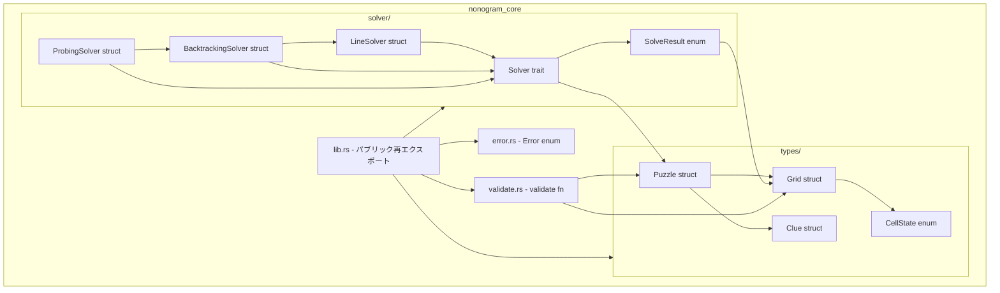
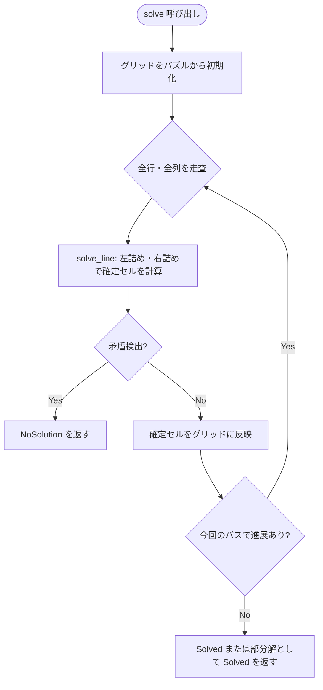
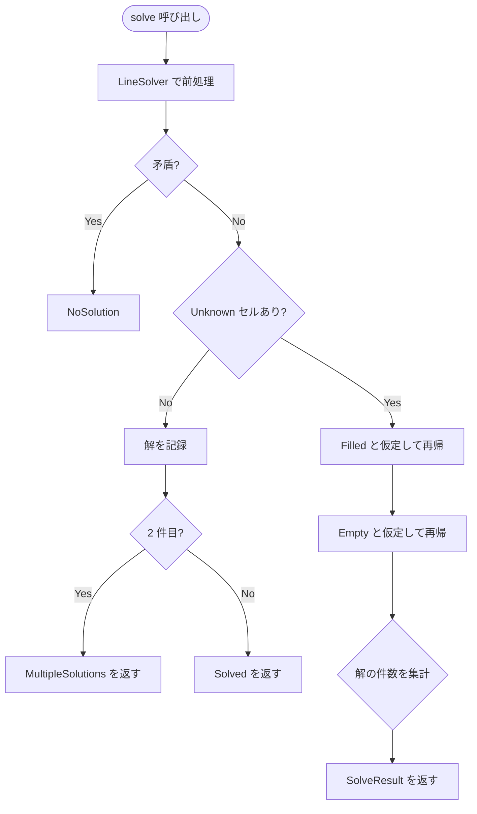
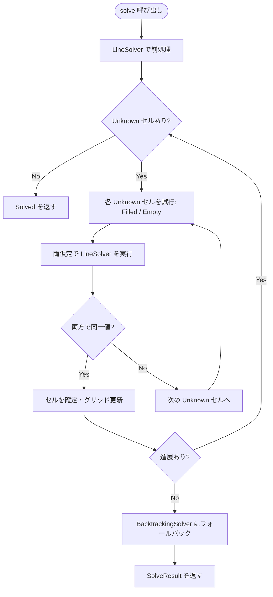

# 技術設計書: nonogram-core

## 概要

`nonogram-core` は、2値（黒白）ノノグラムパズルのソルバエンジンを提供する Rust ライブラリクレートである。本クレートは、パズルの内部データ表現・制約伝播・バックトラッキングによる完全求解・解の検証を責務とし、フォーマット層への依存を持たない。

トレイトベースの `Solver` 設計により、LineSolver・BacktrackingSolver・ProbingSolver の各アルゴリズムを統一インターフェースで交換・合成できる。外部クレート依存ゼロで実装し、Rust 2024 edition に準拠する。

本ライブラリは `nonogram-wasm`・`apps/cli`・`apps/desktop` から参照されるが、`nonogram-format` への依存は禁止される。

### ゴール

- 型安全なパズルデータ型（`Grid`・`Clue`・`Puzzle`）の提供
- 統一された `Solver` トレイトによるアルゴリズムの交換可能性
- 制約伝播のみで解けるパズルの高速処理（25×25 以内、500ms）
- 完全求解（解なし・唯一解・複数解の判定）
- パニックのない安全なエラーハンドリング

### 非ゴール

- `nonogram-format` クレートへの依存・JSON 入出力機能
- マルチスレッド並列ソルバ
- 3 値以上のカラーノノグラムのサポート
- WASM バインディング（`nonogram-wasm` クレートの責務）

---

## 要件トレーサビリティ

| 要件 | 概要 | コンポーネント | インターフェース | フロー |
|------|------|--------------|----------------|------|
| 1.1 | Grid 型（3 状態セル） | Grid | `Grid::new` | — |
| 1.2 | Clue 型（ブロック長列） | Clue | `Clue::new` | — |
| 1.3 | Puzzle 型（集約） | Puzzle | `Puzzle::new` | — |
| 1.4 | Puzzle 次元不整合エラー | Puzzle, Error | `Puzzle::new -> Err` | — |
| 1.5 | Clone + Debug | Grid, Clue, Puzzle | derive | — |
| 2.1 | Solver トレイト定義 | Solver | `fn solve` | — |
| 2.2 | SolveResult 型 | SolveResult | enum | — |
| 2.3 | dyn Solver 交換可能性 | Solver | オブジェクト安全 | — |
| 2.4 | 解の整合性保証 | LineSolver, BacktrackingSolver | Solver impl | CP フロー, BT フロー |
| 2.5 | パブリック API ドキュメント | Solver, SolveResult | doc comment | — |
| 3.1 | LineSolver 実装 | LineSolver | Solver impl | CP フロー |
| 3.2 | 行列制約伝播（交差法） | LineSolver | `solve_line` | CP フロー |
| 3.3 | 収束まで反復 | LineSolver | ループ | CP フロー |
| 3.4 | 部分解を Solved で返却 | LineSolver | SolveResult | — |
| 3.5 | 25×25 / 500ms 性能目標 | LineSolver | — | — |
| 4.1 | BacktrackingSolver 実装 | BacktrackingSolver | Solver impl | BT フロー |
| 4.2 | Unknown セル分岐 | BacktrackingSolver | 再帰探索 | BT フロー |
| 4.3 | バックトラック | BacktrackingSolver | 再帰探索 | BT フロー |
| 4.4 | 複数解即座停止 | BacktrackingSolver | SolveResult | BT フロー |
| 4.5 | NoSolution 返却 | BacktrackingSolver | SolveResult | BT フロー |
| 4.6 | 唯一解返却 | BacktrackingSolver | SolveResult | BT フロー |
| 5.1 | ProbingSolver 実装 | ProbingSolver | Solver impl | Probe フロー |
| 5.2 | 試行的制約伝播 | ProbingSolver | `probe` | Probe フロー |
| 5.3 | BacktrackingSolver へのフォールバック | ProbingSolver | 内部移譲 | Probe フロー |
| 5.4 | 完全解返却 | ProbingSolver | SolveResult | — |
| 6.1 | validate 関数 | Validator | `validate` | — |
| 6.2 | Unknown セルで false | Validator | `validate` | — |
| 6.3 | パブリック API | Validator | `pub fn validate` | — |
| 7.1 | Error enum | Error | — | — |
| 7.2 | DimensionMismatch | Error | `Error::DimensionMismatch` | — |
| 7.3 | ClueExceedsLength | Error | `Error::ClueExceedsLength` | — |
| 7.4 | unwrap/expect 禁止 | 全コンポーネント | — | — |
| 8.1 | nonogram-format 非依存 | Cargo.toml | — | — |
| 8.2 | ≥ 80% ラインカバレッジ | テストモジュール | cargo-llvm-cov | — |
| 8.3 | cfg(test) 単体テスト | 各ソースファイル | — | — |
| 8.4 | 警告なしビルド | 全コンポーネント | — | — |
| 8.5 | パブリック API ドキュメント | 全公開型・関数 | doc comment | — |

---

## アーキテクチャ

### アーキテクチャパターンと境界マップ

採用パターン: **階層モジュール構成**（`types/` ・ `solver/` ・ `validate` ・ `error`）。責務を分離し、新しいソルバを `solver/` モジュールに追加するだけで拡張できる設計とする。



**境界の決定**:
- `types/` 層は `solver/` に依存しない（一方向依存）
- `solver/` 内ではより単純なソルバを複合ソルバが内部利用する（LineSolver → BacktrackingSolver → ProbingSolver の委譲チェーン）
- `validate.rs` は独立した純粋関数として分離し、ソルバからも利用可能にする
- ステアリング準拠: `nonogram-format` への依存は `Cargo.toml` レベルで排除

### テクノロジースタック

| レイヤー | 選択 / バージョン | フィーチャーにおける役割 | 備考 |
|---------|-----------------|----------------------|------|
| 言語 | Rust (edition 2024) | 型安全実装、パフォーマンス | ステアリング規定 |
| 依存クレート | なし（std のみ） | ゼロ外部依存 | 要件 8.1 準拠 |
| テストカバレッジ | cargo-llvm-cov | ≥ 80% 目標計測 | CI で使用 |

---

## システムフロー

### CP フロー: LineSolver 制約伝播



**フロー上の決定事項**: 矛盾（有効配置が 0 件）が検出された時点で即座に `NoSolution` を返す。収束後にも Unknown セルが残る場合は部分解として `Solved(grid)` を返す（要件 3.4）。

### BT フロー: BacktrackingSolver バックトラッキング



**フロー上の決定事項**: 各分岐の前に LineSolver を内部呼び出しして探索空間を削減する（要件 4.1）。2 件目の解が見つかった時点で探索を即座に打ち切る（要件 4.4）。

### Probe フロー: ProbingSolver 試行的制約伝播



---

## コンポーネントとインターフェース

### コンポーネントサマリー

| コンポーネント | 層 | 責務 | 要件カバレッジ | 主要依存 | コントラクト |
|-------------|---|------|--------------|---------|------------|
| CellState | types | セル状態の3値表現 | 1.1 | — | State |
| Grid | types | M×N 盤面の管理 | 1.1, 1.5 | CellState | State |
| Clue | types | ブロック長列の管理 | 1.2, 1.5 | Error | Service |
| Puzzle | types | パズル集約 | 1.3, 1.4, 1.5 | Grid, Clue, Error | Service |
| Error | error | エラー種別定義 | 7.1, 7.2, 7.3 | — | — |
| Solver | solver | ソルバ統一トレイト | 2.1, 2.3, 2.4, 2.5 | Puzzle, SolveResult | Service |
| SolveResult | solver | 求解結果の表現 | 2.2 | Grid | State |
| LineSolver | solver | 制約伝播ソルバ | 3.1–3.5 | Puzzle, Grid, Clue | Service |
| BacktrackingSolver | solver | バックトラッキングソルバ | 4.1–4.6 | LineSolver, Puzzle | Service |
| ProbingSolver | solver | 試行制約伝播ソルバ | 5.1–5.4 | BacktrackingSolver | Service |
| Validator | validate | 解の整合性検証 | 6.1–6.3 | Puzzle, Grid | Service |

---

### データ型層 (types/)

#### CellState

| フィールド | 詳細 |
|----------|------|
| 責務 | ノノグラムセルの3状態を表す列挙型 |
| 要件 | 1.1, 1.5 |

**責務と制約**
- `Unknown`・`Filled`・`Empty` の 3 値のみを表現する
- `Clone`・`Debug`・`PartialEq` を derive する

**コントラクト**: State [ x ]

##### 状態モデル

```rust
#[derive(Clone, Debug, PartialEq)]
pub enum CellState {
    Unknown,
    Filled,
    Empty,
}
```

---

#### Grid

| フィールド | 詳細 |
|----------|------|
| 責務 | M×N 盤面の型安全な管理 |
| 要件 | 1.1, 1.5 |

**責務と制約**
- 行数・列数とフラット配列（行優先）でセルを管理する
- 行・列スライスへの読み取り/書き込みアクセサを提供する
- `Clone`・`Debug` を実装する

**依存**
- 外部: `CellState` — セル状態の表現 (P0)

**コントラクト**: Service [ x ] / State [ x ]

##### サービスインターフェース

```rust
impl Grid {
    /// rows × cols の Unknown セルで初期化した Grid を生成する。
    pub fn new(rows: usize, cols: usize) -> Grid;

    /// rows × cols を返す。
    pub fn rows(&self) -> usize;
    pub fn cols(&self) -> usize;

    /// (row, col) のセル状態を返す。境界外は panic を起こさずアクセス不可。
    pub fn get(&self, row: usize, col: usize) -> CellState;

    /// (row, col) のセル状態を設定する。
    pub fn set(&mut self, row: usize, col: usize, state: CellState);

    /// row 番目の行のセル列を返す。
    pub fn row_cells(&self, row: usize) -> Vec<CellState>;

    /// col 番目の列のセル列を返す。
    pub fn col_cells(&self, col: usize) -> Vec<CellState>;
}
```

- **事前条件**: `(row, col)` はそれぞれ `0..rows`・`0..cols` の範囲内
- **不変条件**: 内部フラット配列の長さは常に `rows * cols`

**実装ノート**
- 内部表現: `Vec<CellState>`（行優先）。インデックス計算は `row * cols + col`
- `get`・`set` の境界外アクセスはパニックで良い（APIの事前条件として文書化）

---

#### Clue

| フィールド | 詳細 |
|----------|------|
| 責務 | 1 行/列分のブロック長列を管理 |
| 要件 | 1.2, 1.5, 7.3 |

**責務と制約**
- 1 以上の正整数ブロック長の順序付きリストを保持する
- `line_length` を受け取り、ブロックの合計が線長を超える場合に `Err` を返す
- `Clone`・`Debug` を実装する

**依存**
- 外部: `Error` — 構築エラーの返却 (P0)

**コントラクト**: Service [ x ]

##### サービスインターフェース

```rust
impl Clue {
    /// blocks: ブロック長の順序付きリスト（各値 ≥ 1）。
    /// line_length: この Clue を適用する行/列の長さ。
    /// ブロック合計 + 最小スペースが line_length を超えるとき Err を返す。
    pub fn new(blocks: Vec<u32>, line_length: usize) -> Result<Clue>;

    /// ブロック長列のスライスを返す。
    pub fn blocks(&self) -> &[u32];
}
```

- **事前条件**: `blocks` の各要素は 1 以上
- **不変条件**: `blocks.iter().sum::<u32>() + (blocks.len().saturating_sub(1)) as u32 <= line_length as u32`

---

#### Puzzle

| フィールド | 詳細 |
|----------|------|
| 責務 | Grid + 行クルー列 + 列クルー列を集約するパズル構造 |
| 要件 | 1.3, 1.4, 1.5 |

**責務と制約**
- `Grid` の行数 = `row_clues` の長さ、列数 = `col_clues` の長さを検証する
- 不整合の場合は `Err(Error::DimensionMismatch)` を返す
- `Clone`・`Debug` を実装する

**依存**
- 外部: `Grid` (P0)、`Clue` (P0)、`Error` (P0)

**コントラクト**: Service [ x ]

##### サービスインターフェース

```rust
impl Puzzle {
    /// grid の次元と row_clues / col_clues のリスト長が一致しない場合 Err を返す。
    pub fn new(grid: Grid, row_clues: Vec<Clue>, col_clues: Vec<Clue>) -> Result<Puzzle>;

    pub fn grid(&self) -> &Grid;
    pub fn row_clues(&self) -> &[Clue];
    pub fn col_clues(&self) -> &[Clue];
}
```

---

### エラー層 (error.rs)

#### Error

| フィールド | 詳細 |
|----------|------|
| 責務 | ライブラリ全体のエラー種別を列挙 |
| 要件 | 7.1, 7.2, 7.3 |

**責務と制約**
- パニックを使わず、すべてのエラー条件を表現する
- `std::fmt::Display` と `std::error::Error` を実装する
- `Debug` を derive する

**コントラクト**: State [ x ]

##### エラー定義

```rust
#[derive(Debug)]
pub enum Error {
    /// 行数/列数と対応するクルーリスト長が不一致。
    DimensionMismatch {
        expected: usize,
        actual: usize,
    },
    /// クルーのブロック合計が行/列の長さを超過。
    ClueExceedsLength {
        clue_sum: usize,
        line_length: usize,
    },
}

pub type Result<T> = std::result::Result<T, Error>;
```

---

### ソルバ層 (solver/)

#### Solver トレイトと SolveResult

| フィールド | 詳細 |
|----------|------|
| 責務 | ソルバ統一インターフェースと求解結果の型定義 |
| 要件 | 2.1, 2.2, 2.3, 2.5 |

**責務と制約**
- `Solver` トレイトはオブジェクト安全でなければならない（`dyn Solver` として利用可能）
- `SolveResult` の各バリアントは要件 2.2 の 3 種類に対応する

**コントラクト**: Service [ x ] / State [ x ]

##### サービスインターフェース

```rust
/// A nonogram solver. Implementors must be object-safe (usable as `dyn Solver`).
pub trait Solver {
    /// Solves the given puzzle and returns the result.
    fn solve(&self, puzzle: &Puzzle) -> SolveResult;
}

/// The outcome of a solve attempt.
#[derive(Debug)]
pub enum SolveResult {
    /// The puzzle has exactly one solution.
    Solved(Grid),
    /// The puzzle has multiple solutions; two representative solutions are provided.
    MultipleSolutions(Grid, Grid),
    /// The puzzle has no valid solution.
    NoSolution,
}
```

- **事後条件**: `Solved(grid)` の場合、`grid` はパズルのクルー制約と一致する（`validate` で確認可能）

---

#### LineSolver

| フィールド | 詳細 |
|----------|------|
| 責務 | 行列単位の制約伝播による前処理ソルバ |
| 要件 | 3.1, 3.2, 3.3, 3.4, 3.5 |

**責務と制約**
- `Solver` トレイトを実装する
- 内部ヘルパー `solve_line(line: &[CellState], clue: &Clue) -> Option<Vec<CellState>>` で 1 行/列の確定計算を行う
- 全行・全列を反復し、進展がなくなるまでループする
- 矛盾検出時は即座に `NoSolution` を返す
- 収束後に Unknown が残る場合は部分解として `Solved(grid)` を返す

**依存**
- 外部: `Puzzle` (P0)、`Grid` (P0)、`Clue` (P0)

**コントラクト**: Service [ x ]

##### サービスインターフェース

```rust
/// Constraint-propagation-only solver. Operates line by line.
pub struct LineSolver;

impl Solver for LineSolver {
    fn solve(&self, puzzle: &Puzzle) -> SolveResult;
}

impl LineSolver {
    /// Computes the intersection of all valid arrangements for a single line.
    /// Returns None if no valid arrangement exists (contradiction).
    pub(crate) fn solve_line(line: &[CellState], clue: &Clue) -> Option<Vec<CellState>>;
}
```

**実装ノート**
- `solve_line` は左詰め・右詰めアルゴリズム（Overlap 法）を使用する（詳細は `research.md` 参照）
- パフォーマンス目標: 25×25 パズルを debug ビルド・シングルスレッドで 500ms 以内（要件 3.5）

---

#### BacktrackingSolver

| フィールド | 詳細 |
|----------|------|
| 責務 | 制約伝播を前処理として組み合わせた完全求解ソルバ |
| 要件 | 4.1, 4.2, 4.3, 4.4, 4.5, 4.6 |

**責務と制約**
- `Solver` トレイトを実装する
- 各分岐前に `LineSolver` を内部呼び出しして探索空間を削減する
- Unknown セルを発見した場合、`Filled`・`Empty` の 2 分岐を再帰的に探索する
- 2 件目の解が見つかった時点で探索を即座に打ち切る

**依存**
- 外部: `LineSolver` (P0)、`Puzzle` (P0)、`Grid` (P0)

**コントラクト**: Service [ x ]

##### サービスインターフェース

```rust
/// Complete solver using backtracking with constraint propagation at each node.
pub struct BacktrackingSolver;

impl Solver for BacktrackingSolver {
    fn solve(&self, puzzle: &Puzzle) -> SolveResult;
}
```

**実装ノート**
- 内部探索関数: `fn search(puzzle: &Puzzle, grid: Grid, found: &mut Vec<Grid>) -> bool` — `found` が 2 件になった時点で `true`（早期終了）を返す
- グリッドの clone コストに注意。バックトラック時に Grid を clone して分岐ごとに独立したコピーを使用する

---

#### ProbingSolver

| フィールド | 詳細 |
|----------|------|
| 責務 | 試行的制約伝播（プロービング）＋バックトラッキングの複合ソルバ |
| 要件 | 5.1, 5.2, 5.3, 5.4 |

**責務と制約**
- `Solver` トレイトを実装する
- 各 Unknown セルについて、`Filled`・`Empty` の両仮定で `LineSolver` を実行し、両仮定で同一値となるセルを確定させる
- プロービングで進展がなくなった場合は `BacktrackingSolver` にフォールバックする

**依存**
- 外部: `LineSolver` (P0)、`BacktrackingSolver` (P0)、`Puzzle` (P0)

**コントラクト**: Service [ x ]

##### サービスインターフェース

```rust
/// Solver that applies probing (lookahead constraint propagation) before falling back to backtracking.
pub struct ProbingSolver;

impl Solver for ProbingSolver {
    fn solve(&self, puzzle: &Puzzle) -> SolveResult;
}
```

---

### 検証層 (validate.rs)

#### Validator

| フィールド | 詳細 |
|----------|------|
| 責務 | ソルバが返したグリッドとクルーの整合性を検証するパブリック関数 |
| 要件 | 6.1, 6.2, 6.3 |

**責務と制約**
- `grid` に `Unknown` セルが 1 つでも存在する場合は `false` を返す
- 全行・全列がそれぞれ対応するクルーを満たす場合のみ `true` を返す
- パブリック API として公開する

**コントラクト**: Service [ x ]

##### サービスインターフェース

```rust
/// Returns true if and only if every row and column in `grid` satisfies
/// the corresponding clue in `puzzle`, and `grid` contains no Unknown cells.
pub fn validate(puzzle: &Puzzle, grid: &Grid) -> bool;
```

- **事前条件**: `puzzle` と `grid` の次元が一致していること（一致しない場合の動作は未定義）
- **事後条件**: `true` のとき、`grid` の全セルは `Filled` または `Empty` であり、各行・列のブロックパターンがクルーと一致する

---

## データモデル

### ドメインモデル

```mermaid
erDiagram
    Puzzle {
        Grid grid
        Vec_Clue row_clues
        Vec_Clue col_clues
    }
    Grid {
        usize rows
        usize cols
        Vec_CellState cells
    }
    Clue {
        Vec_u32 blocks
    }
    CellState {
        Unknown
        Filled
        Empty
    }
    SolveResult {
        Solved
        MultipleSolutions
        NoSolution
    }

    Puzzle ||--|| Grid : contains
    Puzzle ||--o{ Clue : row_clues
    Puzzle ||--o{ Clue : col_clues
    Grid ||--o{ CellState : cells
    SolveResult ||--o| Grid : Solved
    SolveResult ||--o{ Grid : MultipleSolutions
```

**不変条件**:
- `Grid.cells.len() == rows * cols`
- `Puzzle.row_clues.len() == grid.rows()`
- `Puzzle.col_clues.len() == grid.cols()`
- `Clue.blocks` の各要素 ≥ 1

---

## エラーハンドリング

### エラー戦略

`nonogram-core` はパニックを使用しない。ライブラリコードパスでの `unwrap()` / `expect()` は禁止（要件 7.4）。すべてのエラーは `Result<T, Error>` で伝播する。

### エラーカテゴリと対応

| エラー | 発生箇所 | 原因 | 呼び出し元への応答 |
|-------|---------|------|-----------------|
| `Error::DimensionMismatch` | `Puzzle::new` | 行数/列数とクルーリスト長の不一致 | `Err` を返す。呼び出し元がクルーリストの長さを修正すべき |
| `Error::ClueExceedsLength` | `Clue::new` | ブロック合計 > 行/列の長さ | `Err` を返す。呼び出し元がクルーまたは盤面サイズを修正すべき |
| `NoSolution` (SolveResult) | ソルバ内部 | パズルに有効な解が存在しない | `SolveResult::NoSolution` を返す。エラー型ではなく正常な求解結果 |

### モニタリング

エラーロギングはライブラリ層の責務外とする。呼び出し元（`apps/cli` 等）がエラーを受け取り適切に記録・表示する。

---

## テスト戦略

### 単体テスト（各ソースファイル内 `#[cfg(test)]`）

- `CellState`: バリアント比較、Clone 動作確認
- `Grid::new` / `get` / `set` / `row_cells` / `col_cells`: 正常系・境界値
- `Clue::new`: ブロック合計超過でのエラー返却
- `Puzzle::new`: 次元不整合エラー、正常構築
- `LineSolver::solve_line`: 空クルー・単一ブロック・複数ブロック・部分確定ケース
- `LineSolver::solve`: 単純パズルの完全解決、部分解返却、矛盾検出
- `BacktrackingSolver::solve`: 唯一解・複数解・解なしの各ケース
- `ProbingSolver::solve`: プロービングで確定セルが増加するケース
- `validate`: 完全解 → true、部分解 → false、クルー違反 → false

### 統合テスト

- LineSolver → BacktrackingSolver の委譲フロー（LineSolver が部分解を返した後に BacktrackingSolver が完全解を求める）
- ProbingSolver → BacktrackingSolver のフォールバックフロー
- 複数解パズルでの `MultipleSolutions` 返却

### パフォーマンステスト

- LineSolver: 25×25 パズル（最悪ケース）を debug ビルドで 500ms 以内に処理（要件 3.5）
- BacktrackingSolver: 代表的な 15×15 難解パズルでの実用的な求解時間を確認

---

## オプションセクション

### パフォーマンスと拡張性

- **目標メトリクス**: LineSolver が 25×25 パズルを debug ビルド・シングルスレッドで 500ms 以内（要件 3.5）
- **Overlap 法の計算量**: O(行数 × 列数 × ブロック数) = 25×25×25 = 15,625 操作/反復。実用上数十反復以内で収束
- **メモリ**: Grid は `usize * 2 + Vec<CellState>`。25×25 = 625 バイト（CellState が 1 バイト enumの場合）。バックトラッキング時の clone コストは許容範囲
- **将来の拡張**: マルチスレッド探索（`rayon` 等）は本フィーチャーの非ゴールだが、`Solver` トレイトの `&self` シグネチャにより将来的な実装が阻害されない
