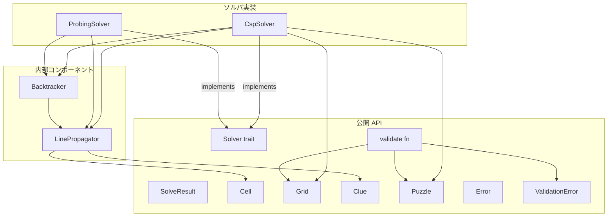
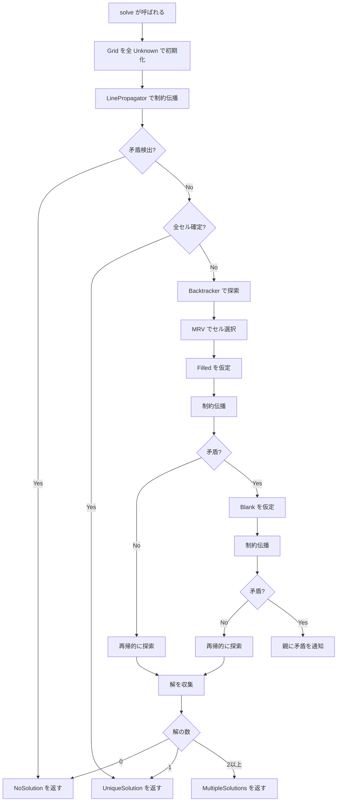
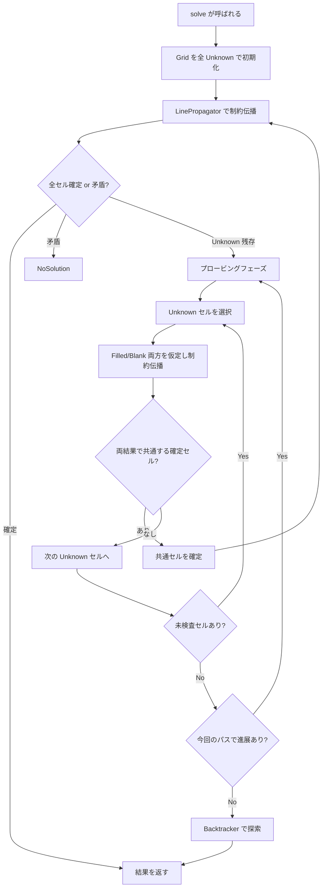
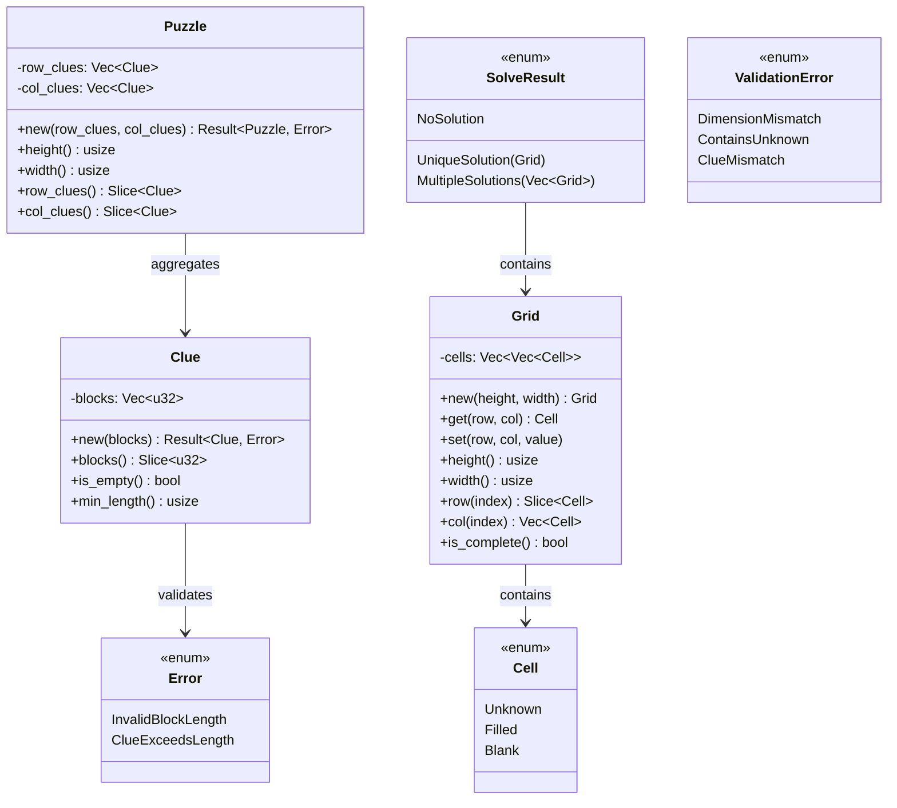

# 技術設計書: nonogram-core

## Overview

**目的**: `nonogram-core` は2値ノノグラムパズルの完全求解エンジンを提供する Rust ライブラリクレートである。パズルの内部表現・制約伝播・網羅的探索・解の判定を、フォーマット層に依存しない純粋なドメインロジックとして実装する。

**対象ユーザー**: ソルバ利用者（CLI/Web/デスクトップアプリ経由）およびソルバアルゴリズム研究者が、統一された `Solver` トレイトを通じてパズルを求解し、新しいアルゴリズムを追加する。

**影響**: 新規クレートの構築（グリーンフィールド）。既存の placeholder コードを完全に置き換える。

### ゴール
- 型安全なパズルデータ表現（Cell, Grid, Clue, Puzzle）を提供する
- `Solver` トレイトによる統一的な求解インターフェースを定義する
- CspSolver による完全求解（唯一解・複数解・解なしの判定）を実現する
- ProbingSolver による高度な求解（オプション）を提供する
- 外部依存ゼロで、`nonogram-format` に依存しない独立クレートとして構築する

### 非ゴール
- JSON フォーマットの入出力（`nonogram-format` の責務）
- WASM バインディング（`nonogram-wasm` の責務）
- GUI/CLI のユーザーインターフェース（`apps/` の責務）
- マルチカラーノノグラムへの対応
- マルチスレッド並列化（将来の拡張）

## Architecture

> 調査の詳細は `research.md` を参照。本セクションでは設計判断と構造を記述する。

### Architecture Pattern & Boundary Map

**選択パターン**: レイヤードアーキテクチャ（データ型層 → 内部コンポーネント層 → ソルバ層 → 公開 API 層）

**ドメイン境界**:
- **公開 API**: `Cell`, `Grid`, `Clue`, `Puzzle`, `Solver`, `SolveResult`, `Error`, `ValidationError`, `validate`
- **内部コンポーネント**: `LinePropagator`, `Backtracker`（`pub(crate)` で非公開）
- **ソルバ実装**: `CspSolver`, `ProbingSolver`（公開、`Solver` トレイト実装）

**既存パターンの遵守**:
- `mod.rs` を使わない現代的 Rust モジュール構成（steering `tech.md`）
- `...Solver` サフィックスは `Solver` トレイト実装型のみ（`docs/naming-conventions.md`）
- `nonogram-format` への依存禁止（steering `structure.md`）



### Technology Stack

| レイヤー | 選択 / バージョン | 本機能での役割 | 備考 |
|---|---|---|---|
| 言語 | Rust (edition 2024) | クレート全体の実装言語 | steering 準拠 |
| ランタイム | std のみ | 標準ライブラリのみ使用 | 外部依存ゼロ |
| テスト | `#[cfg(test)]` + `cargo test` | 各モジュール内の単体テスト | steering 準拠 |
| カバレッジ | `cargo-llvm-cov` | 行カバレッジ ≥ 80% の検証 | CI で計測 |

## System Flows

### CspSolver 求解フロー



**主要な判断ポイント**:
- 制約伝播でフィックスポイントに到達した後に完全性を判定
- バックトラッキングは2件目の解を発見した時点で即座に打ち切り
- MRV ヒューリスティックにより最も制約の強いセルを優先選択

### ProbingSolver 求解フロー



## Requirements Traceability

| 要件 | 概要 | コンポーネント | インターフェース | フロー |
|---|---|---|---|---|
| 1.1 | Cell enum（Unknown, Filled, Blank） | Cell | — | — |
| 1.2 | Grid 型（M×N 盤面） | Grid | Grid API | — |
| 1.3 | Clue 型（ブロック長列） | Clue | Clue API | — |
| 1.4 | Puzzle 型（行/列クルー集約） | Puzzle | Puzzle::new | — |
| 1.5 | 不整合次元でエラー | Puzzle, Error | Puzzle::new → Error | — |
| 1.6 | コア型に Clone, Debug 実装 | Cell, Grid, Clue, Puzzle | derive マクロ | — |
| 1.7 | ゼロブロック長でエラー | Clue, Error | Clue::new → Error | — |
| 2.1 | Solver トレイト定義 | Solver | solve メソッド | — |
| 2.2 | SolveResult 型定義 | SolveResult | — | — |
| 2.3 | solve は完全解のみ返す保証 | Solver, CspSolver, ProbingSolver | — | CspSolver フロー |
| 2.4 | dyn Solver での交換可能利用 | Solver | トレイトオブジェクト | — |
| 2.5 | 公開 API の英語ドキュメント | 全公開型 | doc comments | — |
| 3.1 | LinePropagator（非公開、非 Solver） | LinePropagator | solve_line, propagate | — |
| 3.2 | 有効配置の交差集合で確定セル計算 | LinePropagator | solve_line | CspSolver フロー |
| 3.3 | フィックスポイント反復 | LinePropagator | propagate | CspSolver フロー |
| 3.4 | 矛盾検出時のシグナル | LinePropagator | Result 型 | CspSolver フロー |
| 3.5 | 25×25 で 500ms 以内 | LinePropagator | — | — |
| 4.1 | CspSolver（Solver 実装） | CspSolver | solve | CspSolver フロー |
| 4.2 | 制約伝播を先行実行 | CspSolver, LinePropagator | — | CspSolver フロー |
| 4.3 | MRV による未確定セル選択 | Backtracker | select_cell | CspSolver フロー |
| 4.4 | 矛盾時のバックトラック | Backtracker | search | CspSolver フロー |
| 4.5 | 2件目の解で探索停止 | Backtracker | search | CspSolver フロー |
| 4.6 | 全分岐探索後に NoSolution | CspSolver, Backtracker | — | CspSolver フロー |
| 4.7 | 唯一解で UniqueSolution | CspSolver | — | CspSolver フロー |
| 4a.1 | Backtracker（非公開、非 Solver） | Backtracker | — | — |
| 4a.2 | グリッドスナップショット | Backtracker | Grid::clone | CspSolver フロー |
| 4a.3 | 矛盾時のロールバック | Backtracker | search | CspSolver フロー |
| 4a.4 | 制約伝播との協調 | Backtracker, LinePropagator | — | CspSolver フロー |
| 4a.5 | 2件目の解で早期停止 | Backtracker | search | CspSolver フロー |
| 5.1 | ProbingSolver（Solver 実装） | ProbingSolver | solve | ProbingSolver フロー |
| 5.2 | 両仮定で共通するセルを確定 | ProbingSolver | probe | ProbingSolver フロー |
| 5.3 | プロービング反復 | ProbingSolver | — | ProbingSolver フロー |
| 5.4 | 進展なし時にバックトラッキング移行 | ProbingSolver, Backtracker | — | ProbingSolver フロー |
| 5.5 | 完全な SolveResult 返却 | ProbingSolver | solve | ProbingSolver フロー |
| 6.1 | validate 関数（Result 返却） | validate | validate fn | — |
| 6.2 | サイズ不一致で DimensionMismatch | validate, ValidationError | validate fn | — |
| 6.3 | Unknown セル含有で ContainsUnknown | validate, ValidationError | validate fn | — |
| 6.4 | クルー不一致で ClueMismatch | validate, ValidationError | validate fn | — |
| 6.5 | 公開 API として公開 | validate | pub fn | — |
| 7.1 | Error enum 定義 | Error | — | — |
| 7.2 | InvalidBlockLength エラー | Error, Clue | Clue::new | — |
| 7.3 | ClueExceedsLength エラー | Error, Puzzle | Puzzle::new | — |
| 7.4 | ValidationError enum 定義 | ValidationError | — | — |
| 7.5 | unwrap/expect 不使用 | 全モジュール | — | — |
| 8.1 | nonogram-format 非依存 | Cargo.toml | — | — |
| 8.2 | 行カバレッジ ≥ 80% | テスト全体 | — | — |
| 8.3 | #[cfg(test)] 内の単体テスト | 各ソースファイル | — | — |
| 8.4 | 警告なしコンパイル | 全モジュール | — | — |
| 8.5 | 公開 API の英語ドキュメント | 全公開型 | doc comments | — |

## Components and Interfaces

| コンポーネント | ドメイン/レイヤー | 意図 | 要件カバレッジ | 主要依存 | コントラクト |
|---|---|---|---|---|---|
| Cell | データ型 | セル状態の表現 | 1.1, 1.6 | — | — |
| Grid | データ型 | M×N 盤面の管理 | 1.2, 1.6 | Cell | Service |
| Clue | データ型 | 行/列のヒント表現 | 1.3, 1.6, 1.7 | Error | Service |
| Puzzle | データ型 | パズル全体の集約 | 1.4, 1.5, 1.6 | Clue, Error | Service |
| Error | エラー | 構築時エラー条件の表現 | 7.1, 7.2, 7.3 | — | — |
| ValidationError | エラー | 検証時エラー条件の表現 | 7.4 | — | — |
| Solver | トレイト | 求解インターフェース | 2.1, 2.2, 2.3, 2.4, 2.5 | Puzzle, SolveResult | Service |
| SolveResult | データ型 | 求解結果の表現 | 2.2, 2.3 | Grid | — |
| LinePropagator | 内部コンポーネント | 制約伝播エンジン | 3.1〜3.5 | Cell, Clue, Grid | Service |
| Backtracker | 内部コンポーネント | バックトラッキング探索 | 4a.1〜4a.5 | Grid, LinePropagator | Service |
| CspSolver | ソルバ | CSP 完全求解 | 4.1〜4.7 | LinePropagator, Backtracker (P0) | Service |
| ProbingSolver | ソルバ | 高度完全求解 | 5.1〜5.5 | LinePropagator, Backtracker (P0) | Service |
| validate | 公開関数 | 解の検証 | 6.1〜6.5 | Puzzle, Grid, ValidationError | Service |

### データ型層

#### Cell

| フィールド | 詳細 |
|---|---|
| 意図 | セルの3状態（Unknown, Filled, Blank）を型安全に表現 |
| 要件 | 1.1, 1.6 |

**責務と制約**
- 3バリアントの enum として定義
- `Copy` セマンティクスを持つ値型

**コントラクト**: なし（derive のみ）

```rust
#[derive(Clone, Copy, Debug, PartialEq, Eq, Hash)]
pub enum Cell {
    Unknown,
    Filled,
    Blank,
}
```

#### Grid

| フィールド | 詳細 |
|---|---|
| 意図 | M×N の盤面を管理し、行/列単位のアクセスを提供 |
| 要件 | 1.2, 1.6 |

**責務と制約**
- 盤面サイズは構築時に確定し不変
- 行優先の `Vec<Vec<Cell>>` で内部表現（`research.md` 決定参照）
- 行スライスは直接参照、列アクセスは `Vec<Cell>` を生成

**依存**
- Inbound: Solver 実装, Backtracker, validate — 盤面の読み書き (P0)

**コントラクト**: Service

##### Service Interface

```rust
#[derive(Clone, Debug, PartialEq, Eq)]
pub struct Grid { /* fields private */ }

impl Grid {
    /// Creates a new grid with all cells set to `Unknown`.
    pub fn new(height: usize, width: usize) -> Self;

    /// Returns the cell value at the given position.
    ///
    /// # Panics
    /// Panics if `row >= height` or `col >= width`.
    pub fn get(&self, row: usize, col: usize) -> Cell;

    /// Sets the cell value at the given position.
    ///
    /// # Panics
    /// Panics if `row >= height` or `col >= width`.
    pub fn set(&mut self, row: usize, col: usize, value: Cell);

    /// Returns the number of rows.
    pub fn height(&self) -> usize;

    /// Returns the number of columns.
    pub fn width(&self) -> usize;

    /// Returns a reference to the specified row.
    pub fn row(&self, index: usize) -> &[Cell];

    /// Returns a copy of the specified column as a `Vec<Cell>`.
    pub fn col(&self, index: usize) -> Vec<Cell>;

    /// Returns `true` if no cell is `Unknown`.
    pub fn is_complete(&self) -> bool;
}
```

- 前提条件: `row` < `height`, `col` < `width`（境界外アクセスは panic）
- 事後条件: `set` 後、同座標の `get` は設定した値を返す
- 不変条件: `height` と `width` は構築後に変化しない

#### Clue

| フィールド | 詳細 |
|---|---|
| 意図 | 行/列のヒント（ブロック長の列）を表現 |
| 要件 | 1.3, 1.6, 1.7 |

**責務と制約**
- 空の列はブランク行/列を表す
- ブロック長は正の整数のみ（ゼロは `Error::InvalidBlockLength` で拒否）

**依存**
- Outbound: Error — バリデーション結果 (P0)

**コントラクト**: Service

##### Service Interface

```rust
#[derive(Clone, Debug, PartialEq, Eq)]
pub struct Clue { /* fields private */ }

impl Clue {
    /// Creates a new clue from a sequence of block lengths.
    ///
    /// # Errors
    /// - `Error::InvalidBlockLength` if any block length is zero.
    pub fn new(blocks: Vec<u32>) -> Result<Self, Error>;

    /// Returns the block lengths.
    pub fn blocks(&self) -> &[u32];

    /// Returns `true` if the clue has no blocks (fully blank line).
    pub fn is_empty(&self) -> bool;

    /// Returns the minimum line length required to satisfy this clue.
    /// (sum of block lengths + mandatory gaps between blocks)
    pub fn min_length(&self) -> usize;
}
```

- 前提条件: なし（空ベクタも有効）
- 事後条件: `Ok` の場合、全ブロック長が 1 以上。`min_length` = blocks の合計 + max(0, block 数 - 1)

#### Puzzle

| フィールド | 詳細 |
|---|---|
| 意図 | パズル全体（行クルー + 列クルー）を集約し、構築時に整合性を検証 |
| 要件 | 1.4, 1.5, 1.6 |

**責務と制約**
- 盤面サイズは行クルー数 × 列クルー数で導出
- 構築時にクルーの整合性を検証（DimensionMismatch, ClueExceedsLength）

**依存**
- Outbound: Clue — ブロック情報の保持 (P0)
- Outbound: Error — バリデーション結果 (P0)

**コントラクト**: Service

##### Service Interface

```rust
#[derive(Clone, Debug)]
pub struct Puzzle { /* fields private */ }

impl Puzzle {
    /// Creates a new puzzle from row and column clues.
    ///
    /// # Errors
    /// - `Error::ClueExceedsLength` if any clue's minimum length exceeds
    ///   the corresponding line length.
    pub fn new(row_clues: Vec<Clue>, col_clues: Vec<Clue>) -> Result<Self, Error>;

    /// Returns the number of rows (height).
    pub fn height(&self) -> usize;

    /// Returns the number of columns (width).
    pub fn width(&self) -> usize;

    /// Returns the row clues.
    pub fn row_clues(&self) -> &[Clue];

    /// Returns the column clues.
    pub fn col_clues(&self) -> &[Clue];
}
```

- 前提条件: `row_clues` と `col_clues` は非空（0×N, M×0 パズルはエラー）
- 事後条件: `height()` = `row_clues.len()`, `width()` = `col_clues.len()`
- 不変条件: すべての行クルーの `min_length()` ≤ `width()`, すべての列クルーの `min_length()` ≤ `height()`

**実装メモ**
- `Puzzle::new` は全クルーの `min_length()` を検証し、超過があれば `Error::ClueExceedsLength` を返す

### エラー層

#### Error

| フィールド | 詳細 |
|---|---|
| 意図 | ライブラリの全エラー条件をパニックなしで表現 |
| 要件 | 7.1, 7.2, 7.3, 7.5 |

**責務と制約**
- `std::fmt::Display` と `std::error::Error` を手動実装
- 外部依存なし

**コントラクト**: なし（データ型のみ）

```rust
#[derive(Clone, Debug, PartialEq, Eq)]
pub enum Error {
    /// A block length of zero was provided when constructing a `Clue`.
    InvalidBlockLength {
        block_index: usize,
    },
    /// A clue's minimum length exceeds the line length.
    ClueExceedsLength {
        line_index: usize,
        clue_min_length: usize,
        line_length: usize,
    },
}

impl std::fmt::Display for Error { /* ... */ }
impl std::error::Error for Error {}
```

### ソルバインターフェース層

#### Solver トレイト / SolveResult

| フィールド | 詳細 |
|---|---|
| 意図 | 完全求解の統一インターフェースと結果型を定義 |
| 要件 | 2.1, 2.2, 2.3, 2.4, 2.5 |

**責務と制約**
- オブジェクト安全（`dyn Solver` で利用可能）
- `solve` は常に完全な `SolveResult` を返し、`Unknown` セルを含む Grid を解として返さない

**コントラクト**: Service

##### Service Interface

```rust
/// The result of solving a nonogram puzzle.
#[derive(Clone, Debug)]
pub enum SolveResult {
    /// No valid solution exists.
    NoSolution,
    /// Exactly one solution exists.
    UniqueSolution(Grid),
    /// Two or more solutions exist; representative examples are provided.
    MultipleSolutions(Vec<Grid>),
}

/// A solver that fully solves a nonogram puzzle.
///
/// All implementations guarantee that `solve` returns a complete result
/// and never returns a grid containing `Unknown` cells as a solution.
pub trait Solver {
    /// Solves the given puzzle and returns the result.
    fn solve(&self, puzzle: &Puzzle) -> SolveResult;
}
```

- 前提条件: `puzzle` は `Puzzle::new` で正常に構築された有効なパズル
- 事後条件: 返却される Grid には `Unknown` セルが含まれない
- 不変条件: `MultipleSolutions` のベクタは常に2要素以上

### 内部コンポーネント層

#### LinePropagator

| フィールド | 詳細 |
|---|---|
| 意図 | 行/列単位の制約伝播を DP で実行し、確定セルを計算 |
| 要件 | 3.1, 3.2, 3.3, 3.4, 3.5 |

**責務と制約**
- `pub(crate)` — 外部公開しない
- `Solver` トレイトを実装しない
- 2パス DP（フォワード/バックワード）で全有効配置の交差集合を計算
- 全行/列を反復しフィックスポイントまでループ

**依存**
- Inbound: CspSolver, ProbingSolver, Backtracker — 制約伝播の呼び出し (P0)
- Outbound: Cell, Clue, Grid — データの読み書き (P0)

**コントラクト**: Service

##### Service Interface

```rust
/// Crate-internal line constraint propagator.
pub(crate) struct LinePropagator;

impl LinePropagator {
    /// Solves a single line and returns the updated cells.
    ///
    /// Returns `Err(Contradiction)` if no valid arrangement exists.
    pub(crate) fn solve_line(
        line: &[Cell],
        clue: &Clue,
    ) -> Result<Vec<Cell>, Contradiction>;

    /// Runs constraint propagation on the entire grid until fixpoint.
    ///
    /// Returns `Ok(changed)` where `changed` is `true` if any cell was
    /// updated, or `Err(Contradiction)` if an inconsistency is detected.
    pub(crate) fn propagate(
        grid: &mut Grid,
        puzzle: &Puzzle,
    ) -> Result<bool, Contradiction>;
}

/// Signals that constraint propagation found an inconsistency.
pub(crate) struct Contradiction;
```

- 前提条件: `line.len()` はクルーに対応する行/列の長さと一致
- 事後条件: 返却されたセル列で `Filled`/`Blank` のセルは全有効配置で共通
- 不変条件: `propagate` はフィックスポイントに到達するまで反復

**実装メモ**
- `solve_line` の DP アルゴリズム: フォワードパスで各ブロックの「ここまでに配置可能か」を計算、バックワードパスで同様に計算。両パスの結果から各セル位置が全配置で共通する値を導出
- パフォーマンス: O(k × L) per line（k=ブロック数, L=行長）。25×25 パズルの全行/列反復でも数ms 以内

#### Backtracker

| フィールド | 詳細 |
|---|---|
| 意図 | 網羅的探索（仮説→矛盾検出→ロールバック）の共通ロジック |
| 要件 | 4a.1, 4a.2, 4a.3, 4a.4, 4a.5 |

**責務と制約**
- `pub(crate)` — 外部公開しない
- `Solver` トレイトを実装しない
- `Grid::clone()` でスナップショットを管理
- MRV ヒューリスティックでセル選択
- 2件目の解発見時に早期停止を許可

**依存**
- Inbound: CspSolver, ProbingSolver — 探索の呼び出し (P0)
- Outbound: LinePropagator — 仮説後の制約伝播 (P0)
- Outbound: Grid — 状態管理 (P0)

**コントラクト**: Service

##### Service Interface

```rust
/// Crate-internal backtracking search engine.
pub(crate) struct Backtracker;

impl Backtracker {
    /// Performs exhaustive search on the given grid.
    ///
    /// Collects solutions into `solutions`. Stops early when
    /// `solutions.len() >= max_solutions`.
    ///
    /// Returns `Ok(())` on normal completion or early stop.
    pub(crate) fn search(
        grid: &Grid,
        puzzle: &Puzzle,
        solutions: &mut Vec<Grid>,
        max_solutions: usize,
    ) -> Result<(), Contradiction>;
}
```

- 前提条件: `grid` は制約伝播済みの状態（Unknown セルが残存する可能性あり）
- 事後条件: `solutions` に発見された解が追加される。各解に `Unknown` セルは含まれない
- 不変条件: `max_solutions` に達した時点で探索を停止

**実装メモ**
- MRV ヒューリスティック: 各 Unknown セルについて、そのセルを含む行と列の Unknown セル数の合計を計算し、最小値のセルを選択
- スナップショット: `Grid::clone()` で仮説前の状態を保存。矛盾時に復元
- 各仮説（Filled/Blank）設定後に `LinePropagator::propagate()` を呼び出し

### ソルバ実装層

#### CspSolver

| フィールド | 詳細 |
|---|---|
| 意図 | 制約伝播 + バックトラッキングによる完全求解 |
| 要件 | 4.1, 4.2, 4.3, 4.4, 4.5, 4.6, 4.7 |

**責務と制約**
- `Solver` トレイトを実装
- 初回の制約伝播で探索空間を縮小してからバックトラッキング
- `max_solutions = 2` でバックトラッキングを呼び出し（2件目で打ち切り）

**依存**
- Outbound: LinePropagator — 制約伝播 (P0)
- Outbound: Backtracker — 網羅的探索 (P0)

**コントラクト**: Service（`Solver` トレイト実装）

##### Service Interface

```rust
/// A complete solver using constraint satisfaction (constraint propagation
/// + backtracking search).
pub struct CspSolver;

impl Solver for CspSolver {
    fn solve(&self, puzzle: &Puzzle) -> SolveResult;
}
```

**実装メモ**
- `solve` の手順: (1) 全 Unknown の Grid 生成 → (2) `LinePropagator::propagate` → (3) 完全ならば `UniqueSolution` → (4) 矛盾ならば `NoSolution` → (5) Unknown 残存ならば `Backtracker::search(max_solutions=2)` → (6) 解数に応じて `SolveResult` を返す

#### ProbingSolver

| フィールド | 詳細 |
|---|---|
| 意図 | プロービング技法による高度な完全求解 |
| 要件 | 5.1, 5.2, 5.3, 5.4, 5.5 |

**責務と制約**
- `Solver` トレイトを実装
- 3フェーズ: 制約伝播 → プロービングループ → バックトラッキング
- プロービング: 各 Unknown セルに Filled/Blank を仮定し制約伝播を実行、両仮定で共通するセルを確定

**依存**
- Outbound: LinePropagator — 制約伝播 (P0)
- Outbound: Backtracker — 網羅的探索 (P0)

**コントラクト**: Service（`Solver` トレイト実装）

##### Service Interface

```rust
/// A complete solver that uses probing to reduce the search space
/// before falling back to backtracking.
pub struct ProbingSolver;

impl Solver for ProbingSolver {
    fn solve(&self, puzzle: &Puzzle) -> SolveResult;
}
```

**実装メモ**
- プロービングの手順: (1) Unknown セルを走査 → (2) Filled を仮定して制約伝播 → (3) Blank を仮定して制約伝播 → (4) 両結果で同一値のセルを確定 → (5) 確定セルがある限り反復 → (6) 進展なしならバックトラッキングに移行

### 公開関数

#### validate

| フィールド | 詳細 |
|---|---|
| 意図 | ソルバの解がクルーと矛盾しないことを検証 |
| 要件 | 6.1, 6.2, 6.3, 6.4, 6.5 |

**依存**
- Outbound: ValidationError — 検証エラーの報告 (P0)

**コントラクト**: Service

##### Service Interface

```rust
/// Validates that every row and column in `grid` satisfies the
/// corresponding clue in `puzzle`.
///
/// # Errors
/// - `ValidationError::DimensionMismatch` if grid dimensions differ from puzzle.
/// - `ValidationError::ContainsUnknown` if any cell is `Unknown`.
/// - `ValidationError::ClueMismatch` if a row or column does not match its clue.
pub fn validate(puzzle: &Puzzle, grid: &Grid) -> Result<(), ValidationError>;
```

- 前提条件: なし（すべての不正入力をエラーとして報告）
- 事後条件: `Ok(())` はすべての行/列がクルーに完全一致することを保証

#### ValidationError

| フィールド | 詳細 |
|---|---|
| 意図 | validate 関数の検証エラーを詳細に報告 |
| 要件 | 7.4 |

**コントラクト**: なし（データ型のみ）

```rust
#[derive(Clone, Debug, PartialEq, Eq)]
pub enum ValidationError {
    /// Grid dimensions do not match puzzle dimensions.
    DimensionMismatch {
        expected_height: usize,
        expected_width: usize,
        actual_height: usize,
        actual_width: usize,
    },
    /// The grid contains one or more `Unknown` cells.
    ContainsUnknown,
    /// A row or column does not satisfy its clue.
    ClueMismatch {
        /// `true` for row, `false` for column.
        is_row: bool,
        index: usize,
    },
}

impl std::fmt::Display for ValidationError { /* ... */ }
impl std::error::Error for ValidationError {}
```

## Data Models

### Domain Model



**集約とトランザクション境界**:
- `Puzzle` は `Clue` を所有する集約ルート。構築時にバリデーション
- `Grid` は独立したエンティティ。ソルバが生成し `SolveResult` に包含
- `SolveResult` は `Grid` を所有する値オブジェクト

**ビジネスルール**:
- `Puzzle::new` は全クルーの `min_length()` が対応行/列長以下であることを保証
- `Solver::solve` の返却 Grid に `Unknown` セルは含まれない
- `MultipleSolutions` は常に2要素以上

## Error Handling

### エラー戦略

`nonogram-core` は `Result<T, Error>` および `Result<T, ValidationError>` による明示的エラー返却を採用する。ライブラリコード内で `unwrap()` / `expect()` は使用しない（要件 7.5）。

### エラーカテゴリ

| カテゴリ | 型 | バリアント | 発生場所 | 対応 |
|---|---|---|---|---|
| 構築エラー | `Error` | `InvalidBlockLength` | `Clue::new` | ゼロ値のブロック長を検出 |
| 構築エラー | `Error` | `ClueExceedsLength` | `Puzzle::new` | クルーの最小長が行/列長を超過 |
| 検証エラー | `ValidationError` | `DimensionMismatch` | `validate` | Grid と Puzzle のサイズ不一致 |
| 検証エラー | `ValidationError` | `ContainsUnknown` | `validate` | Grid に Unknown セル含有 |
| 検証エラー | `ValidationError` | `ClueMismatch` | `validate` | 行/列がクルーと不一致 |
| 内部状態 | `Contradiction` | — | `LinePropagator` 内部 | 有効配置がゼロ。呼び出し元ソルバに通知 |

`Contradiction` は `pub(crate)` の内部型であり、外部には `SolveResult::NoSolution` として表出する。

## Testing Strategy

### 単体テスト
- **Cell**: バリアント値の等価性、Clone/Copy/Debug 動作確認
- **Grid**: 構築、get/set、行/列アクセス、境界チェック、is_complete
- **Clue**: 空クルー、単一ブロック、複数ブロック、min_length 計算、ゼロブロック長エラー
- **Puzzle**: 正常構築、DimensionMismatch エラー、ClueExceedsLength エラー
- **Error**: Display 出力の検証
- **LinePropagator::solve_line**: 全 Filled 行、全 Blank 行、部分確定行、矛盾行
- **LinePropagator::propagate**: 小パズルでフィックスポイント到達確認、矛盾パズルの検出
- **Backtracker**: 唯一解パズル、複数解パズル（2件で停止確認）、解なしパズル
- **validate**: 正解グリッド → Ok、クルー不一致 → ClueMismatch、Unknown 含有 → ContainsUnknown、サイズ不一致 → DimensionMismatch

### 結合テスト
- **CspSolver**: 1×1 パズル、5×5 典型パズル、解なしパズル、複数解パズル、空クルーパズル
- **ProbingSolver**: CspSolver と同一テストケースで結果一致を検証
- **dyn Solver**: トレイトオブジェクト経由での呼び出し確認

### パフォーマンステスト
- **LinePropagator**: 25×25 パズルの制約伝播が 500ms 以内（要件 3.5）
- **CspSolver**: 25×25 パズルの完全求解が合理的な時間内に完了

## ファイル構成

`mod.rs` を使わない現代的 Rust モジュール構成（steering `tech.md` 準拠）:

```
crates/nonogram-core/src/
  lib.rs              # 公開 API の re-export
  cell.rs             # Cell enum
  grid.rs             # Grid 型
  clue.rs             # Clue 型
  puzzle.rs           # Puzzle 型
  error.rs            # Error enum
  validate.rs         # validate 関数
  solver.rs           # Solver trait, SolveResult, サブモジュール宣言
  solver/
    csp.rs            # CspSolver
    probing.rs        # ProbingSolver
  propagator.rs       # LinePropagator (pub(crate))
  backtracker.rs      # Backtracker (pub(crate))
```

`lib.rs` での re-export:
```rust
pub mod cell;
pub mod grid;
pub mod clue;
pub mod puzzle;
pub mod error;
pub mod solver;
pub mod validate;

mod propagator;  // pub(crate)
mod backtracker; // pub(crate)

pub use cell::Cell;
pub use grid::Grid;
pub use clue::Clue;
pub use puzzle::Puzzle;
pub use error::{Error, ValidationError};
pub use solver::{Solver, SolveResult};
pub use validate::validate;
```
