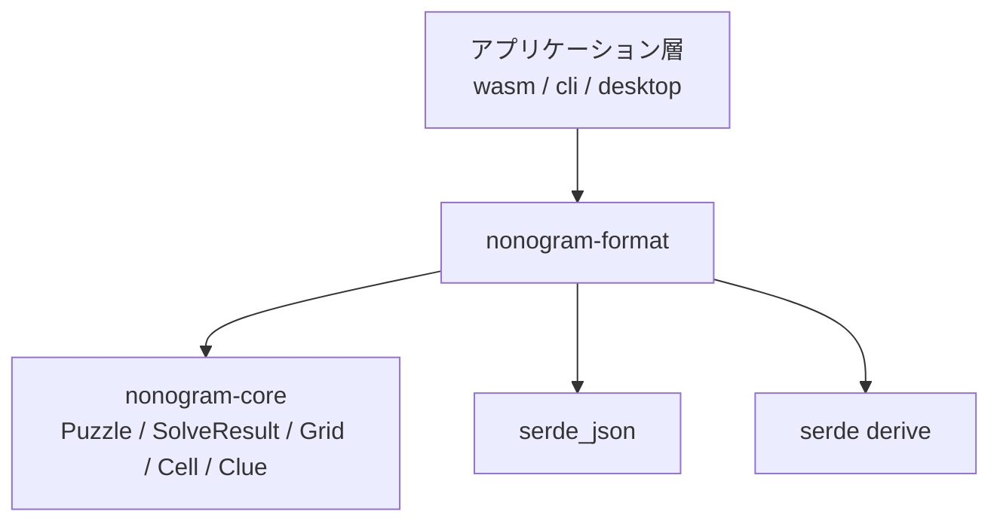

# 設計ドキュメント: nonogram-format

## 概要

`nonogram-format` クレートは、ノノグラムパズルの問題・解答・テンプレートを JSON 形式で入出力する**薄いアダプター層**を提供する。`nonogram-core` のドメイン型（`Puzzle`, `SolveResult`, `Grid`, `Cell`, `Clue`）と JSON 文字列の相互変換に特化し、ビジネスロジックや状態を持たない。

**目的**: アプリケーション層（`nonogram-wasm`, `apps/cli`, `apps/desktop`）に共通の JSON 変換インターフェースを提供し、各アプリが `nonogram-core` を直接 JSON で扱えるようにする。

**利用者**: アプリケーション開発者は、JSON 入力からパズルを構築してソルバに渡し、結果を JSON として出力するために本クレートを使用する。

### Goals

- JSON 文字列から `nonogram_core::Puzzle` へのデシリアライズ関数を提供する
- `nonogram_core::SolveResult` を JSON 文字列へシリアライズする関数を提供する
- 指定サイズの空問題テンプレート JSON を生成する関数を提供する
- すべての変換操作に型安全なエラー型 (`FormatError`) を提供する

### Non-Goals

- ノノグラムの解法ロジックは `nonogram-core` の責務であり本クレートに含まない
- `nonogram-core` の型定義・内部実装を変更しない
- ファイル I/O・ネットワーク・非同期処理は提供しない
- `serde::Serialize` / `Deserialize` を `nonogram-core` 型に追加しない

## 要件トレーサビリティ

| 要件 | 概要 | コンポーネント | インターフェース |
|------|------|---------------|----------------|
| 1.1 | 問題 JSON → `Puzzle` 変換関数 | `puzzle_from_json` | `FormatError` |
| 1.2 | クルーを `Vec<Vec<u32>>` に変換 | `puzzle_from_json` | `PuzzleDto` (内部) |
| 1.3 | 空配列 `[]` をゼロブロッククルーとして扱う | `puzzle_from_json` | `Clue::new(vec![])` |
| 1.4 | フィールド欠落時にエラーを返す | `puzzle_from_json` | `FormatError::Json` |
| 1.5 | `u32` 範囲超過時にエラーを返す | `puzzle_from_json` | `FormatError::Json` |
| 2.1 | `NoSolution` → `{"status":"none","solutions":[]}` | `result_to_json` | `SolutionDto` (内部) |
| 2.2 | `UniqueSolution` → `{"status":"unique","solutions":[[...]]}` | `result_to_json` | `SolutionDto` (内部) |
| 2.3 | `MultipleSolutions` → `{"status":"multiple","solutions":[[...],[...]]}` | `result_to_json` | `SolutionDto` (内部) |
| 2.4 | `Filled`→`true`、`Blank`→`false` | `result_to_json` | セル変換ロジック |
| 2.5 | グリッドを行優先順でシリアライズ | `result_to_json` | `Grid::row()` |
| 2.6 | `Cell::Unknown` → `FormatError::UnknownCell` | `result_to_json` | `FormatError::UnknownCell` |
| 3.1 | テンプレート生成関数 | `generate_template` | - |
| 3.2 | N 行 M 列の空クルー配列を生成 | `generate_template` | `PuzzleDto` (内部) |
| 3.3 | テンプレートが `puzzle_from_json` でデシリアライズ可能 | `generate_template` | ラウンドトリップ保証 |
| 4.1–4.5 | 単体テスト群 | テストモジュール | `#[cfg(test)]` |

## アーキテクチャ

### 既存アーキテクチャ分析

`nonogram-format` クレートは Cargo workspace に登録済みだが、実装は空スタブ（`pub fn add(...)` のみ）の状態である。`Cargo.toml` の `[dependencies]` は空であり、`nonogram-core` および `serde`/`serde_json` の追加が必要である。

ステアリングで定義された依存方向のルールを維持する:

```
nonogram-core  ←  nonogram-format  ←  apps / nonogram-wasm
```

`nonogram-core` が `nonogram-format` に依存することは禁止されている。

### アーキテクチャパターン & 境界マップ

パターン: **薄いアダプター層**。内部 DTO 型（`PuzzleDto`, `SolutionDto`）を通じて JSON ↔ コア型の変換を行い、公開 API は関数3つとエラー型1つに絞る。



- **選択パターン**: 薄いアダプター — ビジネスロジックなし、変換のみ
- **ドメイン境界**: 内部 DTO 型（`PuzzleDto`, `SolutionDto`）は公開しない。公開 API は `nonogram-core` 型か `String` のみを扱う
- **ステアリング準拠**: `nonogram-core` を汚染しない依存方向を維持、`mod.rs` 不使用のモジュール構成

### テクノロジースタック

| レイヤー | 選択 / バージョン | 本機能での役割 | 備考 |
|---------|-----------------|---------------|------|
| シリアライズ | serde 1.x + derive feature | 内部 DTO 型に `Serialize/Deserialize` を付与 | `nonogram-core` 型には適用しない |
| JSON 変換 | serde_json 1.x | `from_str` / `to_string` による JSON ↔ 構造体変換 | フィールド欠落・型不一致を自動検出 |
| エラー | thiserror 2.0.18 | `FormatError` enum のエラー表示 | `nonogram-core` と同バージョン |
| コアドメイン | nonogram-core 0.1.0 | `Puzzle`, `SolveResult`, `Cell`, `Clue`, `Grid` | path 依存 |

## コンポーネントとインターフェース

### サマリーテーブル

| コンポーネント | ドメイン | 意図 | 要件カバレッジ | キー依存 (優先度) | コントラクト |
|--------------|---------|------|--------------|----------------|------------|
| `puzzle_from_json` | JSON→Core変換 | JSON文字列から `Puzzle` を生成 | 1.1–1.5 | nonogram-core (P0), serde_json (P0) | Service |
| `result_to_json` | Core→JSON変換 | `SolveResult` を JSON にシリアライズ | 2.1–2.6 | nonogram-core (P0), serde_json (P0) | Service |
| `generate_template` | テンプレート生成 | 空問題テンプレート JSON を生成 | 3.1–3.3 | serde_json (P0) | Service |
| `FormatError` | エラー型 | 変換失敗の原因を表現 | 1.4, 1.5, 2.6 | thiserror (P0) | State |
| `PuzzleDto` (内部) | JSON DTO | `Puzzle` の中間デシリアライズ型 | 1.1–1.5, 3.1–3.3 | serde (P0) | - |
| `SolutionDto` (内部) | JSON DTO | `SolveResult` の中間シリアライズ型 | 2.1–2.5 | serde (P0) | - |

### 変換層 (nonogram-format)

#### `puzzle_from_json`

| フィールド | 詳細 |
|-----------|------|
| Intent | JSON 文字列を受け取り `nonogram_core::Puzzle` を返す |
| Requirements | 1.1, 1.2, 1.3, 1.4, 1.5 |

**責務 & 制約**

- JSON 文字列を内部型 `PuzzleDto` にデシリアライズし、各クルーを `Clue::new()` で構築後、`Puzzle::new()` で組み立てる
- `serde_json` の標準デシリアライズがフィールド欠落（要件 1.4）と値範囲外（要件 1.5）を検出する
- 空配列 `[]` は `Clue::new(vec![])` により有効なゼロブロッククルーとして扱われる（要件 1.3）

**依存関係**

- 外部: `serde_json::from_str` — JSON 解析 (P0)
- 外部: `nonogram_core::Clue::new` — クルー構築 (P0)
- 外部: `nonogram_core::Puzzle::new` — パズル構築、`Error::EmptyClueList` などを返す (P0)

**コントラクト**: Service [x]

##### サービスインターフェース

```rust
/// JSON 文字列から Puzzle を生成する。
///
/// # Errors
/// - `FormatError::Json` — 不正な JSON、`row_clues`/`col_clues` フィールド欠落、または `u32` 範囲超過
/// - `FormatError::InvalidPuzzle` — `Puzzle` 構築エラー（`Error::EmptyClueList` など）
pub fn puzzle_from_json(json: &str) -> Result<Puzzle, FormatError>;
```

- 事前条件: `json` は UTF-8 文字列
- 事後条件: 成功時、返却された `Puzzle` の `row_clues`・`col_clues` は入力 JSON の配列と一致する
- 不変条件: `nonogram-core` の `Puzzle` 不変条件（クルー超過なし）を維持する

**実装ノート**

- `PuzzleDto` は `#[derive(serde::Serialize, serde::Deserialize)]` を持つクレート内部型（`puzzle_from_json` でデシリアライズ、`generate_template` でシリアライズに使用）
- ゼロブロック検証（`Clue::new` のエラー）は `InvalidPuzzle` にラップされる

---

#### `result_to_json`

| フィールド | 詳細 |
|-----------|------|
| Intent | `SolveResult` を JSON 文字列にシリアライズする |
| Requirements | 2.1, 2.2, 2.3, 2.4, 2.5, 2.6 |

**責務 & 制約**

- `SolveResult` の3バリアントをそれぞれ対応する JSON ステータス文字列にマッピングする
- `Grid` を行優先で走査し、`Cell::Filled`→`true`、`Cell::Blank`→`false`、`Cell::Unknown`→エラーに変換する
- `Cell::Unknown` が存在した場合は即座に `FormatError::UnknownCell` を返す（fail-fast）

**依存関係**

- 外部: `nonogram_core::SolveResult` — 入力型 (P0)
- 外部: `nonogram_core::Grid::row()` — 行優先アクセス (P0)
- 外部: `nonogram_core::Grid::height()` / `Grid::width()` — 行数・列数取得（ループ境界）(P0)
- 外部: `serde_json::to_string` — JSON シリアライズ (P0)

**コントラクト**: Service [x]

##### サービスインターフェース

```rust
/// SolveResult を JSON 文字列にシリアライズする。
///
/// # Errors
/// - `FormatError::UnknownCell` — グリッドに `Cell::Unknown` が含まれる場合
/// - `FormatError::Json` — serde_json シリアライズ失敗（実運用上は発生しない）
pub fn result_to_json(result: &SolveResult) -> Result<String, FormatError>;
```

- 事前条件: `result` が `UniqueSolution` または `MultipleSolutions` の場合、各 `Grid` は `Cell::Unknown` を含まないことを推奨（`Solver` トレイトの契約）
- 事後条件: 成功時、返却 JSON の `status` と `solutions` 配列は入力 `SolveResult` と一致する
- 不変条件: グリッドのインデックス順序は行優先（`solutions[s][row][col]`）を維持する

**実装ノート**

- `SolutionDto` は `#[derive(serde::Serialize)]` のみを持つクレート内部型
- `serde_json::to_string` は `Vec<Vec<Vec<bool>>>` に対して常に成功するため `Json` エラーは実運用上発生しない

---

#### `generate_template`

| フィールド | 詳細 |
|-----------|------|
| Intent | 指定サイズの空問題テンプレート JSON 文字列を生成する |
| Requirements | 3.1, 3.2, 3.3 |

**責務 & 制約**

- `rows` 個の空クルー配列と `cols` 個の空クルー配列からなる `PuzzleDto` を生成し JSON シリアライズする
- 生成した JSON は `puzzle_from_json` でデシリアライズ可能（ラウンドトリップ保証）
- エラーを返さない（`String` を直接返す）

**依存関係**

- 外部: `serde_json::to_string` — JSON 生成 (P0)

**コントラクト**: Service [x]

##### サービスインターフェース

```rust
/// 行数 `rows`・列数 `cols` の空問題テンプレート JSON 文字列を生成する。
///
/// `row_clues` に長さ `rows` の配列、`col_clues` に長さ `cols` の配列を持つ JSON を返す。
/// 各要素は空配列 `[]` である。
pub fn generate_template(rows: usize, cols: usize) -> String;
```

- 事前条件: `rows` と `cols` は任意の `usize`（0 を含む。ただし 0 の場合は生成 JSON を `puzzle_from_json` に渡すと `InvalidPuzzle` エラーになる）
- 事後条件: 返却された JSON は `puzzle_from_json` で `Err` なく変換できる（`rows > 0` かつ `cols > 0` の場合）

**実装ノート**

- `PuzzleDto` の `row_clues` に `vec![vec![]; rows]`、`col_clues` に `vec![vec![]; cols]` を設定し、`serde_json::to_string` でシリアライズする。`Vec<Vec<u32>>`（空配列のみ）は常にシリアライズ成功するため、`.expect()` で安全にアンラップする

---

#### `FormatError`

| フィールド | 詳細 |
|-----------|------|
| Intent | JSON 変換操作で発生しうるエラーの分類 |
| Requirements | 1.4, 1.5, 2.6 |

**コントラクト**: State [x]

```rust
/// nonogram-format における変換エラー。
#[derive(Debug, thiserror::Error)]
pub enum FormatError {
    /// JSON のパースまたはフィールド検証に失敗した（欠落フィールド・型不一致・範囲外を含む）。
    #[error("JSON error: {0}")]
    Json(#[from] serde_json::Error),

    /// 有効な JSON だが Puzzle 構築に失敗した（EmptyClueList など）。
    #[error("invalid puzzle: {0}")]
    InvalidPuzzle(#[from] nonogram_core::Error),

    /// グリッドに Cell::Unknown が含まれており JSON にシリアライズできない。
    #[error("grid contains unknown cells")]
    UnknownCell,
}
```

**実装ノート**

- `#[from] serde_json::Error` により `?` 演算子で要件 1.4・1.5 のエラーが自動変換される
- `#[from] nonogram_core::Error` により `Puzzle::new()`（`EmptyClueList`・`ClueExceedsLength`）および `Clue::new()`（`InvalidBlockLength`）のエラーがすべて `InvalidPuzzle` にラップされる。バリアント名は Puzzle に限定されず、Clue 構築エラーも包含する点に注意

## データモデル

### ドメインモデル

`nonogram-format` はドメインロジックを持たない。変換に使用する内部 DTO 型のみを定義する。

```
PuzzleDto (内部)
  ├── row_clues: Vec<Vec<u32>>   // 各行のブロック長リスト
  └── col_clues: Vec<Vec<u32>>   // 各列のブロック長リスト

SolutionDto (内部)
  ├── status: &'static str       // "none" | "unique" | "multiple"
  └── solutions: Vec<Vec<Vec<bool>>>  // [s][row][col] の順
```

### 論理データモデル

DTO 型は `serde` の derive マクロのみを使用する。`nonogram-core` 型との変換は各関数内でインラインで行う。

### データコントラクト & 統合

#### 問題 JSON スキーマ

```json
{
  "row_clues": [[1, 2], [3], []],
  "col_clues": [[1], [2], [1, 1]]
}
```

| フィールド | 型 | 必須 | 制約 |
|-----------|-----|------|------|
| `row_clues` | `number[][]` | 必須 | 各要素は 1 以上の整数（空配列 `[]` は許可） |
| `col_clues` | `number[][]` | 必須 | 各要素は 1 以上の整数（空配列 `[]` は許可） |

欠落フィールドは `FormatError::Json` を返す（要件 1.4）。`u32` 範囲超過の数値は `FormatError::Json` を返す（要件 1.5）。未知フィールドは無視される（serde デフォルト動作・意図的設計判断）。将来の JSON スキーマ拡張との後方互換性を優先するため `#[serde(deny_unknown_fields)]` は付与しない。

#### 解答 JSON スキーマ

```json
{ "status": "none", "solutions": [] }
{ "status": "unique", "solutions": [[[true, false], [false, true]]] }
{ "status": "multiple", "solutions": [[[true, false], [false, true]], [[false, true], [true, false]]] }
```

| フィールド | 型 | 値 |
|-----------|-----|-----|
| `status` | `string` | `"none"` \| `"unique"` \| `"multiple"` |
| `solutions` | `boolean[][][]` | インデックス順: `solutions[s][row][col]` |

## エラーハンドリング

### エラー戦略

fail-fast 戦略を採用する。入力の検証はデシリアライズ時（`puzzle_from_json`）と変換時（`result_to_json` の `Unknown` チェック）に即座に行い、エラーを呼び出し元に返す。回復処理は提供しない。

### エラーカテゴリと対応

| カテゴリ | 原因 | `FormatError` バリアント | 対応する要件 |
|---------|------|------------------------|------------|
| 入力エラー | 不正 JSON / フィールド欠落 / 数値範囲外（`u32` 超過） | `Json(serde_json::Error)` | 1.4, 1.5 |
| ビジネスロジックエラー | `Clue` 構築失敗（ブロック長 `0` → `InvalidBlockLength`）、`Puzzle` 構築失敗（`EmptyClueList`・`ClueExceedsLength`） | `InvalidPuzzle(nonogram_core::Error)` | 1.1, 1.2 |
| 変換エラー | `Cell::Unknown` を持つグリッドのシリアライズ | `UnknownCell` | 2.6 |

### モニタリング

本クレートはライブラリであるため、ロギング・モニタリングは呼び出し元アプリケーション層が担う。

## テスト戦略

テストは `#[cfg(test)]` ブロック内に記述する（ステアリング準拠）。`cargo test --workspace` で全テストが通過すること（要件 4.5）。

### 単体テスト

1. **正常系: 問題 JSON デシリアライズ**（要件 4.1）
   - 有効な `row_clues` / `col_clues` を持つ JSON から `Puzzle` が正しく生成されること
   - 空配列 `[]` のクルーがゼロブロッククルーとして扱われること（`Clue::is_empty() == true`）
   - 複数ブロックのクルーが正しく変換されること

2. **正常系: 解答 JSON シリアライズ**（要件 4.2）
   - `SolveResult::NoSolution` → `{"status":"none","solutions":[]}`
   - `SolveResult::UniqueSolution(grid)` → `{"status":"unique","solutions":[[...]]}`（`Filled`→`true`、`Blank`→`false`）
   - `SolveResult::MultipleSolutions(grids)` → `{"status":"multiple","solutions":[[...],[...]]}`
   - グリッドのインデックス順が行優先（`solutions[0][0][0]` = 先頭行先頭列）であること

3. **異常系: エラー検証**（要件 4.3）
   - `row_clues` フィールド欠落 → `FormatError::Json`
   - `col_clues` フィールド欠落 → `FormatError::Json`
   - `u32` 範囲超過の数値 → `FormatError::Json`
   - `Cell::Unknown` を含む `Grid` → `FormatError::UnknownCell`

4. **正常系: テンプレート生成**（要件 4.4）
   - `generate_template(3, 2)` が `row_clues` 長 3・`col_clues` 長 2 の JSON を返すこと
   - 生成された JSON が `puzzle_from_json` でエラーなくデシリアライズできること（ラウンドトリップ）
   - `generate_template(5, 10)` の出力構造が `{"row_clues":[[],[],[],[],[]],"col_clues":[[],[],[],[],[],[],[],[],[],[]]}` であること
