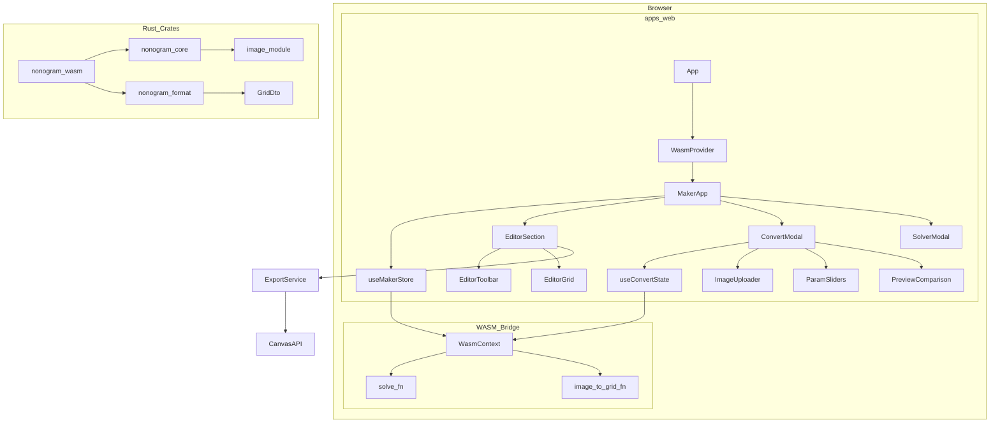
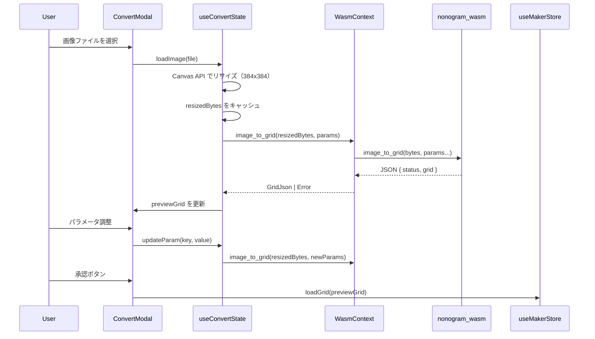
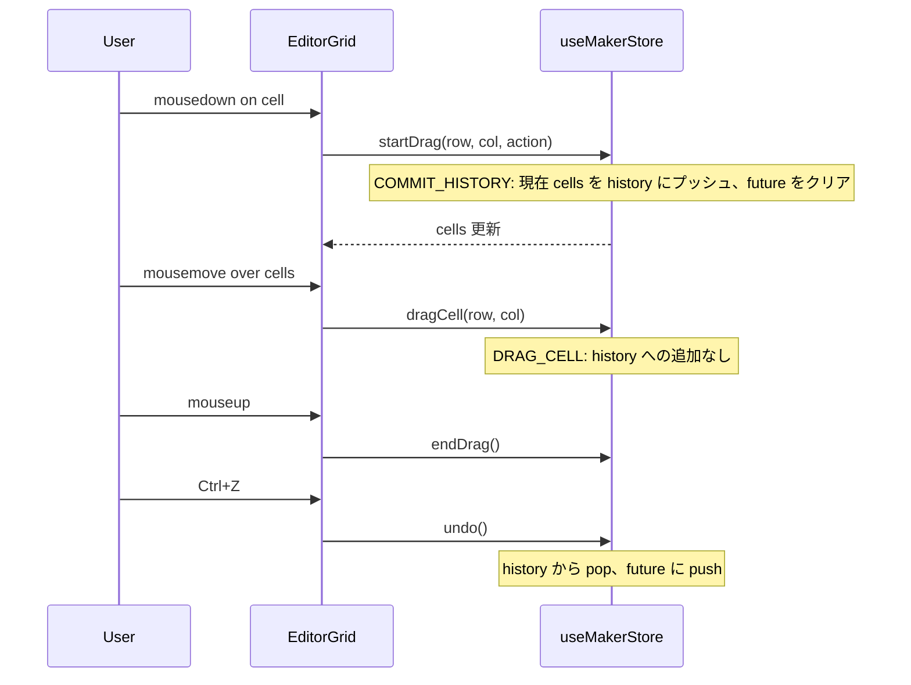
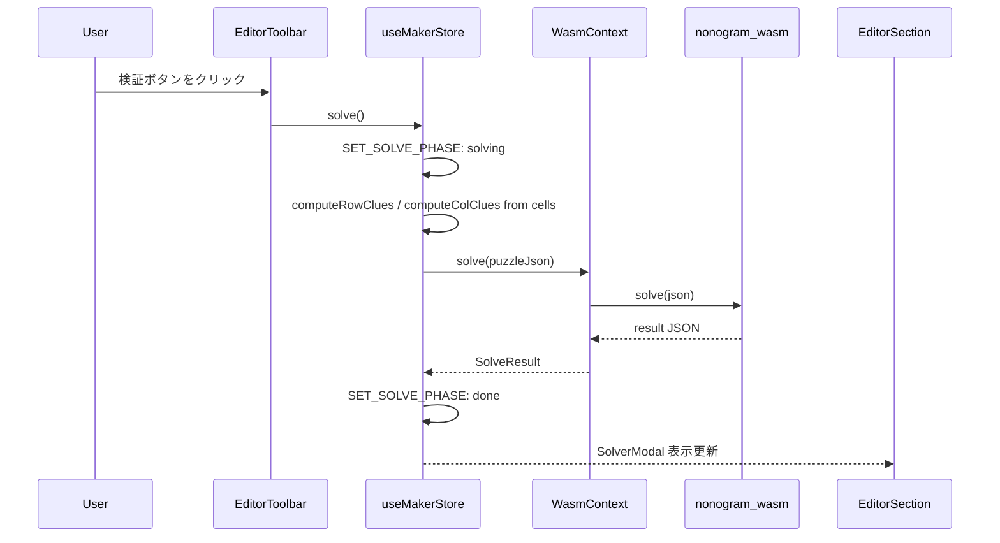
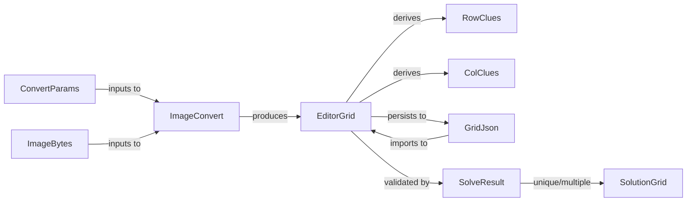

# 技術設計書: nonogram-maker

## 概要

本フィーチャーは、既存の Nonogram ソルバー SPA（`apps/web`）を「Nonogram 問題作成アプリ」として全面的に再構築する。ユーザーはドット絵エディタで問題を描き、画像変換機能で効率的にグリッドを生成し、ソルバーで一意解を確認してから複数フォーマットでエクスポートする一連のワークフローを単一 SPA 上で完結できる。

対象変更コンポーネントは `apps/web`（UI 全面再構成）、`crates/nonogram-core`（画像変換ロジック追加）、`crates/nonogram-wasm`（WASM エクスポート追加）、`crates/nonogram-format`（Grid JSON スキーマ追加）の 4 つである。Desktop App（`apps/desktop`）は本スペックのスコープ外とする。

### Goals

- ドット絵エディタを主画面とし、undo/redo・リセット・クルーリアルタイム表示を提供する
- 画像ファイルから変換パラメータを調整してグリッドを生成する変換機能を実装する
- WASM ソルバーによる一意解検証を非同期で実行し結果を表示する
- JSON および PNG 形式での問題エクスポートを提供する
- Grid の JSON スキーマを `nonogram-format` で一元管理する

### Non-Goals

- Desktop App（`apps/desktop`）への適用（将来スペックで対応）
- ネイティブファイル保存ダイアログ（デスクトップ固有機能）
- カラー Nonogram のサポート
- オンラインサーバーサイド処理（完全クライアントサイド SPA を維持）

---

## アーキテクチャ

### 既存アーキテクチャ分析

現行 `apps/web` はソルバー入力 UI として設計されており、以下の構造を持つ:

- `useNonogramStore`: クルー文字列入力モードとグリッド描画モードを切り替えるストア
- `ClueInputPanel` / `GridDrawingPanel`: 入力モードに応じた描画
- `ImportExportPanel`: JSON インポート・エクスポート
- `WasmContext`: WASM 初期化コンテキスト（変更なし）

廃止するコンポーネント: `ClueInputPanel`, `ModeToggle`, `GridDrawingPanel`, `SolveButton`, `ResultPanel`, `ImportExportPanel`, `PuzzleSizeInput`, `useNonogramStore`（既存のユーティリティ `clueComputeUtils`, `clueParseUtils` および `PuzzleIOService` は継続利用または参照）

### Architecture Pattern & Boundary Map



**Architecture Integration**:
- 選択パターン: Layered Architecture（Rust ライブラリ層 / WASM バインディング層 / React UI 層）
- ドメイン境界: Rust 側はデータ変換のみ担当、状態管理・UI は TypeScript 側で完結
- 既存パターン維持: `WasmContext` の WASM ロード仕組み、`utils/` + `services/` + `hooks/` + `components/` のディレクトリ構成
- `nonogram-core → nonogram-format` 依存は引き続き禁止（steering 準拠）

### Technology Stack

| Layer | Choice / Version | Role | Notes |
|-------|------------------|------|-------|
| UI | React 19 + TypeScript ~5.8 | グリッドエディタ・変換 UI・エクスポート | strict mode + `verbatimModuleSyntax` |
| State | React `useReducer` | undo/redo 履歴スタック含む全状態管理 | ライブラリ追加なし |
| Build | Vite 7 + `vite-plugin-wasm` | WASM ESM バンドル | 既存規約準拠 |
| Image Decode / Process | `image = "0.25"` + `imageproc = "0.25"` | PNG/JPEG/WebP/GIF デコード、Gaussian blur、Canny、connected components | `nonogram-core` に追加 |
| WASM Binding | `wasm-bindgen 0.2` | `image_to_grid` / `solve` を JS から呼び出し | `nonogram-wasm` 既存依存 |
| Serialization | `serde` / `serde_json` | GridDto の JSON シリアライズ | `nonogram-format` 既存依存 |
| PNG Export | Canvas 2D API（ブラウザ標準） | クルー付き PNG 生成、ダウンロード | Rust 不要 |
| Package Manager | Bun | JS 依存管理・テスト実行 | 既存規約準拠 |
| Test (Rust) | `cargo test` | nonogram-core 変換関数の単体テスト | `#[cfg(test)]` |
| Test (TS) | Vitest + happy-dom | `useMakerStore` reducer・ExportService テスト | 既存規約準拠 |

---

## システムフロー

### 画像変換フロー



### Undo/Redo フロー（ドラッグ操作）



### ソルバー検証フロー



---

## UI デザイン

### 画面レイアウト構成

アプリは単一ページで構成され、画面遷移なしに全機能へアクセスできる（要件 7.4）。

```
┌─────────────────────────────────────────────┐
│  AppHeader                                  │
│  [Nonogram Maker]          [Export ▼]       │
├─────────────────────────────────────────────┤
│  EditorToolbar                              │
│  W:[__] H:[__] [Convert] | [↩][↪][Reset]  │
│  | [✓ 検証] [⬇ Export]                     │
├─────────────────────────────────────────────┤
│  EditorGrid（全幅）                          │
│                                             │
│  col clues →                               │
│  ┌──┬──┬──┐                                │
│  │  │  │  │ ← row clues                   │
│  ├──┼──┼──┤                                │
│  │  │  │  │                                │
│  └──┴──┴──┘                                │
│                                             │
└─────────────────────────────────────────────┘

  ↓「検証」押下時にオーバーレイ表示

┌─────────────────────────────────────────────┐
│  SolverModal（オーバーレイ）                  │
│  [×]  検証結果                              │
│  ─────────────────────────────────────      │
│  ● 唯一解 / 複数解 / 解なし / エラー         │
│  [解グリッド表示]                            │
│                         [閉じる]            │
└─────────────────────────────────────────────┘
```

- **EditorGrid は常時全幅**。SolverModal はレイアウトを占有しない（要件 7.2 の編集主体を反映）
- SolverModal は ConvertModal と同じオーバーレイパターン。同時に両方が開くことはない
- **モバイル（767px 以下）**: EditorGrid のセルサイズを縮小（24px → 16px）、ツールバーはアイコンのみ（要件 7.5）

### EditorGrid レイアウト

クルーとセルを CSS Grid で以下の 4 領域に配置する:

```
┌──────────┬────────────────────────┐
│  空白    │  列クルー（上）         │
│  (角)    │  [1][2 1][3][ ][ ]    │
├──────────┼────────────────────────┤
│  行クルー │  グリッドセル          │
│  （左）  │  ■ □ ■ □ □           │
│  [1]     │  □ ■ □ ■ □           │
│  [2]     │  ■ ■ □ □ ■           │
└──────────┴────────────────────────┘
```

- セルサイズ: デスクトップ 24px / モバイル 16px（CSS カスタムプロパティで制御）
- 塗りつぶし: 黒（`#111`）/ 空白: 白（`#fff`）/ ホバー: グレー（`#ccc`）
- クルーテキスト: セルサイズに比例したフォントサイズ、右寄せ（行クルー）/ 下寄せ（列クルー）

### ConvertModal レイアウト

```
┌───────────────────────────────────────────┐
│  [×] 画像からグリッドに変換               │
├─────────────────┬─────────────────────────┤
│  元画像プレビュー│  グリッドプレビュー     │
│  (ImageUploader) │  (PreviewComparison)   │
│  384×384 max    │  grid_width × grid_h   │
├─────────────────┴─────────────────────────┤
│  ParamSliders                             │
│  グリッド幅: ──●──────── 20              │
│  グリッド高: ──●──────── 20              │
│  ブラー強度: ─────●───── 1.0            │
│  しきい値  : ─────────●─ 128            │
│  エッジ強度: ─●──────── 0.3             │
│  ノイズ除去: ●────────── 0              │
├────────────────────────────────────────────┤
│                      [キャンセル] [適用]   │
└────────────────────────────────────────────┘
```

- フルスクリーンオーバーレイ（背景: 半透明黒）、中央に最大幅 800px のモーダルパネル
- モバイルではプレビュー 2 列が縦積みに変わる
- スライダー操作中は 100ms デバウンス後に WASM 呼び出しを発火（変換中は Spinner を表示）

### SolverModal 状態別表示

SolverModal は「検証」ボタン押下でオープンし、結果確認後に「閉じる」で閉じる。ConvertModal と同じオーバーレイパターンを踏襲する。

| `solvePhase.phase` | モーダル内表示 |
|--------------------|--------------|
| `solving` | スピナー + 「解析中...」。「閉じる」は無効化。エディタ背後はブロックしない |
| `done / unique` | 「唯一解」バッジ + 解グリッド 1 枚 + 「閉じる」 |
| `done / multiple` | 「複数解」バッジ + 解グリッド最大 2 枚（横並び）+ 「閉じる」 |
| `done / none` | 「解なし」メッセージ + 「閉じる」 |
| `done / error` | 「エラー」メッセージ + エラー詳細 + 「閉じる」 |

- モーダルを閉じた後も `solvePhase` は `done` のまま保持し、再度開いた際に前回結果を表示する
- 「検証」ボタン再押下で新たにソルバーを実行し `solvePhase` を上書きする

### EditorToolbar ボタン配置と状態制御

```
[幅: 20 ↕] [高: 20 ↕] [🖼 Convert]  |  [↩ Undo] [↪ Redo] [リセット]  |  [✓ 検証]  [⬇ Export ▼]
```

| グループ | ボタン | 役割 |
|---------|-------|------|
| キャンバス設定 | 幅・高・Convert | 「どのキャンバスで始めるか」に関する操作 |
| 編集履歴 | Undo・Redo・リセット | 現在の状態を変える操作（リセットは Undo で取り消せるため同グループ） |
| 完成・出力 | 検証・Export | ワークフローの最終段階 |

| ボタン | 無効条件 |
|--------|---------|
| Undo | `canUndo === false` |
| Redo | `canRedo === false` |
| 検証 | `isExportable === false`（グリッドが全空白） |
| Export | `isExportable === false`（グリッドが全空白） |

「検証」ボタンは `solvePhase.phase === 'solving'` 中でも押下可能とし、SolverModal 内のスピナーで処理中を示す（エディタをブロックしない）。

### レスポンシブ仕様

| ブレークポイント | 変更内容 |
|---------------|---------|
| `≥ 768px` | 2 カラム（EditorGrid 左 / SolverModal 右）、セル 24px |
| `< 768px` | 1 カラム縦積み、セル 16px、ツールバーはアイコンのみ表示 |

### インタラクション状態一覧

| 状態 | 対象 | 視覚フィードバック |
|------|------|-----------------|
| ドラッグ中 | グリッドセル | カーソル `crosshair`、塗り/消しがリアルタイム反映 |
| WASM 未初期化エラー | AppHeader | 赤背景エラーバナー（既存パターン維持） |
| 変換処理中 | ConvertModal | スライダー無効化 + スピナー表示 |
| ソルバー実行中 | SolverModal | スピナー。エディタ・ツールバーはブロックしない |
| Export ドロップダウン | EditorToolbar | JSON / PNG の 2 択メニュー |

---

## 要件トレーサビリティ

| 要件 | 概要 | コンポーネント | インタフェース | フロー |
|------|------|--------------|--------------|-------|
| 1.1 | グリッドサイズ指定・新規作成 | `EditorToolbar`, `useMakerStore` | `setDimensions(w, h)` | - |
| 1.2 | セルのクリック/トグル | `EditorGrid`, `useMakerStore` | `toggleCell(r, c)` | - |
| 1.3 | ドラッグ方向維持 | `EditorGrid`, `useMakerStore` | `startDrag`, `dragCell`, `endDrag` | Undo/Redo フロー |
| 1.4 | 全セルリセット | `EditorToolbar`, `useMakerStore` | `resetGrid()` | - |
| 1.5 | クルーのリアルタイム表示 | `EditorGrid` | `computeRowClues`, `computeColClues` | - |
| 1.6 | Undo/Redo | `useMakerStore` | `undo()`, `redo()` | Undo/Redo フロー |
| 2.1 | 画像フォーマット受け入れ | `ImageUploader` | `loadImage(file)` | 画像変換フロー |
| 2.2 | アルファ合成 | `nonogram-core::image` | `image_to_grid` 内部処理 | - |
| 2.3 | 384px リサイズ・キャッシュ | `useConvertState` | `resizedBytes` キャッシュ | 画像変換フロー |
| 2.4 | パラメータスライダー | `ParamSliders` | `ConvertParams` | - |
| 2.5 | 変換パイプライン | `nonogram-core::image::convert` | `image_to_grid` | 画像変換フロー |
| 2.6 | 並列プレビュー表示 | `PreviewComparison` | `previewGrid: boolean[][]` | - |
| 2.7 | 承認・エディタ読み込み | `ConvertModal`, `useMakerStore` | `loadGrid(grid)` | 画像変換フロー |
| 2.8 | 読み込み失敗メッセージ | `ImageUploader`, `useConvertState` | `ImageLoadError` | - |
| 3.1 | クルー計算・ソルバー呼び出し | `useMakerStore` | `solve()` | ソルバーフロー |
| 3.2 | 解析中インジケーター | `SolverModal` | `solvePhase: 'solving'` | ソルバーフロー |
| 3.3 | 唯一解表示 | `SolverModal` | `SolveResult.status === 'unique'` | - |
| 3.4 | 複数解表示（最大 2 件） | `SolverModal` | `SolveResult.solutions.slice(0,2)` | - |
| 3.5 | 解なし表示 | `SolverModal` | `SolveResult.status === 'none'` | - |
| 3.6 | エラー表示・操作復帰 | `SolverModal` | `SolveResult.status === 'error'` | - |
| 4.1 | JSON エクスポート | `ExportService` | `exportJson(cells)` | - |
| 4.2 | PNG エクスポート | `ExportService` | `exportPng(cells, rowClues, colClues)` | - |
| 4.3 | エクスポート可能状態チェック | `EditorToolbar` | `isExportable(cells)` | - |
| 4.4 | デスクトップ: ファイルダイアログ | スコープ外（Desktop App） | - | - |
| 5.1 | Grid Rust 型・JSON スキーマ | `nonogram-format::GridDto` | `GridDto` | - |
| 5.2 | rows/cols/cells を JSON に含む | `nonogram-format::GridDto` | `GridDto.cells: Vec<Vec<bool>>` | - |
| 5.3 | serde シリアライズ | `nonogram-format` | `grid_to_json`, `json_to_grid` | - |
| 5.4 | 不正 JSON でエラー返却 | `nonogram-format` | `FormatError::ShapeMismatch` | - |
| 6.1 | 画像→Grid 変換 API | `nonogram-core::image::convert` | `image_to_grid(bytes, params)` | - |
| 6.2 | パイプライン順序保証 | `nonogram-core::image::convert` | 処理パイプライン実装 | - |
| 6.3 | WASM エクスポート | `nonogram-wasm` | `image_to_grid(...)` | 画像変換フロー |
| 6.4 | デコード失敗エラー | `nonogram-core::image` | `Result::Err(ImageError)` | - |
| 6.5 | 変換関数の単体テスト | `nonogram-core` テスト | `#[cfg(test)]` | - |
| 7.1 | 段階的ワークフロー | `MakerApp`, `useMakerStore` | `appPhase` state | - |
| 7.2 | ソルバー入力 UI 廃止 | `apps/web` 全面再構成 | - | - |
| 7.3 | Convert アクセス手段 | `EditorToolbar` | `isConvertOpen` toggle | - |
| 7.4 | SPA 画面遷移なし | `MakerApp` | `appPhase` + `isConvertOpen` | - |
| 7.5 | レスポンシブ対応 | CSS（`apps/web/src/index.css`） | メディアクエリ | - |

---

## コンポーネントとインタフェース

### サマリー表

| Component | Layer | Intent | Req | Key Dependencies | Contracts |
|-----------|-------|--------|-----|-----------------|-----------|
| `useMakerStore` | Hook | アプリ全状態管理（グリッド・undo/redo・ソルバー） | 1.1–1.6, 3.1–3.6, 7.1 | `WasmContext`, `clueComputeUtils` | State, Service |
| `useConvertState` | Hook | 画像変換パラメータ・プレビュー状態管理 | 2.1–2.8 | `WasmContext` | State |
| `MakerApp` | UI | アプリルート（ヘッダー・エディタ・モーダル構成） | 7.1–7.5 | `useMakerStore` | - |
| `EditorToolbar` | UI | グリッドサイズ変更・リセット・Convert/Solve/Export ボタン | 1.1, 1.4, 4.3, 7.3 | `useMakerStore` | - |
| `EditorGrid` | UI | グリッド描画・クルー表示・マウスイベント処理 | 1.2, 1.3, 1.5, 1.6 | `useMakerStore` | - |
| `SolverModal` | UI | ソルバー結果オーバーレイ（unique/multiple/none/error/solving） | 3.2–3.6 | `useMakerStore` | - |
| `ConvertModal` | UI | 画像変換オーバーレイ（Upload・Sliders・Preview・Apply） | 2.1–2.8 | `useConvertState`, `useMakerStore` | - |
| `ImageUploader` | UI | ファイル選択・エラー表示 | 2.1, 2.8 | `useConvertState` | - |
| `ParamSliders` | UI | 変換パラメータスライダー | 2.4 | `useConvertState` | - |
| `PreviewComparison` | UI | 元画像とプレビューグリッドの並列表示 | 2.6 | `useConvertState` | - |
| `ExportService` | Service | JSON / PNG エクスポート処理 | 4.1–4.3 | Canvas 2D API | Service |
| `image_to_grid` (Rust) | nonogram-core | 画像バイト列→Grid 変換パイプライン | 6.1–6.5 | `image`, `imageproc` | Service |
| `GridDto` (Rust) | nonogram-format | Grid の JSON シリアライズ/デシリアライズ型 | 5.1–5.4 | `serde`, `nonogram-core::Grid` | API |
| `image_to_grid` (WASM) | nonogram-wasm | 画像変換の WASM バインディング | 6.3 | `nonogram-core`, `nonogram-format` | API |

---

### React Hooks / State Layer

#### `useMakerStore`

| Field | Detail |
|-------|--------|
| Intent | グリッドエディタの全状態（cells, undo/redo, appPhase, solvePhase）を管理する中央ストア |
| Requirements | 1.1, 1.2, 1.3, 1.4, 1.5, 1.6, 3.1–3.6, 7.1, 7.4 |

**Responsibilities & Constraints**
- グリッドセルの変更・undo/redo 履歴管理（上限 100 ステップ）
- ドラッグ 1 回 = 1 undo ステップ（`startDrag` 時にスナップショット保存）
- `solve()` は非同期で `solvePhase` を `solving` → `done` に遷移させる
- `computeRowClues` / `computeColClues` は cells から直接計算（クルー文字列を持たない）

**Dependencies**
- Inbound: `MakerApp`, `EditorGrid`, `EditorToolbar`, `SolverModal` — ストア参照（P0）
- Outbound: `WasmContext.solve` — WASM ソルバー呼び出し（P0）
- Outbound: `clueComputeUtils` — クルー計算（P1）
- Outbound: `ExportService` — エクスポート（P1）

**Contracts**: State [x] / Service [x]

##### State Management

```typescript
interface MakerState {
  gridWidth: number;        // 1–50
  gridHeight: number;       // 1–50
  cells: boolean[][];       // [row][col]
  history: boolean[][][][]; // undo スタック（最大 100）
  future: boolean[][][][];  // redo スタック
  solvePhase: SolvePhase;
  isConvertOpen: boolean;
  isSolverOpen: boolean;
}

type MakerAction =
  | { type: 'SET_DIMENSIONS'; width: number; height: number }
  | { type: 'TOGGLE_CELL'; row: number; col: number }
  | { type: 'COMMIT_HISTORY' }                                   // ドラッグ開始時
  | { type: 'DRAG_CELL'; row: number; col: number; action: 'fill' | 'erase' }
  | { type: 'RESET_GRID' }
  | { type: 'UNDO' }
  | { type: 'REDO' }
  | { type: 'LOAD_GRID'; cells: boolean[][] }
  | { type: 'SET_SOLVE_PHASE'; phase: SolvePhase }
  | { type: 'SET_CONVERT_OPEN'; open: boolean }
  | { type: 'SET_SOLVER_OPEN'; open: boolean };
```

- Preconditions: `TOGGLE_CELL` / `DRAG_CELL` の row/col はグリッド範囲内
- Postconditions: `UNDO` 後は `history` から末尾を pop、`future` の先頭に現在 cells を push
- Invariants: `history.length <= 100`、`cells.length === gridHeight`、各行 `cells[i].length === gridWidth`

##### Service Interface

```typescript
interface MakerStore extends MakerState {
  // 計算済みプロパティ（memoized）
  rowClues: number[][];
  colClues: number[][];
  canUndo: boolean;
  canRedo: boolean;
  isExportable: boolean;  // cells に 1 つ以上 true が存在する

  // アクション
  setDimensions(width: number, height: number): void;
  toggleCell(row: number, col: number): void;
  startDrag(row: number, col: number, action: 'fill' | 'erase'): void;
  dragCell(row: number, col: number): void;
  endDrag(): void;
  resetGrid(): void;
  undo(): void;
  redo(): void;
  loadGrid(cells: boolean[][]): void;
  /** ソルバーを実行し SolverModal を開く */
  solve(): Promise<void>;
  setConvertOpen(open: boolean): void;
  setSolverOpen(open: boolean): void;
}
```

**Implementation Notes**
- `rowClues` / `colClues` は `useMemo` で `cells` 変更時のみ再計算
- `dragActionRef` を `useRef` で保持してドラッグ状態を管理（reducer 外）
- `COMMIT_HISTORY` は `TOGGLE_CELL` および `startDrag` の直前に dispatch
- `solve()` は `SET_SOLVER_OPEN: true` と `SET_SOLVE_PHASE: solving` を同時に dispatch し、SolverModal を自動オープンしてからソルバーを非同期実行する

---

#### `useConvertState`

| Field | Detail |
|-------|--------|
| Intent | 画像変換モーダル内の状態（画像キャッシュ・パラメータ・プレビュー）を管理する |
| Requirements | 2.1–2.8 |

**Responsibilities & Constraints**
- 読み込んだ画像を Canvas API で 384×384 にリサイズしキャッシュ（`resizedBytes: Uint8Array | null`）
- パラメータ変更のたびに `image_to_grid` を呼び出してプレビューグリッドを更新
- 画像読み込み失敗時は `imageError` フィールドにメッセージを設定

**Dependencies**
- Inbound: `ConvertModal` — 状態参照・操作（P0）
- Outbound: `WasmContext.image_to_grid` — 変換呼び出し（P0）
- External: Canvas 2D API — 画像リサイズ（P0）

**Contracts**: State [x]

##### State Management

```typescript
interface ConvertParams {
  gridWidth: number;      // 5–50, default 20
  gridHeight: number;     // 5–50, default 20
  smoothStrength: number; // 0–5, default 1.0
  threshold: number;      // 0–255, default 128
  edgeStrength: number;   // 0–1, default 0.3
  noiseRemoval: number;   // 0–20, default 0
}

interface ConvertState {
  resizedBytes: Uint8Array | null;  // リサイズ済み画像（PNG バイト列）
  params: ConvertParams;
  previewGrid: boolean[][] | null;
  isConverting: boolean;
  imageError: string | null;
  originalPreviewUrl: string | null; // Object URL for display
}

interface ConvertStateActions {
  loadImage(file: File): Promise<void>;
  updateParam<K extends keyof ConvertParams>(key: K, value: ConvertParams[K]): void;
  reset(): void;
}
```

**Implementation Notes**
- `loadImage` は Canvas で `384×384` 境界ボックスにリサイズ後、`canvas.toBlob('image/png')` → `Uint8Array` に変換してキャッシュ
- 画像幅・高さが 50px 未満の場合は `params.gridWidth` / `params.gridHeight` の上限を制限
- `updateParam` は `resizedBytes` が null でない場合のみ `image_to_grid` を呼び出す

---

### UI Components Layer

#### `EditorGrid`

| Field | Detail |
|-------|--------|
| Intent | グリッドセルの描画・マウスイベント処理・クルーのリアルタイム表示 |
| Requirements | 1.2, 1.3, 1.5, 1.6 |

- セルは `<table>` または CSS Grid で描画（クルーを含む 2D 配置）
- `onMouseDown` → `startDrag`, `onMouseEnter` → `dragCell`, `onMouseUp`（window） → `endDrag`
- キーボードショートカット: `Ctrl+Z` → `undo()`, `Ctrl+Shift+Z` / `Ctrl+Y` → `redo()`
- クルーは `useMakerStore.rowClues` / `colClues` から取得しセル外に表示

#### `SolverModal`

| Field | Detail |
|-------|--------|
| Intent | ソルバー実行中・結果を表示する（解グリッドの描画を含む） |
| Requirements | 3.2–3.6 |

- `solvePhase.phase === 'solving'`: スピナー表示、他 UI はインタラクション可能（ブロックしない）
- `solvePhase.phase === 'done'`:
  - `status === 'unique'`: 解グリッドを 1 つ表示
  - `status === 'multiple'`: 解グリッドを最大 2 つ表示
  - `status === 'none'` / `'error'`: 対応メッセージ表示

#### `ConvertModal`

| Field | Detail |
|-------|--------|
| Intent | 画像変換ワークフロー全体をオーバーレイで提供する |
| Requirements | 2.1–2.8 |

- `useConvertState` をモーダル内でインスタンス化（モーダルを閉じると状態クリア）
- 承認ボタン押下: `useMakerStore.loadGrid(previewGrid)` を呼び出してモーダルを閉じる
- `imageError` が非 null の場合はエラーメッセージを表示（2.8）

---

### Service Layer

#### `ExportService`

| Field | Detail |
|-------|--------|
| Intent | JSON および PNG 形式での問題エクスポートを処理する |
| Requirements | 4.1, 4.2, 4.3 |

**Dependencies**
- External: Canvas 2D API — PNG 生成（P0）
- External: `URL.createObjectURL` / `<a>` download — ファイルダウンロード（P0）

**Contracts**: Service [x]

##### Service Interface

```typescript
interface ExportServiceInterface {
  /**
   * グリッドから puzzle JSON を生成してダウンロードする。
   * cells から rowClues / colClues を計算して nonogram-format 互換 JSON を出力。
   */
  exportJson(cells: boolean[][], filename?: string): void;

  /**
   * クルー付きの Nonogram PNG 画像を生成してダウンロードする。
   */
  exportPng(
    cells: boolean[][],
    rowClues: number[][],
    colClues: number[][],
    filename?: string
  ): Promise<void>;
}
```

- Preconditions: `cells` に 1 つ以上 `true` が存在すること（呼び出し側が `isExportable` で確認済み）
- Postconditions: ブラウザのダウンロードダイアログを通じてファイルが保存される
- JSON スキーマ: `{ row_clues: number[][], col_clues: number[][] }`（既存 nonogram-format 互換）

**Implementation Notes**
- `exportPng`: 動的に `<canvas>` を生成し DOM には追加しない。セルサイズはグリッドサイズに応じて自動調整（推奨: 最小 10px/cell）。クルーは左・上に配置

---

### Rust Layer（nonogram-core）

#### `image::convert` モジュール

| Field | Detail |
|-------|--------|
| Intent | 画像バイト列とパラメータを受け取り binary Grid を返す変換パイプライン |
| Requirements | 6.1, 6.2, 6.4, 6.5 |

**Dependencies**
- External: `image = "0.25"` — PNG/JPEG/WebP/GIF デコード、アルファ合成（P0）
- External: `imageproc = "0.25"` — Gaussian blur (`filters::gaussian_blur_f32`)、Canny エッジ (`edges::canny`)、connected components (`region_labelling::connected_components`)（P0）

**Contracts**: Service [x]

##### Service Interface（Rust）

```rust
/// 画像変換パラメータ
pub struct ImageConvertParams {
    pub grid_width: u32,       // 5–50
    pub grid_height: u32,      // 5–50
    pub smooth_strength: f32,  // 0–5 (Gaussian sigma)
    pub threshold: u8,         // 0–255
    pub edge_strength: f32,    // 0–1
    pub noise_removal: u32,    // 0–20 (最小連結領域サイズ)
}

/// 画像バイト列（PNG/JPEG/WebP/GIF）を Grid に変換する。
///
/// # Errors
/// - `ImageError::Decode` — 画像デコード失敗
pub fn image_to_grid(
    image_bytes: &[u8],
    params: &ImageConvertParams,
) -> Result<Grid, ImageError>
```

**処理パイプライン（要件 2.5 準拠、実行順序固定）**:
1. `image::load_from_memory` でデコード
2. アルファチャンネルを白背景に合成（alpha compositing）
3. グレースケール変換（`image::GrayImage`）
4. Gaussian blur（sigma = `smooth_strength`; 0 の場合スキップ）
5. Canny エッジ検出（`low = threshold * 0.5`, `high = threshold as f32`）
6. エッジマージ（`merged = gray * (1 - edge_strength) + edge * edge_strength`）
7. セル平均ダウンサンプリング（`grid_width × grid_height` にリサイズ、各セル矩形の平均輝度）
8. しきい値処理（平均輝度 < `threshold` → `true`（塗りつぶし））
9. ノイズ除去（`noise_removal > 0` の場合、4-connectivity connected components でサイズ < `noise_removal` の領域を除去）

**Error 型**:

```rust
#[derive(Debug, thiserror::Error)]
pub enum ImageError {
    #[error("image decode failed: {0}")]
    Decode(String),
}
```

**Implementation Notes**
- モジュールファイル構成: `crates/nonogram-core/src/image.rs` + `crates/nonogram-core/src/image/convert.rs`（steering の mod.rs 禁止規約準拠）
- `Cargo.toml` に `image = { version = "0.25", default-features = false, features = ["png", "jpeg", "webp", "gif"] }` と `imageproc = "0.25"` を追加
- `smooth_strength = 0` の場合は Gaussian blur をスキップして処理時間を短縮
- 単体テスト: 既知の白黒画像バイト列（テスト用 PNG）に対して期待グリッドを検証

---

### Rust Layer（nonogram-format）

#### `GridDto`

| Field | Detail |
|-------|--------|
| Intent | Grid の JSON シリアライズ/デシリアライズ型とユーティリティ関数を提供する |
| Requirements | 5.1–5.4 |

**Contracts**: API [x]

##### API Contract（Rust 関数）

```rust
/// Grid を JSON 文字列にシリアライズする。
pub fn grid_to_json(grid: &Grid) -> Result<String, FormatError>

/// JSON 文字列から Grid をデシリアライズする。
///
/// # Errors
/// - `FormatError::Json` — 不正な JSON またはフィールド欠落
/// - `FormatError::ShapeMismatch` — rows/cols と cells の次元が一致しない
pub fn json_to_grid(json: &str) -> Result<Grid, FormatError>
```

**GridDto JSON スキーマ**:

```json
{
  "rows": 20,
  "cols": 20,
  "cells": [[true, false, true], [false, true, false]]
}
```

**`FormatError` への追加 variant**:

```rust
/// cells の行数または列数が rows/cols と一致しない。
#[error("shape mismatch: expected {rows}x{cols}, got {actual_rows}x{actual_cols}")]
ShapeMismatch {
    rows: usize, cols: usize,
    actual_rows: usize, actual_cols: usize,
}
```

---

### Rust Layer（nonogram-wasm）

#### `image_to_grid`（WASM エクスポート）

| Field | Detail |
|-------|--------|
| Intent | nonogram-core の画像変換を JavaScript から呼び出せる WASM 関数として公開する |
| Requirements | 6.3 |

**Contracts**: API [x]

##### API Contract（WASM）

```rust
/// JS から画像バイト列と変換パラメータを受け取り、Grid JSON を返す。
///
/// 成功: `{"status":"ok","grid":{"rows":N,"cols":M,"cells":[[...],...]}}`
/// 失敗: `{"status":"error","message":"..."}`
#[wasm_bindgen]
pub fn image_to_grid(
    image_bytes: &[u8],
    grid_width: u32,
    grid_height: u32,
    smooth_strength: f32,
    threshold: u8,
    edge_strength: f32,
    noise_removal: u32,
) -> String
```

**Implementation Notes**
- `nonogram_core::image_to_grid` を呼び出し、結果の `Grid` を `nonogram_format::grid_to_json` でシリアライズ
- エラー時は既存 `error_json(message)` ユーティリティを再利用

---

## データモデル

### ドメインモデル

エディタの主要集約は **EditorGrid**（`cells: boolean[][]`、`history`、`future`）。クルー（`rowClues`、`colClues`）は `cells` から派生する計算値であり、独立して保持しない。



### 論理データモデル

**GridJson（JavaScript / nonogram-format 両用）**:

| フィールド | 型 | 制約 |
|----------|-----|------|
| `rows` | `number` / `usize` | 1–50 |
| `cols` | `number` / `usize` | 1–50 |
| `cells` | `boolean[][]` / `Vec<Vec<bool>>` | 行優先、`cells.length === rows`、各行 `length === cols` |

**ConvertParams（TypeScript）**:

| フィールド | 型 | 範囲 | デフォルト |
|----------|-----|------|----------|
| `gridWidth` | `number` | 5–50 | 20 |
| `gridHeight` | `number` | 5–50 | 20 |
| `smoothStrength` | `number` | 0–5 | 1.0 |
| `threshold` | `number` | 0–255 | 128 |
| `edgeStrength` | `number` | 0–1 | 0.3 |
| `noiseRemoval` | `number` | 0–20 | 0 |

### データコントラクト & インテグレーション

**WASM ↔ JavaScript**:
- `solve(puzzleJson: string): string` — 既存 API（変更なし）
- `image_to_grid(bytes, w, h, smooth, thr, edge, noise): string` — 新規 API

**JSON エクスポート形式**:
- `{ "row_clues": number[][], "col_clues": number[][] }` — 既存 nonogram-format 互換（`puzzle_from_json` 対応済み）

---

## エラー処理

### エラー戦略

- **Fail Fast**: WASM 呼び出しエラーは常に JSON レスポンス形式で返し、例外をスローしない
- **Graceful Degradation**: 画像変換エラーはモーダル内にメッセージを表示し、エディタ操作は継続可能
- **User Context**: エラーメッセージは原因と対処を日本語で表示する

### エラーカテゴリと対応

| エラー | 発生箇所 | 対応 |
|--------|---------|------|
| 画像デコード失敗（Rust） | `nonogram-core::image` | `Result::Err(ImageError::Decode)` → WASM で `{"status":"error","message":"..."}` → `imageError` フィールドに表示 |
| 不正 GridJson（rows/cols 不一致） | `nonogram-format::json_to_grid` | `FormatError::ShapeMismatch` → WASM エラー or エディタ import エラーダイアログ |
| WASM 未初期化 | `WasmContext` | `wasm.status.phase === 'error'` → エラーバナー表示（既存パターン維持） |
| ソルバーエラー | `useMakerStore.solve()` | `SolveResult.status === 'error'` → `SolverModal` にメッセージ表示 |
| エクスポート時グリッド空 | `ExportService` / `EditorToolbar` | `isExportable === false` → エクスポートボタン無効化（4.3） |

---

## テスト戦略

### 単体テスト（Rust）

- `nonogram-core::image::convert`:
  - 既知の 2×2 白黒 PNG バイト列 → 期待グリッドを検証（6.5）
  - `noise_removal = 0` と `noise_removal > 0` での出力差を検証
  - 不正バイト列 → `Err(ImageError::Decode)` を検証
- `nonogram-format`:
  - `grid_to_json` → `json_to_grid` ラウンドトリップ
  - 行数不一致の JSON → `FormatError::ShapeMismatch`

### 単体テスト（TypeScript）

- `useMakerStore` reducer:
  - `COMMIT_HISTORY` + `TOGGLE_CELL` でドラッグ 1 回 = 1 undo ステップ
  - `UNDO` / `REDO` の history/future スタック操作
  - `RESET_GRID` で cells が全 false、history にスナップショット追加
  - `SET_DIMENSIONS` でグリッドリサイズ（既存 cells を保持またはトリミング）
- `ExportService`:
  - `exportJson` が `{ row_clues, col_clues }` 形式の JSON を生成する
  - `isExportable` が全 false のグリッドで `false` を返す

### 統合テスト

- `useConvertState` + WASM モック: `loadImage` → `updateParam` → `previewGrid` 更新フロー
- エクスポートフロー: グリッド描画 → `exportJson` → JSON パース → `puzzle_from_json` 成功

### E2E / UI テスト（将来対応）

- エディタ: セルクリック → クルー更新 → undo で元に戻る
- 変換モーダル: 画像アップロード → スライダー操作 → 承認 → エディタ反映

### パフォーマンス

- 画像変換（50×50 グリッド、384×384 入力）: 1 秒以内を目標
- `useMakerStore.rowClues` / `colClues` の `useMemo` 再計算: cells 変更時のみ

---

## パフォーマンス & スケーラビリティ

- **undo 履歴上限**: 100 ステップ（`history.length > 100` で最古エントリを破棄）
- **変換パイプライン**: JS 側でリサイズ済みバイト列（最大 384×384 RGBA = 589KB）を WASM に渡すため、大サイズ画像でも処理時間が一定
- **グリッド描画**: 50×50 = 2500 セルの `boolean[][]` は React の差分更新で十分高速。Virtual DOM 最適化（`React.memo` の適用）は必要に応じて実施
- **パラメータ変更のデバウンス**: スライダー操作中に WASM を連続呼び出しするため、`useConvertState` 内で 100ms デバウンスを適用
