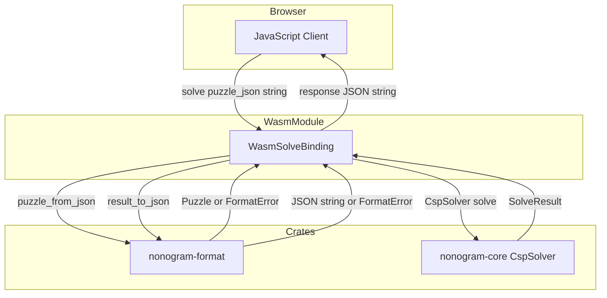
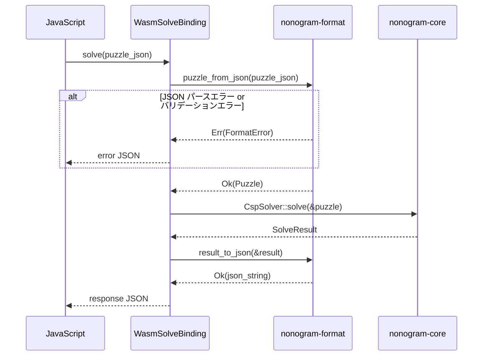

# 技術設計ドキュメント: nonogram-wasm

## 概要

`nonogram-wasm` は `nonogram-core` のソルバロジックを WebAssembly 経由でブラウザから利用可能にするバインディングクレートである。`wasm-bindgen` を用いて JavaScript 向けに `solve` 関数をエクスポートし、`apps/web` の React フロントエンドがバックエンドなしでノノグラムパズルを解けるようにする。JSON の解析・生成はすべて `nonogram-format` に委譲し、WASMバインディング層では JSON を直接処理しない。

**ユーザー:** Webアプリ開発者は `solve(puzzle_json)` を呼び出して解答 JSON を受け取る。フロントエンドはサーバー通信なしにパズルを解ける。

**インパクト:** `nonogram-wasm/src/lib.rs` のスタブを本実装に置き換え、`Cargo.toml` に依存（`wasm-bindgen`・`nonogram-core`・`nonogram-format`）とビルド設定を追加する。

### Goals

- JavaScript から直接呼び出せる `solve(puzzle_json: &str) -> String` 関数の提供
- 不正入力に対してもパニックせず安全な JSON 応答を返すエラーハンドリング
- `wasm-pack build --target bundler crates/nonogram-wasm` でビルド可能なパッケージング
- CI ワークフロー（`build-wasm` ジョブ）への統合

### Non-Goals

- `CspSolver` 以外のソルバの選択機能（将来拡張）
- 非同期 API（Web Workers での利用は呼び出し側の責務）
- `generate_template` や `puzzle_to_json` のエクスポート（現在のスコープ外）

---

## 要件トレーサビリティ

| 要件 | 概要 | コンポーネント | インターフェース | フロー |
|------|------|----------------|------------------|--------|
| 1.1 | `#[wasm_bindgen]` で `solve` を公開 | WasmSolveBinding | Rust Service Interface | solve フロー |
| 1.2 | 有効 JSON → CspSolver で求解 | WasmSolveBinding | Rust Service Interface | solve フロー |
| 1.3 | 解答 JSON を返す | WasmSolveBinding | Rust Service Interface | solve フロー |
| 1.4 | JSON 処理を nonogram-format に委譲 | WasmSolveBinding | nonogram-format 依存 | solve フロー |
| 1.5 | nonogram-core・format のみに依存 | Cargo.toml 設定 | — | — |
| 2.1 | 不正 JSON でもパニックしない | WasmSolveBinding | エラー応答 | エラーフロー |
| 2.2 | バリデーション失敗でエラー JSON を返す | WasmSolveBinding | エラー応答 | エラーフロー |
| 2.3 | エラー JSON に `status`・`message` を含む | ErrorResponseDto | データモデル | — |
| 3.1 | `wasm-pack build` でビルド成功 | Cargo.toml / CI | — | — |
| 3.2 | `crate-type = ["cdylib", "rlib"]` | Cargo.toml | — | — |
| 3.3 | `wasm-bindgen` を依存に含める | Cargo.toml | — | — |
| 3.4 | `solve` が ES モジュールとして公開 | wasm-pack bundler target | — | — |
| 3.5 | CI `build-wasm` ジョブでビルド成功 | `.github/workflows/ci.yml` | — | — |

---

## アーキテクチャ

### 既存アーキテクチャ分析

`nonogram-wasm` クレートはすでに Cargo workspace に登録されているが、`src/lib.rs` は `add` 関数のみのスタブ状態であり、`Cargo.toml` に依存は存在しない。ステアリング方針により以下の制約が確定している:

- `nonogram-core` → `nonogram-format` の依存は禁止（逆方向も禁止）
- `nonogram-wasm` は `nonogram-core` と `nonogram-format` のみに依存する（1.5）
- JSON 変換責務はアプリ/バインディング層（本クレート）に置く

### Architecture Pattern & Boundary Map

選択パターン: **Thin Wrapper**。`#[wasm_bindgen]` 関数が `nonogram-format` の変換関数と `nonogram-core` のソルバを直接呼び出す。中間アダプター層は設けない（1関数のみのスコープでは過剰設計）。



**境界の決定:**
- WASMモジュール境界: JavaScript ↔ `#[wasm_bindgen]` 関数
- クレート境界: `nonogram-wasm` は `nonogram-format` と `nonogram-core` を依存とする
- JSON 処理境界: `nonogram-format` が全 JSON 変換を担う（1.4）
- エラー変換境界: `FormatError` → JSON 変換は `nonogram-wasm` の責務

### Technology Stack

| レイヤー | 選択 / バージョン | 本フィーチャーでの役割 | 備考 |
|----------|-------------------|------------------------|------|
| WASM バインディング | wasm-bindgen 0.2 | JS ↔ Rust の ABI 橋渡し | crates.io 最新: 0.2.114（2026-02-27）|
| ビルドツール | wasm-pack | WASM + ESモジュール生成 | `--target bundler` で Vite 互換出力 |
| JSON 変換 | nonogram-format（内部クレート） | Puzzle/SolveResult ↔ JSON | puzzle_from_json・result_to_json を委譲 |
| ソルバ | nonogram-core::CspSolver | 制約伝播 + バックトラッキング | Solver トレイト実装 |
| ビルドターゲット | wasm32-unknown-unknown | WASM バイナリ生成 | Rust WASM 標準ターゲット |

詳細なバージョン調査と wasm-pack の互換性ノートは `research.md` を参照。

---

## System Flows

### solve 呼び出しフロー



**フロー決定事項:** エラー発生時は即座に error JSON を返す（早期リターン）。`CspSolver::solve` はパニックしない設計のため、エラーパスは `FormatError` のみ。

---

## Components and Interfaces

### コンポーネントサマリー

| コンポーネント | レイヤー | 役割 | 要件カバレッジ | 主要依存 | コントラクト |
|----------------|----------|------|----------------|----------|--------------|
| WasmSolveBinding | WASM バインディング | `solve` 関数のエクスポートとエラー変換 | 1.1–1.4, 2.1–2.3 | nonogram-format (P0), nonogram-core (P0) | Service |
| ErrorResponseDto | データモデル | エラー時の JSON 応答構造体 | 2.3 | — | State |
| Cargo.toml 設定 | ビルド設定 | クレートタイプ・依存定義 | 1.5, 3.1–3.3 | — | — |
| CI ワークフロー | インフラ | `build-wasm` ジョブ | 3.4, 3.5 | wasm-pack | — |

---

### WASM バインディング層

#### WasmSolveBinding

| フィールド | 詳細 |
|------------|------|
| Intent | `#[wasm_bindgen]` で `solve` を公開し、format/core を呼び出してエラーを安全に変換する |
| Requirements | 1.1, 1.2, 1.3, 1.4, 2.1, 2.2, 2.3 |

**Responsibilities & Constraints**
- `puzzle_json: &str` を受け取り、`nonogram_format::puzzle_from_json` に渡す
- `nonogram_core::CspSolver::solve(&puzzle)` で求解する
- `nonogram_format::result_to_json(&result)` で JSON 化する
- いずれかのステップで失敗した場合、`FormatError::to_string()` を使ってエラー JSON を返す
- パニックしてはならない（`#[wasm_bindgen]` 関数でのパニックはランタイムエラーになるため）
- JSON 処理を `nonogram-format` に委譲し、直接 `serde_json` を使用しない

**Dependencies**
- Inbound: JavaScript — `solve` 関数を呼び出す (P0)
- Outbound: `nonogram-format::puzzle_from_json` — 入力 JSON をパース (P0)
- Outbound: `nonogram-core::CspSolver::solve` — パズルを解く (P0)
- Outbound: `nonogram-format::result_to_json` — 結果を JSON 化 (P0)

**Contracts**: Service [x] / API [ ] / Event [ ] / Batch [ ] / State [ ]

##### Service Interface

```rust
/// JavaScript に公開するソルバ関数。
///
/// # Parameters
/// - `puzzle_json`: `{"row_clues": [[u32]], "col_clues": [[u32]]}` 形式の JSON 文字列
///
/// # Returns
/// 成功時: `nonogram-format` が定義する解答 JSON 文字列
/// 失敗時: `{"status": "error", "message": "<エラー内容>"}` JSON 文字列
#[wasm_bindgen]
pub fn solve(puzzle_json: &str) -> String
```

- 事前条件: 引数は UTF-8 文字列（wasm-bindgen が保証）
- 事後条件: 常に有効な JSON 文字列を返す（パニックしない）
- 不変条件: JSON 処理は `nonogram-format` に委譲する（直接 serde_json は使用しない）

**Implementation Notes**
- `FormatError` を捕捉して `ErrorResponseDto` にマッピングする。`serde_json::to_string` によるエラー JSON 生成はフォールバックとして `expect` を使用してよい（`ErrorResponseDto` は常にシリアライズ可能）
- `console_error_panic_hook` は依存制約（1.5）のため採用しない
- リスク: `result_to_json` の `FormatError::UnknownCell` は `CspSolver` が全セルを解決するため実運用上は発生しないが、エラーパスで捕捉済み

---

## Data Models

### Domain Model

`nonogram-wasm` は新たなドメインエンティティを持たない。`nonogram-core` の `Puzzle`・`SolveResult`・`Grid` を利用し、`nonogram-format` の変換関数を通じて JSON と相互変換する。

### Data Contracts & Integration

#### API Data Transfer（JavaScript ↔ WasmSolveBinding）

**入力スキーマ（puzzle_json）**

```
{
  "row_clues": [[u32, ...], ...],
  "col_clues": [[u32, ...], ...]
}
```

- `row_clues`: 行のヒント。各要素は連続するブロックサイズの配列（空配列 `[]` は空行を意味する）
- `col_clues`: 列のヒント。同上
- バリデーション: `nonogram-format::puzzle_from_json` が実施

**成功レスポンススキーマ**（`nonogram-format` が定義）

```
{
  "status": "unique" | "multiple" | "none",
  "solutions": [[[bool, ...], ...], ...]
}
```

- `status: "unique"` — 唯一解、`solutions` に1要素
- `status: "multiple"` — 複数解、`solutions` に複数要素
- `status: "none"` — 解なし、`solutions` は空配列

**エラーレスポンススキーマ**（ErrorResponseDto）

```
{
  "status": "error",
  "message": "<エラー内容の文字列>"
}
```

`status` フィールドにより、フロントエンドは成功・エラーを一貫したパターンで分岐できる。

### ビルド設定

**`crates/nonogram-wasm/Cargo.toml` の必須設定:**

```toml
[lib]
crate-type = ["cdylib", "rlib"]

[dependencies]
wasm-bindgen = "0.2"
nonogram-core = { path = "../nonogram-core" }
nonogram-format = { path = "../nonogram-format" }
```

- `cdylib`: WASM バイナリ生成に必要
- `rlib`: `cargo test` でのRustユニットテストに必要

---

## Error Handling

### Error Strategy

`solve` 関数は `Result` を返さず `String` を返す。エラーは JSON 文字列に変換して返すことでパニックを回避する（2.1、2.2）。

### Error Categories and Responses

| エラー種別 | 原因 | `FormatError` バリアント | `message` 例 |
|------------|------|--------------------------|--------------|
| 不正 JSON | `puzzle_json` が JSON として無効 | `FormatError::Json` | `"JSON error: ..."` |
| バリデーション失敗 | 空のヒントリスト等 | `FormatError::InvalidPuzzle` | `"invalid puzzle: ..."` |
| UnknownCell | CspSolver が未解決セルを残した場合 | `FormatError::UnknownCell` | `"grid contains unknown cells"` |

すべてのエラーは `{"status": "error", "message": "<FormatError::to_string()>"}` に変換する。

### Monitoring

WASMバインディングはブラウザ環境で動作するため、サーバーサイドログは持たない。フロントエンドが `status: "error"` を検出した場合、`message` フィールドをユーザーに表示するか `console.error` で記録する責務を持つ。

---

## Testing Strategy

### Unit Tests（Rust / `cargo test`）

1. `solve` に有効な puzzle JSON を渡すと `status: "unique|multiple|none"` を返す
2. `solve` に不正 JSON を渡すと `{"status": "error", ...}` を返す（パニックしない）
3. `solve` に無効な puzzle JSON（空ヒストリスト等）を渡すと `{"status": "error", ...}` を返す
4. 返り値が常に有効な JSON 文字列であることを `serde_json::from_str` で検証

### Integration Tests

1. `wasm-pack build --target bundler crates/nonogram-wasm` が成功してバイナリが生成される（CI）
2. 生成された `nonogram_wasm.d.ts` に `solve(puzzle_json: string): string` が含まれる

### Performance

WASMバインディングはシリアライゼーション/デシリアライゼーションのオーバーヘッドを持つ。通常のパズルサイズ（≦30×30）では問題にならないため、パフォーマンスターゲットは現フェーズでは定義しない。

---

## Optional Sections

### Security Considerations

- `solve` は入力文字列を `serde_json` でパースするのみであり、コードインジェクションのリスクはない
- WASM モジュールはブラウザのサンドボックス内で動作する

### Performance & Scalability

- `CspSolver` のソルバ計算時間はパズルサイズに依存する。大規模パズル（≧50×50）では Web Workers での非同期実行を推奨するが、WASMバインディング自体は同期 API のみを提供する（呼び出し側の責務）
