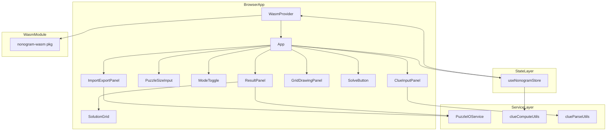
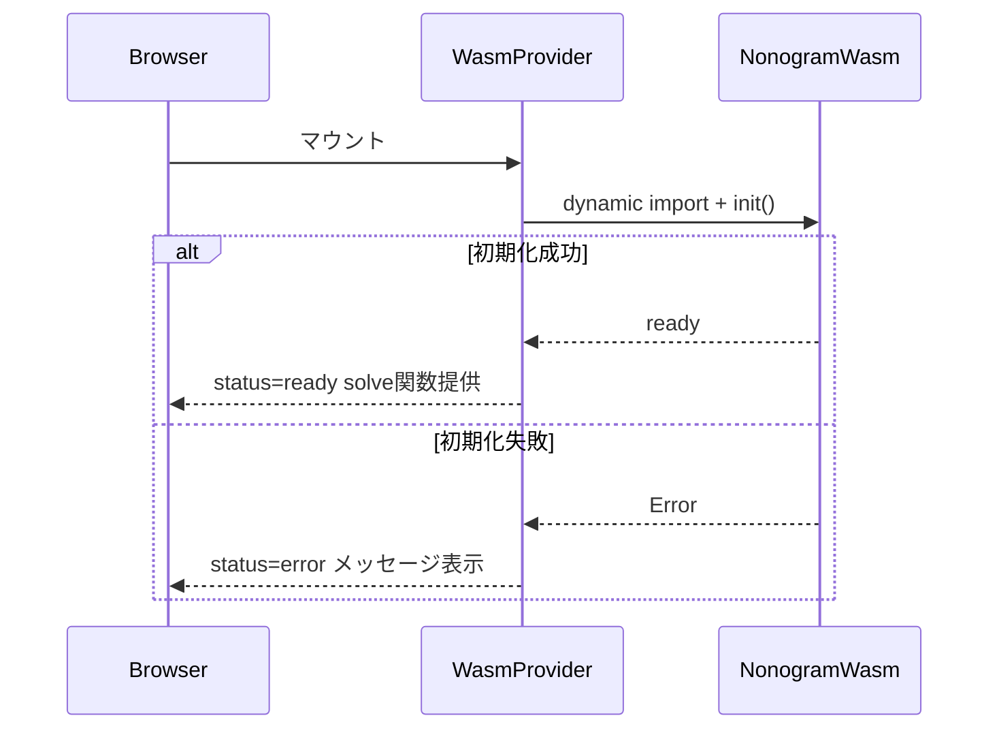
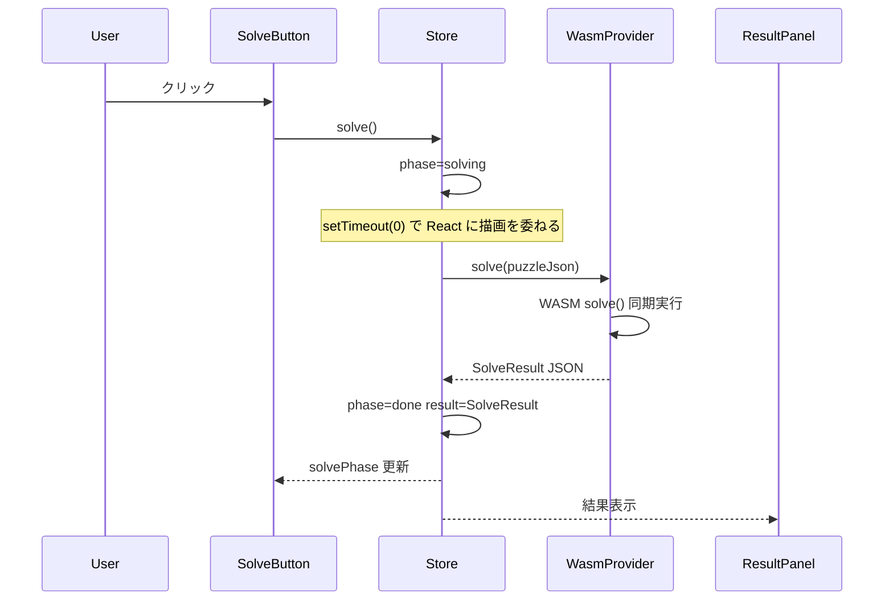
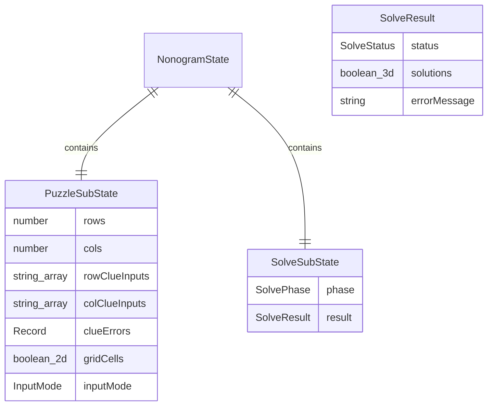
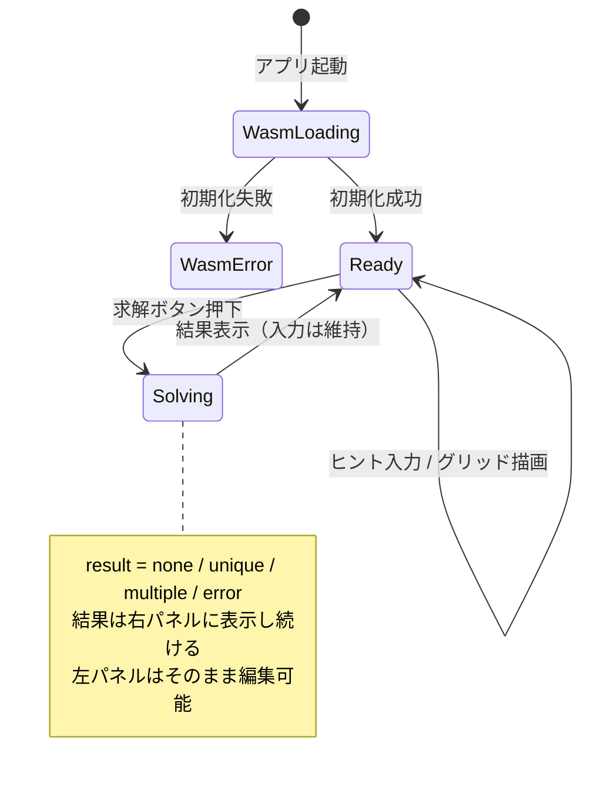

# 設計文書: Webアプリ (`apps/web`)

## 概要

本フィーチャーは、ノノグラムパズルをブラウザ内で完結して作成・求解・入出力できる SPA を提供する。`nonogram-wasm` を介して Rust 製ソルバをブラウザで実行し、バックエンドサーバーは一切不要で動作する。

**目的**: ユーザーがブラウザだけでノノグラムパズルの作成（ヒント入力・グリッド描画の 2 モード）、求解、および JSON 形式での問題・解答のインポート/エクスポートを行えるようにする。
**ユーザー**: ノノグラムパズルを解きたいユーザー、パズルを作成・共有したいユーザー。
**影響**: `apps/web` の既存 Vite + React + TypeScript スキャフォールドに完全な機能を追加する。`vite.config.ts` および `package.json` を更新する。

### ゴール

- WASM モジュールの動的ロードと初期化エラーハンドリング
- ヒント入力モードとグリッド描画モードの相互切り替え
- JSON 形式での問題インポート/エクスポートおよびテンプレート生成
- 求解結果（解なし/唯一解/複数解）の視覚表示と解答 JSON エクスポート

### 非ゴール

- バックエンドサーバーとの通信
- ユーザーアカウント管理・パズルの永続化（ローカルストレージ保存等）
- カラーノノグラム・3 値以上のノノグラム
- Web Worker による非同期 WASM 実行（将来拡張候補）

---

## 要件トレーサビリティ

| 要件 | 概要 | コンポーネント | インターフェース | フロー |
|------|------|----------------|-----------------|--------|
| 1.1 | バックエンドなし動作 | WasmProvider | WasmContextValue | — |
| 1.2 | WASM 初期化 | WasmProvider | WasmContextValue | WASM 初期化フロー |
| 1.3 | WASM エラー表示 | WasmProvider, App | WasmContextValue | — |
| 1.4 | solve() 呼び出し | useNonogramStore, WasmProvider | NonogramStore.solve | 求解フロー |
| 2.1 | 行数・列数入力 | PuzzleSizeInput | NonogramStore.setDimensions | — |
| 2.2 | ヒント入力欄生成 | ClueInputPanel | NonogramStore | — |
| 2.3 | カンマ/スペース区切り入力 | ClueInputPanel, clueParseUtils | parseClueString | — |
| 2.4 | バリデーションエラー表示 | ClueInputPanel | NonogramStore.clueErrors | — |
| 2.5 | 空ヒント入力可 | ClueInputPanel, clueParseUtils | parseClueString | — |
| 3.1 | グリッド描画モード | GridDrawingPanel, ModeToggle | NonogramStore.inputMode | — |
| 3.2 | セルクリックトグル | GridDrawingPanel | NonogramStore.toggleCell | — |
| 3.3 | ドラッグ操作 | GridDrawingPanel | NonogramStore.dragCell | — |
| 3.4 | リアルタイムヒント自動計算 | useNonogramStore, clueComputeUtils | computeRowClues, computeColClues | — |
| 3.5 | モード切り替え | ModeToggle | NonogramStore.setInputMode | — |
| 4.1 | 問題エクスポート | ImportExportPanel, PuzzleIOService | PuzzleIOService.exportPuzzle | — |
| 4.2 | 問題インポート | ImportExportPanel, PuzzleIOService | PuzzleIOService.importPuzzle | — |
| 4.3 | インポートバリデーション | PuzzleIOService | PuzzleIOService.importPuzzle | — |
| 4.4 | テンプレートエクスポート | ImportExportPanel, PuzzleIOService | PuzzleIOService.exportTemplate | — |
| 5.1 | 求解実行 | SolveButton, useNonogramStore | NonogramStore.solve | 求解フロー |
| 5.2 | ローディング表示 | SolveButton | NonogramStore.solvePhase | 求解フロー |
| 5.3 | 解なし表示 | ResultPanel | SolveResult.status | — |
| 5.4 | 唯一解表示 | ResultPanel, SolutionGrid | SolveResult | — |
| 5.5 | 複数解表示 | ResultPanel, SolutionGrid | SolveResult | — |
| 5.6 | セル視覚区別 | SolutionGrid | SolutionGridProps.grid | — |
| 6.1 | 解答エクスポートボタン有効化 | ResultPanel | NonogramStore.solvePhase | — |
| 6.2 | 解答エクスポート | ResultPanel, PuzzleIOService | PuzzleIOService.exportSolution | — |
| 6.3 | 解答なし時ボタン無効化 | ResultPanel | NonogramStore.solvePhase | — |

---

## アーキテクチャ

### 既存アーキテクチャ分析

`apps/web` は Vite 7 + React 19 + TypeScript のスキャフォールドのみ存在し、`App.tsx` はデフォルトのカウンタ実装のみを含む。`nonogram-wasm` は `crates/nonogram-wasm/src/lib.rs` に実装済みで `wasm-pack build` でビルド可能。`nonogram-wasm` は `solve(puzzle_json: &str) -> String` を同期関数として公開する。

**統合上の制約**:
- Vite 7 は WASM ESM を標準サポートしないため `vite-plugin-wasm` + `vite-plugin-top-level-await` が必要（詳細は `research.md`）
- wasm-bindgen 生成コードは ESM 形式で `init()` (default export) + `solve()` を公開する
- `nonogram-wasm` パッケージは `crates/nonogram-wasm/pkg/` から `"file:"` 参照でインストールする

### アーキテクチャパターン・境界マップ

**選択パターン**: Provider + Custom Hook + Service Layer（React 標準パターン）

- WASM の副作用ロードを `WasmProvider` に隔離し、`WasmContext` 経由でアプリ全体に提供する
- パズル状態を `useNonogramStore` フック（`useReducer` ベース）に集約する
- ファイル I/O は副作用として `PuzzleIOService` モジュールに分離する
- 純粋計算（ヒント計算・ヒント文字列パース）はユーティリティモジュールに分離する



**境界の決定**:
- WASM 初期化とエラーハンドリングは `WasmProvider` が所有する
- パズル状態・求解状態は `useNonogramStore` が所有する
- UI コンポーネントはローカル状態を持たず、ストアからプロップスを受け取る（`GridDrawingPanel` のドラッグ一時状態を除く）
- ファイル操作（Blob, FileReader）は `PuzzleIOService` が所有する

**ステアリングコンプライアンス**: TypeScript strict mode、`PascalCase` コンポーネント名、`camelCase` ユーティリティ名、相対パスインポートを遵守する。

### テクノロジースタック

| レイヤー | 選択 / バージョン | 本フィーチャーでの役割 | 備考 |
|---------|-----------------|----------------------|------|
| フロントエンド | React 19 + Vite 7 | SPA フレームワーク | 既存設定使用 |
| 言語 | TypeScript ~5.9 | 型安全実装 | strict mode 維持 |
| WASM | nonogram-wasm (wasm-bindgen) | ノノグラムソルバ呼び出し | `file:../../crates/nonogram-wasm/pkg` ローカル参照 |
| Vite プラグイン | vite-plugin-wasm + vite-plugin-top-level-await | WASM ESM バンドル対応 | devDependencies に新規追加 |
| 状態管理 | React useReducer + Context | パズル・求解状態集約 | 外部ライブラリ不要 |
| パッケージマネージャ | Bun | 依存管理・開発サーバ | steering 準拠 |

---

## システムフロー

### WASM 初期化フロー



### 求解フロー



**フロー決定事項**: WASM `solve()` は同期実行だが、`await new Promise(r => setTimeout(r, 0))` を挿入して React がローディング状態を描画してから WASM を呼び出す（詳細は `research.md`）。

---

## コンポーネントとインターフェース

### サマリテーブル

| コンポーネント | ドメイン/レイヤー | 役割 | 要件カバレッジ | 主要依存 (P0/P1) | コントラクト |
|--------------|----------------|------|-------------|-----------------|------------|
| WasmProvider | WASM統合 | WASM ロード・コンテキスト提供 | 1.1, 1.2, 1.3 | nonogram-wasm (P0) | Context, State |
| useNonogramStore | 状態管理 | 中央状態・全アクション | 1.4, 2.1–2.5, 3.1–3.5, 5.1–5.6, 6.1, 6.3 | WasmContext (P0), clueComputeUtils (P1) | Service, State |
| PuzzleIOService | サービス | ファイル I/O | 4.1–4.4, 6.2 | ブラウザ Blob/FileReader API (P0) | Service |
| clueComputeUtils | ユーティリティ | グリッド → ヒント変換 | 3.4 | — | — |
| clueParseUtils | ユーティリティ | ヒント文字列パース・バリデーション | 2.3, 2.4, 2.5 | — | — |
| App | UI/ルート | WASM エラー表示・コンポーネント組み合わせ | 1.3 | WasmProvider (P0) | — |
| PuzzleSizeInput | UI/入力 | 行数・列数入力 | 2.1, 2.2 | useNonogramStore (P0) | — |
| ModeToggle | UI/入力 | 入力モード切り替え | 3.5 | useNonogramStore (P0) | — |
| ClueInputPanel | UI/入力 | ヒント入力グリッド表示 | 2.3, 2.4, 2.5 | useNonogramStore (P0) | — |
| GridDrawingPanel | UI/入力 | グリッド描画（ポインタドラッグ対応） | 3.1, 3.2, 3.3, 3.4 | useNonogramStore (P0) | State |
| ImportExportPanel | UI/I/O | インポート/エクスポート UI | 4.1, 4.2, 4.3, 4.4 | PuzzleIOService (P0) | — |
| SolveButton | UI/アクション | 求解トリガ・ローディング表示 | 5.1, 5.2 | useNonogramStore (P0) | — |
| ResultPanel | UI/表示 | 結果表示・解答エクスポート | 5.3, 5.4, 5.5, 5.6, 6.1, 6.2, 6.3 | useNonogramStore (P0), PuzzleIOService (P1) | State |
| SolutionGrid | UI/表示 | 解答グリッド描画 | 5.6 | — | — |

---

### WASM統合層

#### WasmProvider

| フィールド | 詳細 |
|----------|------|
| Intent | nonogram-wasm の動的ロード・初期化・WasmContext 提供 |
| Requirements | 1.1, 1.2, 1.3 |

**責務と制約**
- アプリ起動時に `nonogram-wasm` を動的インポートし `init()` で WASM バイナリを初期化する
- loading / error / ready の 3 状態を管理し、`WasmContext` 経由でアプリ全体に公開する
- `status.phase !== 'ready'` の間は `solve` はノーオペレーション実装を返す

**依存関係**
- 外部: `nonogram-wasm` pkg — wasm-bindgen 生成バインディング (P0)

**コントラクト**: Context [x] / State [x]

##### Context インターフェース

```typescript
type WasmLoadStatus =
  | { phase: 'loading' }
  | { phase: 'error'; message: string }
  | { phase: 'ready' };

interface WasmContextValue {
  status: WasmLoadStatus;
  solve: (puzzleJson: string) => string;
}

const WasmContext: React.Context<WasmContextValue>;

function WasmProvider(props: { children: React.ReactNode }): React.JSX.Element;

function useWasm(): WasmContextValue;
```

- 事前条件: なし（アプリ起動時に自動実行）
- 事後条件: `status.phase === 'ready'` のとき `solve` は有効な WASM 関数を参照する
- 不変条件: `status.phase !== 'ready'` のとき `solve` は `{"status":"error","message":"WASM not ready"}` を返す空実装

**実装ノート**
- 統合: `vite.config.ts` に `wasm()` と `topLevelAwait()` プラグインを追加する。`package.json` に `"nonogram-wasm": "file:../../crates/nonogram-wasm/pkg"` を追加し `bun install` で反映する
- バリデーション: `init()` が例外をスローした場合は `{ phase: 'error', message: e.message }` に遷移する
- リスク: WASM バイナリ未ビルド時にインポートエラーが発生する。CI で `build-wasm` を `build-web` の前提条件にする

---

### アプリケーション状態層

#### useNonogramStore

| フィールド | 詳細 |
|----------|------|
| Intent | パズル状態・求解状態・入力モードの中央管理と全アクションの提供 |
| Requirements | 1.4, 2.1–2.5, 3.1–3.5, 5.1–5.6, 6.1, 6.3 |

**責務と制約**
- パズル寸法・ヒント入力・グリッドセル・バリデーションエラー・求解状態を `useReducer` で一元管理する
- グリッド描画モードでセルが変更された際、`clueComputeUtils` でヒントをリアルタイム計算して `rowClueInputs`/`colClueInputs` を更新する
- `solve()` は `setTimeout(0)` 遅延後に WASM を呼び出し、React がローディング状態を描画できるようにする
- ヒント入力⇔グリッド描画のモード切り替え時に内部状態を相互変換する

**依存関係**
- インバウンド: 全 UI コンポーネント — アクション呼び出し・状態購読 (P0)
- アウトバウンド: `WasmContext` (useWasm) — solve 関数取得 (P0)
- 外部: `clueComputeUtils` — グリッドからヒント計算 (P1)
- 外部: `clueParseUtils` — ヒント文字列パース・バリデーション (P1)

**コントラクト**: Service [x] / State [x]

##### サービスインターフェース

```typescript
type InputMode = 'clue' | 'grid';

type SolvePhase =
  | { phase: 'idle' }
  | { phase: 'solving' }
  | { phase: 'done'; result: SolveResult };

interface SolveResult {
  status: 'none' | 'unique' | 'multiple' | 'error';
  solutions: boolean[][][];
  errorMessage?: string;
}

interface PuzzleJson {
  row_clues: number[][];
  col_clues: number[][];
}

interface NonogramStore {
  // 状態
  rows: number;
  cols: number;
  rowClueInputs: string[];
  colClueInputs: string[];
  clueErrors: Record<string, string>;
  gridCells: boolean[][];
  inputMode: InputMode;
  solvePhase: SolvePhase;
  // アクション
  setDimensions(rows: number, cols: number): void;
  updateRowClue(index: number, raw: string): void;
  updateColClue(index: number, raw: string): void;
  toggleCell(row: number, col: number): void;
  startDrag(row: number, col: number): void;
  dragCell(row: number, col: number): void;
  endDrag(): void;
  setInputMode(mode: InputMode): void;
  solve(): Promise<void>;
  loadPuzzle(puzzle: PuzzleJson): void;
  getPuzzleJson(): PuzzleJson;
}

function useNonogramStore(): NonogramStore;
```

- 事前条件: `solve()` は `WasmContext.status.phase === 'ready'` かつ `clueErrors` が空の場合のみ WASM を呼び出す
- 事後条件: `setDimensions(r, c)` 後は `rowClueInputs.length === r` かつ `colClueInputs.length === c` を保証する
- 不変条件: `gridCells` は常に `rows × cols` の 2D 配列を維持する

##### 状態管理

- 状態モデル: `useReducer` による単一ステートオブジェクト（`NonogramState`）
- 永続化: なし（セッション内のみ）
- 並行戦略: React 描画サイクル内のシリアル更新

**実装ノート**
- 統合: `useContext(WasmContext)` で WASM アクセス。グリッド変更ディスパッチ後に `clueComputeUtils.computeRowClues` / `computeColClues` で `rowClueInputs`/`colClueInputs` を更新する
- バリデーション: `updateRowClue`/`updateColClue` 時に `clueParseUtils.parseClueString()` でリアルタイムバリデーションし、エラーを `clueErrors` に反映する
- リスク: 大きなグリッド（50×50 超）ではリアルタイムヒント計算が遅くなる可能性がある。各セルの `React.memo` と `useMemo` で最適化する

---

### サービス層

#### PuzzleIOService

| フィールド | 詳細 |
|----------|------|
| Intent | パズル・テンプレート・解答 JSON のファイルダウンロードとインポート |
| Requirements | 4.1, 4.2, 4.3, 4.4, 6.2 |

**責務と制約**
- ブラウザの `Blob` + `<a>` 要素を使ったファイルダウンロードを担う
- `FileReader.readAsText()` でファイルインポートし JSON パースおよびスキーマ検証を行う
- インポート時に `row_clues`・`col_clues` フィールドの存在と `number[][]` 型を検証する

**依存関係**
- 外部: ブラウザ Blob API / URL API / FileReader API (P0)

**コントラクト**: Service [x]

##### サービスインターフェース

```typescript
interface ImportedPuzzle {
  row_clues: number[][];
  col_clues: number[][];
}

type PuzzleIOError =
  | { kind: 'parse'; message: string }
  | { kind: 'schema'; message: string };

interface PuzzleIOService {
  exportPuzzle(rowClues: number[][], colClues: number[][]): void;
  exportTemplate(rows: number, cols: number): void;
  exportSolution(result: SolveResult): void;
  importPuzzle(file: File): Promise<ImportedPuzzle>;
}
```

- 事前条件: `importPuzzle()` の引数 `file` は UTF-8 テキストの JSON ファイルであることを前提とする
- 事後条件: `importPuzzle()` は `row_clues`・`col_clues` が `number[][]` であることを保証する。不正な場合は `PuzzleIOError` をスローする
- 不変条件: `exportPuzzle()`/`exportTemplate()`/`exportSolution()` は副作用（ファイルダウンロード）のみを持つ

**実装ノート**
- 統合: `URL.createObjectURL()` + 仮想 `<a>` の `.click()` でダウンロード実装。使用後は `URL.revokeObjectURL()` で解放する
- バリデーション: `row_clues` と `col_clues` が配列であること、各要素が `number[]` であること、各数値が `>= 0` の整数であることを検証する
- リスク: 実用サイズ（〜50×50）のパズル JSON では FileReader の性能上問題はない

#### clueComputeUtils（サマリ）

グリッドセル配列 `boolean[][]` から行・列ヒント `number[][]` を計算する純粋関数モジュール。

```typescript
function computeRowClues(cells: boolean[][]): number[][];
function computeColClues(cells: boolean[][]): number[][];
```

- 連続する `true` セルの個数を数えてヒント配列を生成する
- 行または列が全て `false` の場合は空配列 `[]` を返す（空ヒントとして有効）

#### clueParseUtils（サマリ）

ヒント入力文字列のパースとバリデーションを行う純粋関数モジュール。

```typescript
type ParseResult =
  | { ok: true; clues: number[] }
  | { ok: false; error: string };

function parseClueString(input: string): ParseResult;
```

- カンマまたはスペース区切りの正整数列を `number[]` に変換する
- 空文字列は空配列（ヒントなし）として有効とする（要件 2.5）
- 正整数以外の文字を含む場合は `ok: false` とエラー文字列を返す（要件 2.4）

---

### UIコンポーネント層

#### GridDrawingPanel

| フィールド | 詳細 |
|----------|------|
| Intent | Pointer Events によるインタラクティブなグリッド描画 |
| Requirements | 3.1, 3.2, 3.3, 3.4 |

**責務と制約**
- `rows × cols` のセルグリッドを描画し、ポインタイベントでセルのトグルとドラッグ操作を処理する
- `onPointerDown` 時にドラッグ開始セルの操作種別（塗りつぶし/消去）を決定し、ドラッグ中すべての通過セルに同じ操作を適用する
- `inputMode === 'clue'` の場合は非表示にする
- 各セルは `React.memo` でメモ化し再描画コストを最小化する

**依存関係**
- インバウンド: `useNonogramStore` — `gridCells`, `toggleCell`, `startDrag`, `dragCell`, `endDrag` (P0)

**コントラクト**: State [x]

##### 状態管理

- 状態モデル: ドラッグ状態（`isDragging: boolean`, `dragAction: 'fill' | 'erase' | null`）をコンポーネントローカル `useState` で管理する。`gridCells` は `useNonogramStore` から取得する
- 永続化: なし
- 並行戦略: `onPointerDown` で `element.setPointerCapture(pointerId)` を呼び出し、ポインタがグリッド外に出ても `onPointerUp` を確実に捕捉する

**実装ノート**
- 統合: 各セルに `onPointerDown` を登録し、セルルート要素に `onPointerUp` を登録する。セル間移動は各セルの `onPointerEnter` で `isDragging === true` のときのみ `dragCell()` を呼び出す
- バリデーション: `onPointerEnter` は `isDragging === true` の場合のみ処理する
- リスク: 大きなグリッド（50×50 以上）でのセル再描画コスト。`React.memo` と安定したコールバック参照（`useCallback`）でミティゲーションする

#### ResultPanel

| フィールド | 詳細 |
|----------|------|
| Intent | 求解結果のステータス別表示と解答エクスポート |
| Requirements | 5.3, 5.4, 5.5, 5.6, 6.1, 6.2, 6.3 |

**責務と制約**
- `solvePhase` の値に応じて以下を表示する:
  - `idle`: 何も表示しない
  - `solving`: ローディングインジケーター（SolveButton 側でも表示）
  - `done / status=none`: 「解が存在しないパズルです」メッセージ
  - `done / status=unique`: 「一意解」ラベルと `SolutionGrid` 1 つ
  - `done / status=multiple`: 2 つの `SolutionGrid` を並べて表示
  - `done / status=error`: エラーメッセージ
- 解答エクスポートボタンは `status === 'unique' || status === 'multiple'` のときのみ有効化する（要件 6.1, 6.3）

**依存関係**
- インバウンド: `useNonogramStore` — `solvePhase` (P0)
- アウトバウンド: `PuzzleIOService.exportSolution` (P1)
- アウトバウンド: `SolutionGrid` — 解答グリッド描画 (P1)

**コントラクト**: State [x]

##### 状態管理

- 状態モデル: `solvePhase` は `useNonogramStore` から取得する（ローカル状態なし）
- 永続化: なし

**実装ノート**
- 統合: `solvePhase.phase === 'done' && solvePhase.result.status !== 'none'` のとき解答エクスポートボタンを `disabled={false}` で表示する
- バリデーション: `status === 'error'` の場合は `errorMessage` をユーザーに表示する
- リスク: なし

#### SolutionGrid（サマリ）

`boolean[][]` グリッドを視覚的にレンダリングする表示専用コンポーネント。

```typescript
interface SolutionGridProps {
  grid: boolean[][];
  label?: string;
}
```

- `true` セル（塗りつぶし）と `false` セル（空白）を CSS クラスで視覚的に区別する（要件 5.6）
- `label` が指定された場合はグリッド上部に表示する（例: 「唯一解」「解例 1」）

#### ImportExportPanel（サマリ）

問題インポート/エクスポート・テンプレートエクスポートの UI を提供する。`<input type="file" accept=".json">` でファイル選択し `PuzzleIOService.importPuzzle()` を呼び出す。インポートエラー（`PuzzleIOError`）はコンポーネントローカル状態でインラインメッセージとして表示する。エクスポート成功/失敗はインポートとは独立して処理する。

#### PuzzleSizeInput（サマリ）

行数（`rows`）・列数（`cols`）の数値入力フィールドを提供する。`1 ≤ rows, cols ≤ 50` のバリデーションを行い、確定時に `useNonogramStore.setDimensions()` を呼び出す。

#### ModeToggle（サマリ）

「ヒント入力」と「グリッド描画」の 2 モードを切り替えるトグルボタン。現在の `inputMode` を表示し、`onClick` で `useNonogramStore.setInputMode()` を呼び出す。

#### SolveButton（サマリ）

`solvePhase.phase === 'solving'` のときローディングインジケーターを表示してボタンを `disabled` にする。`onClick` で `useNonogramStore.solve()` を呼び出す。クリック可能な条件: `wasm.status.phase === 'ready'` かつ `Object.keys(clueErrors).length === 0`。

#### ClueInputPanel（サマリ）

`rows` 個の行ヒント入力欄と `cols` 個の列ヒント入力欄を表示する。各入力欄の `onChange` で `updateRowClue()`/`updateColClue()` を呼び出す。`clueErrors` に対応するキー（例: `"row-0"`, `"col-2"`）が存在する場合、入力欄下にバリデーションエラーメッセージを表示する。`inputMode === 'grid'` の場合は非表示にする。

---

## データモデル

### ドメインモデル

- **Puzzle**: `rowClueInputs: string[]`（未解析のヒント入力）、`colClueInputs: string[]`（未解析）、`gridCells: boolean[][]`（グリッド描画モードのセル状態）
- **PuzzleJson**: `row_clues: number[][]`、`col_clues: number[][]`（WASM 入力・ファイル I/O の共通 JSON フォーマット）
- **SolveResult**: `status: 'none' | 'unique' | 'multiple' | 'error'`、`solutions: boolean[][][]`

ビジネスルール:
- `row_clues.length` がグリッドの行数を決定する
- `col_clues.length` がグリッドの列数を決定する
- 各ヒント値は正整数（≥ 1）。空のヒントは `[]` で表現する（要件 2.5）

### 論理データモデル



### データコントラクトと統合

**問題 JSON（インポート/エクスポート）**: `docs/repository-plan.md` セクション 4.1 に準拠

```json
{ "row_clues": [[3], [1, 1]], "col_clues": [[2], [1], [1]] }
```

**解答 JSON（エクスポート）**: `docs/repository-plan.md` セクション 4.2 に準拠

```json
{ "status": "unique", "solutions": [[[true, false], [false, true]]] }
```

**テンプレート JSON**: `docs/repository-plan.md` セクション 4.3 に準拠（全ヒントが空配列）

```json
{ "row_clues": [[], [], []], "col_clues": [[], [], []] }
```

シリアライゼーション形式: `application/json`、UTF-8 エンコーディング。スキーマバージョニングは不要（単一のスキーマバージョンのみ存在する）。

---

## エラーハンドリング

### エラー戦略

- **フェイルファスト**: ヒント入力のバリデーションは入力時にリアルタイム実行し、エラーが存在する間は求解ボタンを無効化する
- **グレースフルデグラデーション**: WASM 初期化失敗時はエラーバナーを表示し求解機能を無効化するが、インポート/エクスポート機能は継続利用可能
- **ユーザーコンテキスト**: エラーメッセージは操作可能な情報を含む（例:「ヒントには正の整数を入力してください」「インポートファイルに row_clues フィールドがありません」）

### エラー分類と応答

**ユーザー入力エラー**:
- ヒント値が正整数以外 → 対応する入力欄にインラインエラー。求解ボタンを `disabled`
- インポート JSON が不正 → `ImportExportPanel` にインラインエラーメッセージ。インポートを中断（既存状態を保持）
- 行数・列数が範囲外（≤ 0 または > 50） → `PuzzleSizeInput` にバリデーションエラー

**システムエラー**:
- WASM 初期化失敗 → アプリ上部にエラーバナー表示。求解関連コンポーネントを無効化
- WASM `solve()` がエラー JSON（`status: "error"`）を返した場合 → `ResultPanel` にエラーメッセージを表示

**ビジネスロジックエラー**:
- 解なし → `ResultPanel` に「解が存在しないパズルです」メッセージを表示（要件 5.3）

### 監視

- WASM 初期化失敗および予期しない solve エラーを `console.error` でログ出力する

---

## テスト戦略

### 単体テスト

- `clueParseUtils.parseClueString()`: 空文字列、カンマ区切り、スペース区切り、混在区切り、不正値（文字、小数、負数）の各ケース
- `clueComputeUtils.computeRowClues()`/`computeColClues()`: 全空、連続セル、飛び飛びセル、全塗りつぶしの各ケース
- `PuzzleIOService.importPuzzle()`: 正常 JSON、スキーマ不正（フィールド欠損）、JSON パース不正の各ケース
- `useNonogramStore` アクション: `setDimensions` 後の配列長、`toggleCell` のトグル動作、`solve` の phase 遷移（idle → solving → done）

### 統合テスト

- WASM 初期化 → `solve()` 呼び出し → `SolveResult` 解析の一連フロー
- ヒント入力 → バリデーション → 求解 → 結果表示（唯一解・複数解・解なしの各ケース）
- グリッド描画 → ヒント自動計算 → 求解 → 結果表示
- 問題インポート → 入力フィールド反映 → 求解 → 解答エクスポート

### E2Eテスト

- ユーザーが行数・列数を入力 → ヒントを入力 → 求解ボタンをクリック → 結果が表示されるまで
- グリッド描画モードでセルを描画（クリック・ドラッグ） → 求解 → 結果表示
- 問題 JSON インポート → 求解 → 解答 JSON エクスポートの一連フロー

---

## UI仕様

### ユーザー操作ストーリー

レイアウト設計の基盤となる代表的な操作シナリオ。

| Story | 概要 | 重要な UX 要件 |
|-------|------|--------------|
| A: パズルを解く | ヒントを入力して求解し、解答を確認する | ヒント入力→求解→結果の流れが途切れない |
| B: パズルを作る | グリッドを描いてヒントを自動生成し、唯一解か検証する | 描いた内容とヒントが同時に見える |
| C: インポートして解く | 保存済み JSON を読み込み、求解・解答エクスポートする | インポートが素早く完了し即座に求解できる |
| D: 反復改善 | 「複数解」→グリッド修正→「唯一解」を繰り返す | **結果を見ながら入力を修正できる（最重要）** |

**Story D が最も要求が厳しい**: 入力エリアと結果エリアが**スクロールなしで同時に視野に入る**ことが必須。これが縦 1 列レイアウトを採用しない主な理由。

---

### 画面遷移図

アプリは単一ページ（SPA）。画面遷移ではなく **UI 状態遷移** で表示が変化する。



**重要**: 求解後も左パネルの入力内容は保持される。Story D の反復ワークフローを支えるため、結果表示は入力をリセットしない。

---

### レイアウト仕様

#### 基本レイアウト: 左右 2 カラム

入力パネル（左）と結果パネル（右）を常時並列表示する。これにより Story D の「入力しながら結果を確認する」操作が自然に行える。

```
┌─────────────────────────────────────────────────────────────────────┐
│  Nonogram Solver            [問題インポート] [問題エクスポート] [テンプレート] │
│  ─────────────────────── WASM エラーバナー（失敗時のみ）────────────────── │
├──────────────────────────────┬──────────────────────────────────────┤
│  ←─── 入力パネル ───→        │  ←─────── 結果パネル ────────→       │
│                              │                                      │
│  行数 [___] × 列数 [___]     │                                      │
│  [確定]                      │  (求解前)                             │
│                              │  「パズルを入力して「解く」を押してください」│
│  ┌─ ヒント入力 ─┬─ グリッド描画─┐ │                                      │
│                              │  ──────────────────────────────────  │
│  ┌────────────────────────┐ │  (求解後: 解なし)                      │
│  │                        │ │  解が存在しないパズルです               │
│  │  入力エリア             │ │                                      │
│  │  (ClueInputPanel       │ │  (求解後: 唯一解)                      │
│  │   または                │ │  ✓ 唯一解                            │
│  │   GridDrawingPanel)    │ │  ┌────────────────┐                 │
│  │                        │ │  │  SolutionGrid  │                 │
│  └────────────────────────┘ │  └────────────────┘                 │
│                              │                                      │
│  ──────────────────────────  │  (求解後: 複数解)                     │
│  [        解  く        ]    │  ⚠ 複数解（例を 2 つ表示）             │
│  求解中: [●●● 求解中...]      │  ┌──────────┐  ┌──────────┐        │
│                              │  │Solution 1│  │Solution 2│        │
│                              │  └──────────┘  └──────────┘        │
│                              │                                      │
│                              │  ──────────────────────────────────  │
│                              │  [解答エクスポート]  ← 解あり時のみ有効  │
└──────────────────────────────┴──────────────────────────────────────┘
```

**レイアウト決定の根拠**:
- 左パネル: 入力・操作のすべてを集約。上から「サイズ→モード→入力→求解」の流れが自然
- 右パネル: 結果の専用領域。求解前は案内、求解後は結果を表示し続ける（再求解まで維持）
- 「解く」ボタンは左パネル末尾に配置し、入力完了→求解のアクションフローを完結させる
- ヘッダーの Import/Export は補助操作として目立ちすぎない位置に置く

---

#### ClueInputPanel（ヒント入力モード）

行ヒントと列ヒントをセクション分けして表示する。実際のノノグラムと同じく「行ヒント」「列ヒント」の 2 グループ構成。

```
行ヒント（左から右に読む順で入力）
  行  1: [___________]       ← カンマまたはスペース区切り
  行  2: [___________]          例: "3" / "1 2" / "3,1,2"
  行  3: [___________] ← エラー: ヒントに正の整数以外が含まれています
  ...

列ヒント（左の列から順に入力）
  列  1: [_______]
  列  2: [_______]
  列  3: [_______]
  ...（列数が多い場合は折り返し）
```

- バリデーションエラーは入力欄の直下に赤字でインライン表示
- 空入力（空ヒント = 行/列がすべて空白）は有効とし、エラーは表示しない
- 入力欄の幅は列数に関わらず統一（スクロール対応）

---

#### GridDrawingPanel（グリッド描画モード）

本物のノノグラム盤面形式を採用する。列ヒントを上に、行ヒントを左に並べ、描きながらヒントが更新されるのを直感的に確認できる。

```
          ┌─ 列ヒント（リアルタイム更新）─┐
          │  [2]  [1]  [3]  [2]  [1] │
          └──────────────────────────┘
  ┌──────┐ ┌────┬────┬────┬────┬────┐
  │ [1,1]│ │ ■  │    │    │    │ ■  │  行 1
  │  [2] │ │ ■  │ ■  │    │    │    │  行 2
  │  [3] │ │ ■  │ ■  │ ■  │    │    │  行 3
  │  [1] │ │    │    │    │    │ ■  │  行 4
  │  [2] │ │    │    │ ■  │ ■  │    │  行 5
  └──────┘ └────┴────┴────┴────┴────┘
  ↑ 行ヒント（リアルタイム更新）
```

- 塗りつぶしセル（`true`）: 濃色背景（黒に近い色）
- 空白セル（`false`）: 明色背景（白または薄いグレー）
- ホバー時: `crosshair` カーソルでドラッグ操作可能であることを示す
- 5 セルごとに薄い区切り線を入れ、大きなグリッドでもマス目を数えやすくする
- 行ヒント・列ヒントはセルが変化するたびにリアルタイムで再計算・更新される

**ドラッグ操作の視覚フィードバック**:
- ドラッグ開始時に塗りつぶし/消去のどちらの操作かを確定し、通過したすべてのセルに同じ操作を適用
- ドラッグ中のセルはハイライト（半透明オーバーレイ）で操作中であることを示す

---

#### ResultPanel（結果表示）

結果パネルは求解状態に応じて 4 通りの表示を切り替える。

**解なし**:
```
╔══════════════════════════════╗
║  ✗  解が存在しないパズルです  ║
║                              ║
║  ヒントの組み合わせを確認して  ║
║  ください。                  ║
╚══════════════════════════════╝
```

**唯一解**:
```
╔══════════════════════════════════════╗
║  ✓  唯一解                          ║
║                                     ║
║  ┌─────────────────────────────┐   ║
║  │                             │   ║
║  │      SolutionGrid           │   ║
║  │  （塗りつぶし / 空白で表示）    │   ║
║  │                             │   ║
║  └─────────────────────────────┘   ║
╚══════════════════════════════════════╝
[解答エクスポート]
```

**複数解**:
```
╔══════════════════════════════════════════════════╗
║  ⚠  複数の解が存在します（例を 2 つ表示）           ║
║                                                  ║
║  ┌──────────────────┐  ┌──────────────────┐    ║
║  │                  │  │                  │    ║
║  │  SolutionGrid 1  │  │  SolutionGrid 2  │    ║
║  │  （解例 1）       │  │  （解例 2）       │    ║
║  │                  │  │                  │    ║
║  └──────────────────┘  └──────────────────┘    ║
║                                                  ║
║  唯一解にするにはグリッドを描き直してください。      ║
╚══════════════════════════════════════════════════╝
[解答エクスポート]
```

**求解エラー**:
```
╔══════════════════════════════════════╗
║  ✗  求解エラー                      ║
║  [エラーメッセージ]                  ║
╚══════════════════════════════════════╝
```

- 「複数解」結果には「グリッドを描き直してください」という誘導メッセージを付け、Story D のワークフローをサポートする
- `SolutionGrid` はセルサイズを結果パネル幅に合わせて自動調整する

---

### UI状態マトリクス

左パネルの表示条件と右パネルの表示内容を状態ごとに整理する。

| 状態 | WasmStatus | inputMode | solvePhase | 左パネル | 右パネル |
|------|-----------|-----------|------------|--------|--------|
| 起動中 | loading | — | idle | ローディングスピナー（全面） | — |
| WASM エラー | error | — | idle | エラーバナー + 入力 UI（解くボタン disabled） | 案内テキスト |
| ヒント入力 | ready | clue | idle | ClueInputPanel + 解くボタン | 案内テキスト |
| グリッド描画 | ready | grid | idle | GridDrawingPanel（盤面形式）+ 解くボタン | 案内テキスト |
| 求解中 | ready | any | solving | 入力 UI（操作不可） + スピナー | 前回結果または空 |
| 解なし | ready | any | done/none | 入力 UI（編集可能） | 解なしメッセージ |
| 唯一解 | ready | any | done/unique | 入力 UI（編集可能） | 唯一解ラベル + SolutionGrid + エクスポートボタン |
| 複数解 | ready | any | done/multiple | 入力 UI（編集可能） | 複数解メッセージ + SolutionGrid × 2 + エクスポートボタン |
| 求解エラー | ready | any | done/error | 入力 UI（編集可能） | エラーメッセージ |

**求解中の左パネル操作不可**: 求解処理中に入力が変化するとユーザーの意図と結果がずれるため、`solving` 状態では入力を `disabled` にする。求解完了後は即座に編集可能に戻す。

---

### 実装ヒント: frontend-design スキルの活用

UI コンポーネントの実装時（`/kiro:spec-impl` フェーズ）に **`/frontend-design` スキル**を活用することを推奨する。視覚的な完成度が重要なコンポーネントに特に有効。

| コンポーネント | frontend-design を推奨する理由 |
|-------------|------------------------------|
| `GridDrawingPanel` | ノノグラム盤面形式（クルーをグリッド上/左に配置）の CSS レイアウトが複雑。ドラッグ操作の視覚フィードバックも含む |
| `ResultPanel` | 4 状態（解なし/唯一解/複数解/エラー）の切り替え表示と、状態ごとのビジュアルトーン（✓/✗/⚠）が重要 |
| `SolutionGrid` | セルサイズの自動調整とグリッド全体の視覚的な整合性が必要 |
| アプリシェル（2 カラムレイアウト） | 左右パネルのレスポンシブ対応と、モード切り替えアニメーション |

**使い方**: 各コンポーネントのタスク実装時に `/frontend-design` を呼び出し、上記の UI仕様セクションのレイアウト図を入力として与える。

---

## セキュリティ考慮事項

- **JSON インポート**: `JSON.parse()` 後に TypeScript 型ガード関数でスキーマ検証を行い、不正データを排除する。`eval()` や `Function()` は一切使用しない
- **ファイルダウンロード**: Blob URL は使用後に `URL.revokeObjectURL()` で即座に解放する
- **XSS**: ユーザー入力は全て React JSX の自動エスケープを通じてレンダリングする。`dangerouslySetInnerHTML` は使用しない

---

## パフォーマンスと拡張性

- **グリッド再描画**: 各セルを `React.memo` でメモ化し、`useCallback` で安定したコールバック参照を保持する
- **ヒントリアルタイム計算**: `useMemo` でグリッドセル変更時のみ再計算する
- **WASM ロード**: 動的インポートにより WASM バイナリは初回アクセス時のみダウンロードされる（ブラウザキャッシュ利用）
- **将来拡張**: Web Worker による非同期 WASM 実行に移行する場合は `WasmProvider` の `solve` 実装を差し替えるだけで対応できる設計にする
